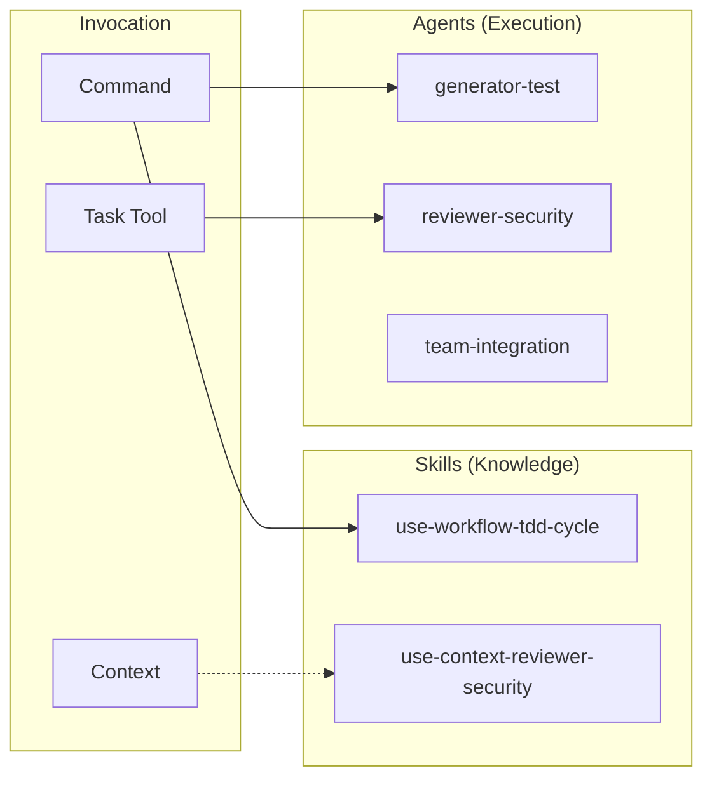
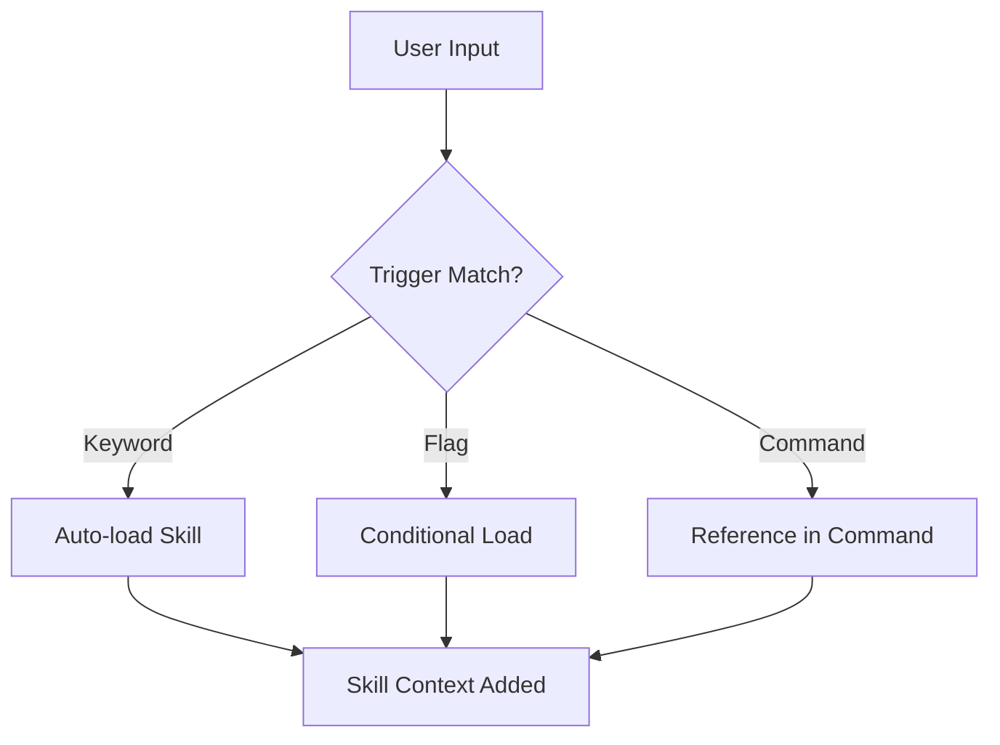

# Skills & Agents Design

Design intent and usage guidelines for Skills and Agents.

📌 **[日本語版](../.ja/docs/SKILLS_AGENTS.md)**

## Core Concept



## Skills vs Agents

| Aspect         | Skills                         | Agents        |
| -------------- | ------------------------------ | ------------- |
| **Role**       | Knowledge base (What/How)      | Executor (Do) |
| **Invocation** | Auto-load or command reference | Via Task tool |
| **Context**    | Main or fork                   | Always fork   |
| **State**      | Read-only                      | Mutable       |
| **Output**     | Information                    | Artifacts     |

## Skills

### Purpose

Skills are "knowledge modules" that provide domain-specific knowledge when AI
executes tasks.

### Categories

| Category      | Skills                                               | Purpose                  |
| ------------- | ---------------------------------------------------- | ------------------------ |
| TDD/Testing   | use-workflow-tdd-cycle                          | Testing methodology      |
| Documentation | adr, glossary                                        | Documentation generation |
| Review        | reviewing-\*                                         | Code review perspectives |
| Workflow      | use-workflow-code                                        | Workflow definitions     |

### Loading Mechanism



**Trigger Examples:**

| Trigger              | Skill Loaded         |
| -------------------- | -------------------- |
| "TDD", "test-driven" | use-workflow-tdd-cycle |

### File Structure

```text
skills/[skill-name]/
├── SKILL.md        # Required: YAML front matter + knowledge body
└── references/     # Optional: detailed guides
    └── *.md
```

### YAML Front Matter

```yaml
---
name: use-workflow-tdd-cycle
description: TDD with RGRC cycle and Baby Steps. Use when: TDD, テスト駆動, Red-Green-Refactor, Baby Steps.
allowed-tools: Read Write Edit Grep Glob
context: fork # fork or inline
user-invocable: false # Whether invocable as slash command
---
```

## Agents

### Purpose

Agents are "specialized executors" spawned via the Task tool to autonomously
perform specific analysis or generation tasks.

### Categories

```text
agents/
├── architects/     # Design (architect-feature)
├── critics/        # Critical verification (critic-audit, critic-design, critic-evidence)
├── enhancers/      # Code improvement (enhancer-code)
├── evaluators/     # Quality evaluation (evaluator-test)
├── explorers/      # Exploration (explorer-feature)
├── generators/     # Generation (branch, commit, issue, pr, test)
├── resolvers/      # Problem resolution (resolver-build)
├── reviewers/      # Review (20 specialized reviewers)
└── teams/          # Team integration (team-integration, team-qa, team-implementation)
```

### Reviewer Agents (20 types)

| Agent                          | Focus                             |
| ------------------------------ | --------------------------------- |
| reviewer-accessibility         | WCAG compliance                   |
| reviewer-readability          | Structure + readability           |
| reviewer-design        | React patterns                    |
| reviewer-document              | Documentation quality             |
| reviewer-duplication           | Cross-file DRY analysis           |
| reviewer-efficiency            | Algorithmic cost + hot paths      |
| reviewer-operations | Error boundaries + logging        |
| reviewer-performance           | Performance                       |
| reviewer-progressive           | CSS-first + JS reduction          |
| reviewer-prompt                | Prompt/agent definition quality   |
| reviewer-reuse                 | Existing code reuse opportunities |
| reviewer-causation            | Root cause analysis               |
| reviewer-security              | OWASP Top 10                      |
| reviewer-silence        | Silent failure detection          |
| reviewer-spec              | SOW/Spec Ready/NotReady gate      |
| reviewer-coverage         | Test coverage quality             |
| reviewer-testability           | Testability                       |
| reviewer-encapsulation           | Type design + encapsulation       |
| reviewer-strictness           | TypeScript type safety            |

### Team Agents

| Agent                  | Focus                                                           |
| ---------------------- | --------------------------------------------------------------- |
| team-integration | Reconcile challenge/verification results + root cause synthesis |
| team-qa            | Non-blocking QA participant via peer DM                         |
| team-implementation       | RGRC cycle implementation for assigned files and tests          |

### Invocation via Task Tool

```markdown
Task tool with:

- subagent_type: "reviewer-security"
- prompt: "Review the authentication module for vulnerabilities"
- model: "sonnet" (optional)
```

## Design Decisions

### Why Separate Skills and Agents?

| Reason                     | Explanation                                             |
| -------------------------- | ------------------------------------------------------- |
| **Separation of Concerns** | Separate knowledge (Skills) from execution (Agents)     |
| **Context Management**     | Agents run in fork, don't pollute main context          |
| **Reusability**            | Skills can be referenced from multiple commands         |
| **Specialization**         | Agents specialize in specific tasks for deeper analysis |

### Reference Depth Rule

```text
SKILL.md → reference.md (1 level only)
```

Reason: Claude truncates deep nesting with `head -100`, causing information
loss.

## Related

- [COMMANDS.md](./COMMANDS.md) — Command design
- [SKILLS](../rules/conventions/SKILLS.md) — Skill definition format
- [SUBAGENT](../rules/conventions/SUBAGENT.md) — Sub-agent definition format
