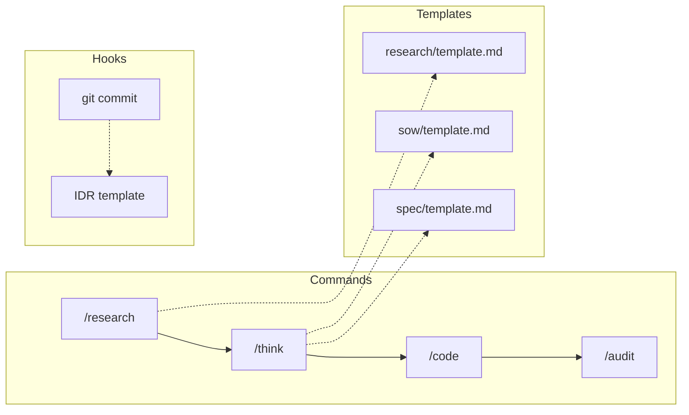
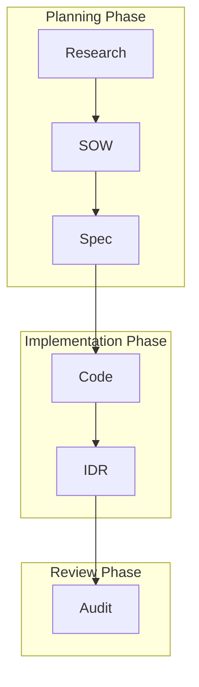

# Templates Design

テンプレートシステムの設計意図と使い方を説明します。

📌 **[日本語版](../.ja/docs/TEMPLATES.md)**

## Overview



## Template Categories

| Category    | Templates                     | Generated By      |
| ----------- | ----------------------------- | ----------------- |
| `sow/`      | SOW (Statement of Work)       | `/think`          |
| `spec/`     | Specification                 | `/think`, `/spec` |
| `research/` | Research findings             | `/research`       |
| `adr/`      | Architecture Decision Records | `/adr`            |
| `docs/`     | Documentation                 | `/docs`           |
| `issue/`    | GitHub Issues                 | `/issue`          |
| `audit/`    | Audit reports                 | `/audit`          |

## Document Lifecycle



| Document | Role             | Audience | Update           |
| -------- | ---------------- | -------- | ---------------- |
| **SOW**  | 計画、基準、設計 | AI       | 承認後は静的     |
| **Spec** | 実装詳細、テスト | AI       | 承認後は静的     |
| **IDR**  | 実装記録         | Human    | 動的（追記のみ） |

## Template Structure

### SOW Template

```markdown
# SOW: {title}

## Status

- [ ] Draft
- [ ] Approved

## Context

[背景と目的]

## Acceptance Criteria

| ID     | Criterion | Priority |
| ------ | --------- | -------- |
| AC-001 | ...       | Must     |

## Implementation Plan

[実装計画]

## Non-Functional Requirements

[NFR]
```

### Spec Template

```markdown
# Spec: {title}

## Component Design

[コンポーネント設計]

## Test Plan

| ID    | Description | Type |
| ----- | ----------- | ---- |
| T-001 | ...         | Unit |

## API Design

[API設計]
```

### ADR Templates

| Template                  | Use Case               |
| ------------------------- | ---------------------- |
| `technology-selection.md` | 技術選定               |
| `architecture-pattern.md` | アーキテクチャパターン |
| `deprecation.md`          | 非推奨化               |
| `process-change.md`       | プロセス変更           |

## Variable Syntax

テンプレート内で使用できる変数構文:

| Pattern        | Example           | Output         |
| -------------- | ----------------- | -------------- |
| `{field}`      | `{project_name}`  | `MyApp`        |
| `{obj.prop}`   | `{summary.total}` | `8`            |
| `{arr[].prop}` | `{items[].id}`    | 各アイテムのid |

詳細: [TEMPLATE_VARIABLES](../rules/conventions/TEMPLATE_VARIABLES.md)

## Customization Rules

1. **必須セクション維持**: `##` ヘッダーは変更しない
2. **確信度マーカー使用**: `[✓]` ≥95%, `[→]` 70-94%, `[?]` <70%
3. **ID規約遵守**: I-001, AC-001, FR-001, T-001, NFR-001

## File Locations

| Document | Location                                                     |
| -------- | ------------------------------------------------------------ |
| SOW/Spec | `planning/[feature]/` or `$HOME/.claude/workspace/planning/` |
| IDR      | 同上（SOW存在時）or `planning/YYYY-MM-DD/`                   |
| ADR      | `adr/NNNN-title.md`                                          |

## Related

- [TEMPLATE_VARIABLES](../rules/conventions/TEMPLATE_VARIABLES.md) — 変数構文
- [idr-pre-commit.sh](../hooks/lifecycle/idr-pre-commit.sh) — IDR生成フック
- [templates/README.md](../templates/README.md) — テンプレート一覧
