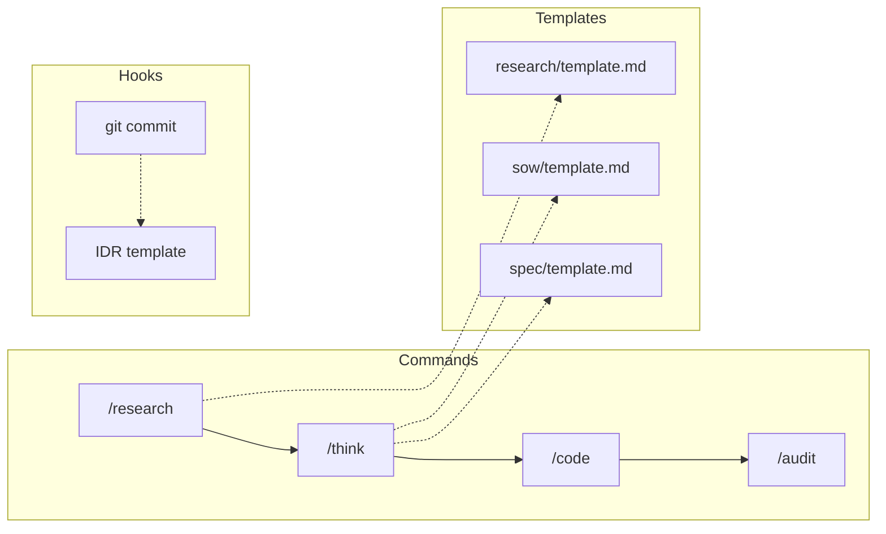
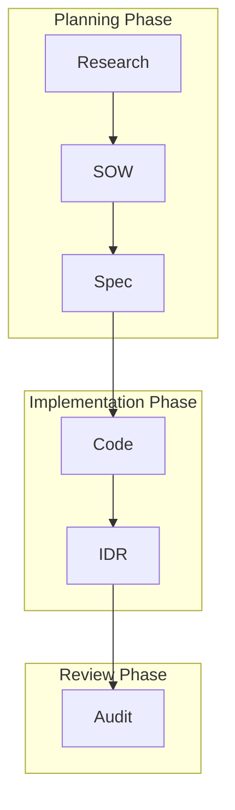

# Templates Design

Design intent and usage of the template system.

📌 **[日本語版](../.ja/docs/TEMPLATES.md)**

## Overview



## Template Categories

| Category        | Templates                     | Generated By |
| --------------- | ----------------------------- | ------------ |
| `sow/`          | SOW (Statement of Work)       | `/think`     |
| `spec/`         | Specification                 | `/think`     |
| `research/`     | Research findings             | `/research`  |
| `adr/`          | Architecture Decision Records | `/adr`       |
| `issue/`        | GitHub Issues                 | `/issue`     |
| `pr/`           | Pull Request descriptions     | `/pr`        |
| `audit/`        | Audit reports                 | `/audit`     |
| `devcontainer/` | Dev container config          | —            |

## Document Lifecycle



| Document | Role                          | Audience | Update                |
| -------- | ----------------------------- | -------- | --------------------- |
| **SOW**  | Planning, criteria, design    | AI       | Static after approval |
| **Spec** | Implementation details, tests | AI       | Static after approval |
| **IDR**  | Implementation record         | Human    | Dynamic (append-only) |

## Template Structure

### SOW Template

```markdown
# SOW: {title}

## Status

- [ ] Draft
- [ ] Approved

## Context

[Background and purpose]

## Acceptance Criteria

| ID     | Criterion | Priority |
| ------ | --------- | -------- |
| AC-001 | ...       | Must     |

## Implementation Plan

[Implementation plan]

## Non-Functional Requirements

[NFR]
```

### Spec Template

```markdown
# Spec: {title}

## Component Design

[Component design]

## Test Plan

| ID    | Description | Type |
| ----- | ----------- | ---- |
| T-001 | ...         | Unit |

## API Design

[API design]
```

### ADR Templates

| Template                  | Use Case              |
| ------------------------- | --------------------- |
| `technology-selection.md` | Technology selection  |
| `architecture-pattern.md` | Architecture patterns |
| `deprecation.md`          | Deprecation           |
| `process-change.md`       | Process changes       |

## Variable Syntax

Variable syntax available in templates:

| Pattern        | Example           | Output         |
| -------------- | ----------------- | -------------- |
| `{field}`      | `{project_name}`  | `MyApp`        |
| `{obj.prop}`   | `{summary.total}` | `8`            |
| `{arr[].prop}` | `{items[].id}`    | Each item's id |

Details: [TEMPLATES](../rules/conventions/TEMPLATES.md)

## Customization Rules

1. **Keep required sections**: Do not change `##` headers
2. **Use confidence markers**: `[✓]` ≥95%, `[→]` 70-94%, `[?]` <70%
3. **Follow ID conventions**: I-001, AC-001, FR-001, T-001, NFR-001

## File Locations

| Document | Location                                                                    |
| -------- | --------------------------------------------------------------------------- |
| SOW/Spec | `.claude/workspace/planning/[feature]/`                                     |
| IDR      | Same as above (when SOW exists) or `.claude/workspace/planning/YYYY-MM-DD/` |
| ADR      | `adr/NNNN-title.md`                                                         |

## Related

- [TEMPLATES](../rules/conventions/TEMPLATES.md) — Variable syntax
- [idr-pre-commit.sh](../hooks/lifecycle/idr-pre-commit.sh) — IDR generation hook
- [templates/README.md](../templates/README.md) — Template list
