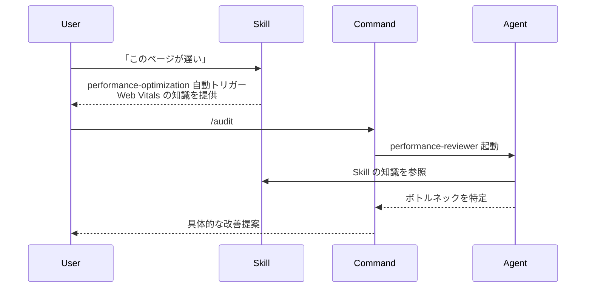

# Claude Code 実践ワークフロー Part 1

## Commands / Agents / Skills の三層設計

> **対象読者**: Claude Code（Anthropic の CLI ツール）を既に導入している開発チーム

Claude Codeを長期運用していると、CLAUDE.mdが肥大化して「何度も同じミスを繰り返す」「前言ったことを覚えていない」という問題が起きます。

私たちはこれを**三層構造（Commands / Agents / Skills）**で解決しました。この記事では、新しい機能を追加するときに「どこに書けばいいか」迷わないための**判断基準**を紹介します。

---

## 課題: CLAUDE.mdに全部書くと破綻する

Claude Codeは便利ですが、運用が複雑化するにつれてCLAUDE.mdに書く内容が増えていきます。

- コーディング規約
- テスト方針
- レビュー基準
- プロジェクト固有のルール
- ...

結果、数百行のCLAUDE.mdが生まれ、Claudeが全てを把握しきれなくなります。

**解決策**: CLAUDE.mdはインデックス（目次）にして、詳細は別ファイルに分散する。

---

## 三層構造の概要

私たちは以下の三層で機能を整理しています。

| 層 | 役割 | 例 | 特徴 |
|----|------|-----|------|
| **Commands** | ユーザーが直接呼び出すワークフロー | /audit, /code, /think | 薄いラッパー、Agents や Skills を調整 |
| ↓ 呼び出す ||||
| **Agents** | 専門分析・レビュー | performance-reviewer, accessibility-reviewer | 特定タスク実行、短期的 |
| ↓ 参照する ||||
| **Skills** | 知識ベース・ガイド | code-principles, progressive-enhancement | 永続的知識、キーワードで自動トリガー |

### 協調動作の例: パフォーマンス最適化



---

## CLAUDE.mdはインデックスに

CLAUDE.mdには詳細を書かず、**どこに何があるか**だけを示します。

```markdown
# CLAUDE.md

## Priority Rules (FOLLOW IN ORDER)

### [P0] CRITICAL - Core AI Operation Rules
Core principles: [@./rules/core/AI_OPERATION_PRINCIPLES.md]

### [P1] REQUIRED - Language Settings
- Output: **JAPANESE ONLY**

### [P2] DEFAULT - Development Approach
Core principles via `code-principles` skill:
- Occam's Razor (KISS)
- SOLID Principles
- DRY, YAGNI

### [P3] CONTEXTUAL - Just-in-Time References
- Code tasks: `progressive-enhancement` skill
- React/UI: `frontend-patterns` skill
- Testing: `tdd-test-generation` skill
```

**ポイント**:

- **Priority (P0-P4)** で優先度を明確化
- **`@./path`** 形式で外部ファイル参照
- **Skill名** を明示して自動読み込みを促す

> **Note**: 実際の CLAUDE.md には P4（オプション設定：ファイル削除動作など）も含まれますが、ここでは核心部分（P0-P3）のみを記載しています。

---

## ディレクトリ構成

```text
~/.claude/
├── CLAUDE.md              # インデックス（目次）
├── commands/              # /コマンド定義
│   ├── code.md
│   ├── audit.md
│   ├── think.md
│   └── ...
├── agents/                # 専門エージェント（.mdファイル）
│   ├── reviewers/         # コードレビュー系
│   │   ├── performance.md
│   │   └── accessibility.md
│   ├── enhancers/         # コード改善系
│   ├── orchestrators/     # 調整・統合系
│   └── ...
├── skills/                # 知識ベース
│   ├── code-principles/SKILL.md
│   ├── progressive-enhancement/SKILL.md
│   └── ...
├── rules/                 # 原則・ルール
│   ├── core/             # 必須ルール
│   └── development/      # 開発ルール
└── workspace/            # 作業ファイル
    ├── sow/              # 設計書
    └── research/         # 調査結果
```

> **Note**: これは基本構造です。運用が進むと `agents/` 配下に `reviewers/`, `generators/`, `watchers/` などのサブディレクトリが追加されていきます。

---

## この設計のメリット

### 1. スケーラビリティ

新しいルールやスキルを追加しても、CLAUDE.mdは肥大化しない。該当ディレクトリにファイルを追加するだけ。

### 2. 役割の明確化 - 使い分けの判断基準

- **何をするか** → Commands
- **どう分析するか** → Agents
- **何を知っているか** → Skills

新しい機能を追加するとき、「どこに書くか」で迷ったらこう判断する：

| 問い | Yes なら |
|------|----------|
| ユーザーが `/xxx` で呼び出す？ | → **Commands** |
| 特定のレビュー・分析タスク？ | → **Agents** |
| 複数の場面で参照される知識？ | → **Skills** |

**具体例：TypeScript型チェック機能を追加する場合**

- 「TypeScriptの型チェックルール」→ **Skills**（知識として保存）
- 「型チェックを実行するレビュー」→ **Agents**（分析タスク）
- 「`/audit` で型チェックを含めて実行」→ **Commands**（呼び出し口）

### 3. 自動読み込み

Skillsは `description` フィールドのキーワードで自動トリガー。明示的に呼び出さなくても、文脈に応じて知識が提供される。

```yaml
# skills/applying-code-principles/SKILL.md
---
name: code-principles
description: >
  Triggers on: SOLID, DRY, YAGNI, principle, 原則, simplicity...
allowed-tools: Read, Grep, Glob
---
```

**仕組み**: ユーザーが「SOLID原則に従った設計にしたい」と発言すると、`description` 内のキーワード `SOLID` にマッチし、`code-principles` Skill が自動的に読み込まれる。Claudeはその知識を参照しながら回答する。

---

## はじめの一歩

三層構造を導入するには、まず1つの Skill を作成してみましょう。

### 実装例：Skill を作成する

```bash
# 1. ディレクトリ作成
mkdir -p ~/.claude/skills/my-guidelines/

# 2. SKILL.md を作成
touch ~/.claude/skills/my-guidelines/SKILL.md
```

```markdown
# ~/.claude/skills/my-guidelines/SKILL.md
---
name: my-guidelines
description: >
  Triggers on: ガイドライン, 規約, convention
allowed-tools: Read, Grep, Glob
---

## コーディング規約

- 変数名はキャメルケース
- 関数は20行以内
- ...（あなたのルールを記載）
```

```markdown
# CLAUDE.md に追記
### [P3] CONTEXTUAL - Just-in-Time References
- My guidelines: `my-guidelines` skill
```

これで、「ガイドライン」と発言すると自動的に読み込まれます。

### 既存 CLAUDE.md からの移行

数百行の CLAUDE.md がある場合は、段階的に移行します：

1. **Phase 1**: 頻繁に参照されるルールを特定
2. **Phase 2**: 1つずつ Skills に抽出（週1-2個ペース）
3. **Phase 3**: レビュー系ルールを Agents 化
4. **Phase 4**: ワークフローを Commands 化

> **Tip**: 移行中は旧 CLAUDE.md と新構成を並行運用し、動作確認しながら進めると安全です。

---

## 次回予告

**Part 2: 計画フェーズ - /think で SOW + Spec を生成する**

`/think` コマンドで「何を作るか」を明確にし、設計書（SOW + Spec）を自動生成する方法を紹介します。

---

## リポジトリ

設定ファイルの全体はこちらで公開しています。

**GitHub**: <https://github.com/thkt/claude-config>

---

*Claude Code 実践ワークフロー シリーズ*

- **Part 1: 三層設計** ← 今回
- [Part 2: 調査フェーズ（/research）](./part2-research-investigation.md)
- [Part 3: 計画フェーズ（/think）](./part3-think-sow-spec.md)
- [Part 4: 実装フェーズ（/code）](./part4-code-implementation.md)
- [Part 5: 品質フェーズ（/audit）](./part5-review-quality.md)
- [Part 6: 横断的関心事（PRE_TASK_CHECK）](./part6-pre-task-check.md)
