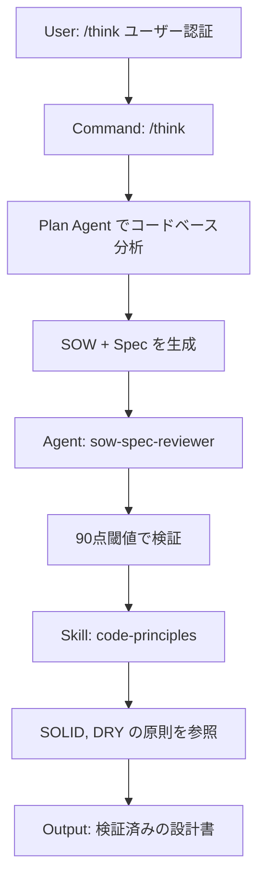

# Claude Code 実践ワークフロー Part 3

## /think で SOW + Spec を生成する

> **対象読者**: Claude Code を既に導入している開発チーム

実装を始める前に「何を作るか」を明確にしていますか？この記事では、`/think` コマンドで **SOW（計画）** と **Spec（仕様）** を自動生成し、手戻りを防ぐ方法を紹介します。

> **Part 1-2 未読の方へ**
> Claude Code は **Commands / Agents / Skills** の三層構造で機能を整理しています。
>
> - **Part 1**: Commands / Agents / Skills の三層構造
> - **Part 2**: `/research` でコードベースを調査
>
> `/think` は Part 2 の `/research` で得た知識を活用して、より正確な計画を生成できます。

---

## 課題: いきなり実装すると手戻りが起きる

「認証機能を追加して」と言われて、すぐにコードを書き始めていませんか？

- 何を達成すれば完了なのか曖昧
- 実装途中で「これじゃない」と言われる
- 仕様の認識ズレで大幅な手戻り

**解決策**: 実装前に `/think` で計画と仕様を明文化する。

---

## /think の役割: 二重設計書を生成

`/think` は2つの文書を自動生成します：

`/think "ユーザー認証機能"` → 以下の2ファイルを生成：

| ファイル | 役割 | 主な内容 |
|---------|------|---------|
| **sow.md** | 計画書（Statement of Work） | ゴール、受け入れ基準、リスクと対策 |
| **spec.md** | 仕様書（Specification） | 機能要件、API仕様、データモデル、テストシナリオ |

**なぜ2つに分けるか？**

- **SOW**: ステークホルダーとの合意用（何を作るか）
- **Spec**: 開発者の実装ガイド（どう作るか）

---

## 生成される文書の構造

### sow.md の主要セクション

```markdown
# SOW: ユーザー認証機能
Version: 1.0.0
Status: Draft

## Executive Summary
[✓] JWT ベースの認証システムを実装する

## Problem Analysis
- [✓] 現状: 認証なしで全APIが公開状態 ← 要件で明示
- [→] 推定影響: セキュリティリスク高 ← 文脈から推論

## Acceptance Criteria
- [ ] [✓] ログイン/ログアウトが動作する ← 要件で明示
- [ ] [→] JWT トークンの発行・検証ができる ← 技術選定から推論
- [ ] [?] セッション有効期限が設定できる ← 未確認、要相談

## Risks & Mitigations
- [✓] リスク: トークン漏洩 → 対策: 短い有効期限 + リフレッシュトークン
```

### spec.md の全10セクション

```markdown
# Specification: ユーザー認証機能

## 1. Functional Requirements
[✓] FR-001: POST /auth/login でJWTを発行
[✓] FR-002: Authorization ヘッダーでトークン検証
[→] FR-003: リフレッシュトークンで延長可能

## 2. API Specification
### POST /auth/login
Request:  { "email": "string", "password": "string" }
Response: { "token": "string", "refreshToken": "string", "expiresIn": 3600 }

## 3. Data Model
interface User {
  id: string;
  email: string;
  passwordHash: string;
  createdAt: Date;
}

## 4. UI Specification
（該当なし - API のみ）

## 5. Non-Functional Requirements
[✓] NFR-001: レスポンス時間 < 200ms
[→] NFR-002: bcrypt でパスワードハッシュ化

## 6. Dependencies
[✓] jsonwebtoken: ^9.0.0
[✓] bcrypt: ^5.1.0

## 7. Test Scenarios
describe('認証', () => {
  it('[✓] 正しい認証情報でログインできる');
  it('[✓] 無効なトークンで401が返る');
  it('[→] 期限切れトークンで401が返る');
});

## 8. Known Issues & Assumptions
[→] OAuth連携は Phase 2 で対応予定
[?] 多要素認証の要否を確認中

## 9. Implementation Checklist
- [ ] User モデル作成
- [ ] /auth/login エンドポイント実装
- [ ] JWT ミドルウェア作成
- [ ] テスト実装

## 10. References
- SOW: sow.md
- JWT仕様: https://jwt.io/
```

### 信頼度マーカー（✓/→/?）の意味

各項目には信頼度マーカーが付きます：

| マーカー | 意味 | 判断基準 |
|---------|------|----------|
| **✓** | 確認済み | 要件として明示された、ドキュメントに記載あり |
| **→** | 推論 | 文脈から判断、技術的に妥当な推測 |
| **?** | 要確認 | 不明、ステークホルダーに確認が必要 |

**[?] が多い場合は実装に進まない**。先に確認を取る。

---

## 実行フロー

### Step 1: /think を実行

```bash
/think "ユーザー認証機能をJWTで実装"
```

### Step 2: コードベース分析（Plan Agent）

既存プロジェクトの場合、`/think` は自動的に **Plan Agent**（Haiku モデル）を起動してコードベースを分析します：

```text
🔍 Plan Agent: コードベース分析中...

[✓] 既存パターン: src/middleware/ にミドルウェアが集約
[✓] 技術スタック: Express + TypeScript
[→] 類似実装: src/middleware/cors.ts を参考にできる
[→] 影響範囲: 全APIルートに認証ミドルウェアが必要
```

この分析結果が SOW/Spec に反映され、既存コードベースと整合性のある設計書が生成されます。

> **Note**: 新規プロジェクト（`from scratch`, `prototype`, `poc` など）では Plan Agent はスキップされます。Haiku モデル使用で追加コストは $0.05-0.15 程度です。

### Step 3: 自動検証（sow-spec-reviewer）

生成後、専用の SOW/Spec レビューエージェント（`agents/reviewers/sow-spec.md`）が自動起動：

**🔍 SOW/Spec Review** — Score: 92/100 ✅ PASS

| カテゴリ | スコア | 評価 |
|---------|--------|------|
| Accuracy | 25/25 | 信頼度マーカーが適切 |
| Completeness | 23/25 | 必須セクション完備 |
| Relevance | 22/25 | 目的との整合性あり |
| Actionability | 22/25 | 実装可能な具体性 |

**スコアに応じた対応**:

| スコア | 判定 | 次のアクション |
|--------|------|----------------|
| **90点以上** | ✅ PASS | 実装フェーズへ進める |
| **70-89点** | ⚠️ CONDITIONAL | 指摘箇所を修正して再度 `/think` |
| **70点未満** | ❌ FAIL | 要件の再確認が必要 |

**70-89点の場合の例**:

```text
⚠️ CONDITIONAL (Score: 78/100)

Issues:
- [?] Acceptance Criteria に3件の未確認項目あり
- [→] API仕様にエラーレスポンス形式が未定義

Recommendation:
1. ステークホルダーに [?] 項目を確認
2. spec.md の API Specification にエラー形式を追加
3. 修正後、再度 /think で検証
```

**修正手順の詳細**:

1. 生成されたファイルを開く：`.claude/workspace/sow/[日付]-[機能名]/spec.md`
2. 指摘された `[?]` 項目を特定
3. ステークホルダーに確認後、マーカーを更新：
   - 確認できた → `[?]` を `[✓]` に変更
   - 推論で補完 → `[?]` を `[→]` に変更（理由を追記）
4. 再度 `/think` を実行して再検証（または手動で sow-spec-reviewer を起動）

### Step 4: 保存場所

```text
.claude/workspace/sow/2025-01-15-user-auth/
├── sow.md
└── spec.md
```

---

## 生成後: 実装フェーズへの流れ

SOW/Spec が生成されたら、以下のように活用されます：

`/think` で生成 → **spec.md** → `/code` と `/review` が自動参照

| フェーズ | spec.md の活用 |
|---------|---------------|
| **/code** | FR-001〜003 を実装ガイドとして使用、Test Scenarios からテスト生成、Implementation Checklist で進捗管理 |
| **/review** | spec.md との整合性を検証、「仕様では定義されているが未実装」を検出、API仕様との乖離をフラグ |

つまり、`spec.md` は **実装・テスト・レビュー** すべてで参照される「信頼できる情報源」になります。

---

## 使い方の具体例

### 例1: 新機能の計画

```bash
/think "商品検索にフィルター機能を追加"
```

→ 検索条件、UI仕様、APIエンドポイントが spec.md に生成される

### 例2: バグ修正の計画

```bash
/think "ログイン後にリダイレクトされない問題を修正"
```

→ 原因分析、修正方針、テストケースが生成される

### 例3: リファクタリングの計画

```bash
/think "認証ロジックをミドルウェアに分離"
```

→ 影響範囲、移行手順、互換性維持の方針が生成される

---

## Plan Mode との使い分け

`/think` と **Plan Mode** はどちらも計画フェーズで使いますが、目的が異なります：

| 機能 | Plan Mode | /think |
|------|-----------|--------|
| **起動方法** | `Shift+Tab` | `/think "説明"` |
| **目的** | アプローチ探索と承認 | 設計書（SOW + Spec）生成 |
| **成果物** | ユーザー承認 | sow.md + spec.md |
| **使う場面** | 複数のアプローチがある | 要件が明確で文書化したい |

### 推奨フロー

```text
[複雑 - アーキテクチャ決定が必要]
/research → Plan Mode → /think → /code

[標準 - 要件が明確]
/think → /code
```

> **Tip**: 「コードベースの理解が必要」→ `/research` を先に、「どう実装するか迷う」→ Plan Mode、「何を実装するか明確」→ `/think`

---

## Part 1-2 との連携: 三層構造の実践



Part 1 で紹介した「Commands → Agents → Skills」の流れがここで実践されています。

---

## FAQ

### Q: Plan Agent と /research の違いは？

**Plan Agent**（`/think` 内で自動起動）:

- SOW/Spec 生成のための**付随分析**
- 軽量・高速（数秒）
- 既存パターンと影響範囲の把握が目的

**/research**（独立したコマンド）:

- 深い調査が必要な場合の**専用フェーズ**
- 詳細・包括的（数分）
- 技術選定や複雑な依存関係の調査が目的

**使い分け**:

```text
要件が明確 → /think のみでOK
要件が曖昧・技術選定が必要 → /research → /think
```

### Q: SOW と Spec のどちらを先に見るべき？

- **ステークホルダー（PM、デザイナー）** → SOW（何を達成するか）
- **開発者** → Spec（どう実装するか）

SOW で合意を取り、Spec で実装を進める。

---

## 次回予告

**Part 4: 実装フェーズ - /code で TDD/RGRC 実装する**

計画が完了したら、`/code` で TDD（テスト駆動開発）と RGRC サイクルを使った実装方法を紹介します。

---

## リポジトリ

設定ファイルの全体はこちらで公開しています。

**GitHub**: <https://github.com/thkt/claude-config>

---

*Claude Code 実践ワークフロー シリーズ*

- [Part 1: 三層設計](./part1-three-layer-architecture.md)
- [Part 2: 調査フェーズ（/research）](./part2-research-investigation.md)
- **Part 3: 計画フェーズ（/think）** ← 今回
- [Part 4: 実装フェーズ（/code）](./part4-code-implementation.md)
- [Part 5: 品質フェーズ（/review）](./part5-review-quality.md)
- [Part 6: 横断的関心事（PRE_TASK_CHECK）](./part6-pre-task-check.md)
