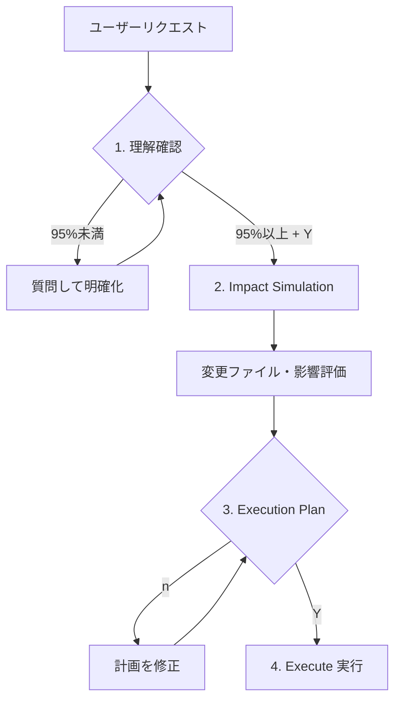

# Claude Code 実践ワークフロー Part 6

## PRE_TASK_CHECK で理解確認する

> **対象読者**: Claude Code を既に導入している開発チーム

「言ったはずなのに、違うものができた…」—— 理解のズレが手戻りの原因になっていませんか？この記事では、**PRE_TASK_CHECK** の仕組みで「実行前の理解確認」を自動化する方法を紹介します。

> **Part 1-5 未読の方へ**
>
> - **Part 1**: Commands / Agents / Skills の三層構造
> - **Part 2**: `/research` でコードベースを調査
> - **Part 3**: `/think` で SOW + Spec を生成
> - **Part 4**: `/code` で TDD/RGRC 実装
> - **Part 5**: `/review` で多角的コードレビュー
>
> PRE_TASK_CHECK は**全コマンドに共通する横断的関心事**です。

---

## 課題: 理解のズレが手戻りを生む

「ユーザー認証機能を追加して」と言ったとき：

- 「JWT認証」を想定していたのに、セッション認証が実装された
- 「ログイン画面」も含むと思ったのに、APIだけだった
- 「既存のAuthServiceを使う」つもりが、新規実装された

結果、**認識のズレで大幅な手戻り**。

**解決策**: PRE_TASK_CHECK で「実行前に理解を確認」する。

---

## PRE_TASK_CHECK とは

PRE_TASK_CHECK は、タスク実行前に**理解度を確認し、ユーザー承認を得る**仕組みです：

**ユーザー**: 「認証機能を追加して」

**🧠 Understanding Level**: ████████░░ 80%

| カテゴリ | 内容 |
|---------|------|
| ✅ 明確に理解 | [✓] JWT ベースの認証（要件で明示）、[→] Express + TypeScript（プロジェクト構造から推論） |
| ❓ 不明確/仮定 | [?] リフレッシュトークンの要否、[?] ログインUIの有無 |
| 💡 推奨アプローチ | /think → /code |

> Is this understanding correct? (Y/n/i)

**ポイント**: 95% 未満の理解度では**実行に進まない**。先に質問して明確化する。

---

## 95% ルール: なぜ高い閾値か

### 理解度と手戻りリスク

| 理解度 | 手戻りリスク | 推奨アクション |
|--------|-------------|---------------|
| **95%以上** | 低い | 実行に進む |
| **70-94%** | 中程度 | 質問して明確化 |
| **70%未満** | 高い | 要件の再確認が必要 |

### なぜ 95% か？

- **実装後の修正コスト** > 事前の質問コスト
- 5% の不確実性でも、複雑な実装では大きな乖離になりうる
- 「聞いたら失礼」より「聞かずに間違える」方が問題

> **原則**: 質問することは常に、間違った仮定で進めることより良い。

---

## 信頼度マーカー（✓/→/?）

PRE_TASK_CHECK では、各要素に**信頼度マーカー**を付けます：

```text
✅ Elements I understand clearly:
- [✓] JWT ベースの認証 - 要件で明示された
- [✓] Express 4.18.2 - package.json で確認

❓ Unclear or assumed elements:
- [→] bcrypt でパスワードハッシュ - auth.service.ts の import から推論
- [?] リフレッシュトークンの実装有無 - 要件に記載なし
```

### マーカーの意味

| マーカー | 確信度 | 判断基準 |
|---------|--------|----------|
| **[✓]** | High | ファイルやコンテキストで直接確認できる |
| **[→]** | Medium | パターンや構造から妥当な推論が可能 |
| **[?]** | Low | 仮定に基づく、確認が必要 |

> **Note**: 95%ルールは**全体の理解度**の閾値です。個別の✓/→/?マーカーは質的な判断（High/Medium/Low）を示し、これらを総合して全体の理解度を算出します。

**[?] が多い場合は実行に進まない**。先に確認を取る。

---

## フォローアップ質問

理解度が 95% 未満の場合、自動的に質問を提示します：

```text
🤔 Questions to reach 95% confidence:

1. リフレッシュトークンは必要ですか？
   - JWT の有効期限切れ時の挙動に影響します

2. ログイン UI も実装範囲に含みますか？
   - API のみ vs フルスタック実装で工数が変わります

3. 既存の AuthService を拡張しますか、新規実装しますか？
   - src/services/auth.service.ts が存在しています

These clarifications are needed before proceeding.
```

**ユーザーが回答後**、理解度を再計算し、95% 以上なら実行に進みます。

---

## Impact Simulation（Dry-run）

理解確認後、実際の変更を行う前に**影響範囲のシミュレーション**を表示します：

```text
━━━━━━━━━━━━━━━━━━━━━━━━━━━━━━━━━━━━━━━━━━━━━━━━━━━━━━━━━━

🔍 Impact Simulation (Dry-run)

Expected changes:
• Files to modify: src/auth/login.ts, src/middleware/jwt.ts
• Affected components: AuthService, UserSession, LoginPage
• Risk level: 🟡 Medium (認証フロー変更)
• Note: 既存ユーザーセッションの再ログインが必要になる可能性

━━━━━━━━━━━━━━━━━━━━━━━━━━━━━━━━━━━━━━━━━━━━━━━━━━━━━━━━━━
```

### Impact Simulation の目的

- **変更の範囲**を可視化
- **リスクレベル**を事前に把握
- **想定外の影響**を発見

### いつ表示されるか

- ファイル操作（作成/編集/削除）
- 複雑な変更（3ファイル以上）
- 認証・セキュリティ・データ整合性に関わる変更

> **Note**: 単純なファイル読み取りやドキュメント更新では表示されません。

---

## 実行計画（Execution Plan）

Impact Simulation の後、具体的な実行計画を表示します：

```text
━━━━━━━━━━━━━━━━━━━━━━━━━━━━━━━━━━━━━━━━━━━━━━━━━━━━━━━━━━

📝 Execution Plan

Will execute the following:
1. Create new file src/auth/jwt.middleware.ts
2. Edit src/routes/auth.ts - add login endpoint
3. Run npm test to verify changes

━━━━━━━━━━━━━━━━━━━━━━━━━━━━━━━━━━━━━━━━━━━━━━━━━━━━━━━━━━

Proceed with this plan? (Y/n/i)
```

**ユーザー応答**:

- **Y**: 実行に進む
- **n**: 再評価、計画を修正
- **i**: 追加情報を待つ

---

## Done Definition（完了定義）

実装タスクでは、**完了の定義**を明示します：

```text
🎯 Done Definition:
- [ ] [✓] ログイン/ログアウトが動作する
- [ ] [→] JWT トークンの発行・検証ができる
- [ ] [?] セッション有効期限が設定できる

Is this definition correct? Please point out any missing or incorrect items.
```

### なぜ Done Definition が重要か

- **完了の認識ズレ**を防ぐ
- **スコープクリープ**を避ける
- **達成度の測定**が可能になる

> **Note**: Done Definition は TodoWrite とは別物です。Done Definition は「何を達成するか」、TodoWrite は「どう達成するか」を追跡します。

---

## 統合ワークフロー

PRE_TASK_CHECK は以下のフローで動作します：



**STOP ポイント**: 理解確認後と実行計画後の2箇所でユーザー承認を待つ。

---

## いつ PRE_TASK_CHECK が発動するか

### 発動する場合

| 条件 | 例 |
|------|-----|
| ファイル操作 | ファイル作成、編集、削除 |
| コマンド実行 | bash, npm, git など |
| 理解度 95%未満 | 曖昧なリクエスト |
| マルチステップ | 複数の工程を伴うタスク |

### スキップする場合

| 条件 | 例 |
|------|-----|
| 単純な質問 | 「PRE_TASK_CHECK とは？」 |
| 確認応答 | 「y」「ok」「はい」 |
| 読み取り専用 | ファイル読み込み、Grep 検索 |
| フォローアップ | 追加のコンテキスト提供 |

---

## コマンド提案システム

PRE_TASK_CHECK は、タスクに最適なコマンドを提案します：

```text
💡 Suggested approach:
- Command: /think → /code
- Reason: 複雑な機能のため計画が必要、90%以上の理解度
```

### 提案ロジック

| 条件 | 提案コマンド |
|------|-------------|
| 単一ファイルの小さな修正 | `/fix` |
| 複数ファイルの実装 | `/code` |
| 調査が必要 | `/research` |
| 理解度 70%未満 | `/research` を先に |
| 理解度 70-90% | `/think` を先に |
| 理解度 90%以上 | 直接 `/code` |

---

## Part 1-5 との連携

PRE_TASK_CHECK は全コマンドの「前処理」として動作：

| コマンド | PRE_TASK_CHECK | 実行内容 |
|---------|---------------|---------|
| /think | → | SOW + Spec 生成 |
| /research | → | 調査実行 |
| /code | → | TDD/RGRC 実装 |
| /review | → | 並列レビュー |
| /fix | → | バグ修正 |
| /hotfix | → | 緊急修正 |

**全てのコマンドで一貫した理解確認**が行われます。

---

## FAQ

### Q: PRE_TASK_CHECK を無効化できる？

設計上、無効化は推奨されません。ただし、以下の場合は自動的にスキップされます：

- 単純な質問への回答
- 確認応答（「y」「ok」）
- 読み取り専用操作

### Q: 毎回確認が面倒な場合は？

PRE_TASK_CHECK は**リスクの高い操作**にのみ表示されます。単純な操作では自動的にスキップされます。

また、理解度が高い（95%以上）場合は、確認ステップが簡略化されます。

### Q: 信頼度マーカーの基準は？

| マーカー | 根拠の例 |
|---------|---------|
| [✓] | 「package.json:15 で確認」「要件書に明記」 |
| [→] | 「フォルダ構造から推論」「命名規則から推測」 |
| [?] | 「記載なし」「複数の解釈が可能」 |

### Q: 何度質問しても95%に達しない場合は？

**状況別の対処法**:

| 状況 | 原因 | 対処法 |
|------|------|--------|
| 要件が曖昧 | ユーザー側で詳細が未定 | `/think` で一緒に要件を整理する |
| 技術スタックが不明 | プロジェクト情報不足 | `/research` でコードベースを調査 |
| 複数の解釈が可能 | 設計判断が必要 | Plan Mode で設計案を提示・承認 |

**実例**:

```text
User: "ログイン機能を追加"
→ 95%未満（JWTかSession不明、UI要否不明）

User: "/research" → コードベース調査
→ 既存認証方式を発見

User: "既存のJWT認証を使ってログインUIを追加"
→ 95%達成 → 実行
```

### Q: Impact Simulation のリスクレベルは？

| レベル | 基準 |
|--------|------|
| 🟢 Low | 単一ファイル、<10行変更、依存なし |
| 🟡 Medium | 3+ファイル、認証/データ関連 |
| 🔴 High | コア設定、破壊的変更、本番影響 |

---

## 実際に試してみる

### ステップ1: 簡単なタスクで確認

```bash
# Claude Code で以下のように依頼してみましょう
「新しいファイル src/utils/helper.ts を作成して」
```

PRE_TASK_CHECK が表示され、以下を確認できます：

- 理解度の数値化（Progress Bar）
- 信頼度マーカー（✓/→/?）
- 実行計画（Execution Plan）

### ステップ2: 理解度を下げてみる

```bash
# 詳細を意図的に省いて依頼
「認証機能を追加して」
```

95%未満になり、フォローアップ質問が表示されます。質問に回答すると、理解度が更新されます。

### ステップ3: 複雑なタスクで確認

```bash
# 複数ファイルに影響するタスク
「ユーザー管理機能を追加して、CRUD操作とAPIエンドポイントを実装」
```

Impact Simulation が表示され、影響範囲とリスクレベルを確認できます。

---

## まとめ: シリーズ全体の振り返り

Claude Code 実践ワークフロー シリーズでは、以下を紹介しました：

| Part | テーマ | キーコンセプト |
|------|--------|---------------|
| **1** | 三層設計 | Commands / Agents / Skills |
| **2** | /research | Explore Agent、Context Engineering |
| **3** | /think | SOW + Spec、Plan Agent |
| **4** | /code | TDD/RGRC、Baby Steps |
| **5** | /review | 並列レビュー、信頼度フィルタ |
| **6** | PRE_TASK_CHECK | 95%ルール、Impact Simulation |

### 全体フロー

```mermaid
flowchart LR
    A[PRE_TASK_CHECK] --> B[/research]
    B --> C[Plan Mode]
    C --> D[/think]
    D --> E[/code]
    E --> F[/review]
    F --> G[品質の高いソフトウェア]
```

> **Note**: Plan Mode はオプション。「どう実装するか迷う」場合に使用。詳細は Part 3 参照。

**このワークフローで得られるもの**:

- **手戻りの削減**: 理解確認と計画で認識ズレを防止
- **品質の向上**: TDD と並列レビューで品質を担保
- **効率の向上**: 並列実行と自動化で時間を短縮

---

## リポジトリ

設定ファイルの全体はこちらで公開しています。

**GitHub**: <https://github.com/thkt/claude-config>

---

*Claude Code 実践ワークフロー シリーズ*

- [Part 1: 三層設計](./part1-three-layer-architecture.md)
- [Part 2: 調査フェーズ（/research）](./part2-research-investigation.md)
- [Part 3: 計画フェーズ（/think）](./part3-think-sow-spec.md)
- [Part 4: 実装フェーズ（/code）](./part4-code-implementation.md)
- [Part 5: 品質フェーズ（/review）](./part5-review-quality.md)
- **Part 6: 横断的関心事（PRE_TASK_CHECK）** ← 今回
