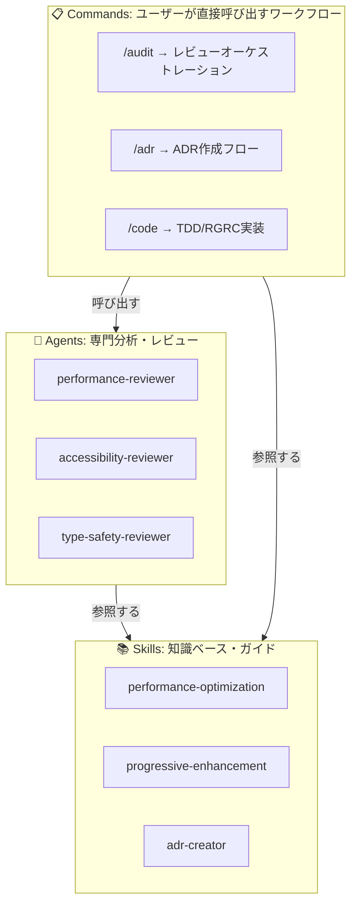
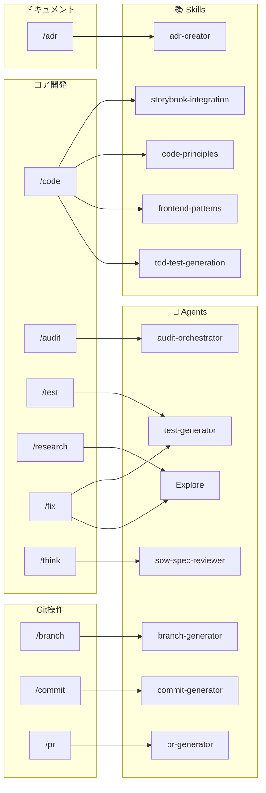

# Claudeコマンドリファレンス

体系的なソフトウェア開発をサポートするカスタムコマンド。

## 🎯 利用可能なコマンド

### コア開発コマンド

| コマンド | 目的 | 環境 |
|---------|------|------|
| `/think` | 検証可能なSOW作成と動的検証 | 分析フェーズ |
| `/research` | 実装なしの調査 | 理解フェーズ |
| `/code` | TDD/RGRC実装 | 開発フェーズ |
| `/test` | 包括的テスト | 検証フェーズ |
| `/audit` | エージェントによるコードレビュー | 品質フェーズ |
| `/sow` | SOW進捗表示 | モニタリングフェーズ |
| `/validate` | SOW適合性検証 | 検証フェーズ |

### クイックアクションコマンド

| コマンド | 目的 | 環境 | 組み合わせ |
|---------|------|------|-----------|
| `/fix` | 素早いバグ修正 | 🔧 開発 | think → code → test |

### 外部レビューコマンド

| コマンド | 目的 | 環境 |
|---------|------|------|
| `/rabbit` | 外部AI視点によるCodeRabbitレビュー | 🐰 品質チェック |

### 自動化コマンド（SlashCommandツール v1.0.123+）

| コマンド | 目的 | 環境 | SlashCommand使用 |
|---------|------|------|-------------------|
| `/auto-test` | 条件付き修正を伴う自動テストランナー | 🔧 開発 | はい - 失敗時に`/fix`を呼び出し |
| `/full-cycle` | 完全な開発サイクル自動化 | 🔄 メタコマンド | はい - 複数コマンドを連鎖 |

### ブラウザ自動化コマンド

| コマンド | 目的 | 環境 |
|---------|------|------|
| `/workflow:create [名前]` | 再利用可能なブラウザ自動化ワークフローを作成 | 🌐 E2Eテスト |

### ドキュメントコマンド

| コマンド | 目的 | 環境 |
|---------|------|------|
| `/adr [タイトル]` | MADR形式でArchitecture Decision Recordを作成 | 📝 ドキュメント |
| `/rulify <番号>` | ADRからプロジェクトルールを生成 | 📝 ドキュメント |

## 🔍 Dry-run影響範囲シミュレーション

**自動安全機能** - PRE_TASK_CHECKワークフローに統合されています。

ファイル操作や複雑な変更を確認する際、Claude Codeは実行前に自動的に簡潔な影響シミュレーションを表示します：

- **変更ファイル**: 2-5個の主要ファイルをリスト
- **影響を受けるコンポーネント**: 影響を受けるモジュールを表示
- **リスクレベル**: 🟢 低 / 🟡 中 / 🔴 高
- **重要な注意点**: 注意が必要な領域を強調

この「Dry-run」アプローチは、実行せずに変更をプレビューし、以下をサポートします：

- 変更の範囲を理解
- 潜在的なリスクを特定
- 進める前に情報に基づいた決定を行う

**ワークフロー統合**:

```txt
1. 理解確認
2. ユーザー確認 (Y) ← 停止ポイント
3. 🔍 影響シミュレーション ← 新機能（リスクの高い変更で自動表示）
4. 実行計画
5. 計画確認 (Y) ← 停止ポイント
6. 実行
```

## 🔄 標準ワークフロー

### 機能開発

複雑さに応じて選択:

```txt
[複雑 - アーキテクチャ決定が必要]
(/research →) Plan Mode → /think → /code → /test → /audit → /validate

[標準 - 要件が明確]
/think → /code → /test → /audit → /validate

[シンプル - 小規模機能]
/code → /test
```

**Plan Mode**: `Shift+Tab` で起動。コードベース探索、アプローチ設計、実装前にユーザー承認を取得。

**注記**: `/research` は永続的なドキュメント化を伴う深い調査が必要な場合、Plan Mode の前にオプションで使用可能。

### 進捗モニタリング

```txt
/sow （いつでも進捗確認）
```

### バグ調査と修正

```txt
/research → /fix
```

### 調査のみ（実装なし）

```txt
/research (発見内容は .claude/workspace/research/ に保存)
```

### 自動化ワークフロー（SlashCommandツール）

```txt
/auto-test        # 自動テスト → 修正サイクル
/full-cycle       # 完全自動開発フロー
```

## 💡 コマンド詳細

### /think - 検証可能なSOWジェネレーター

- 動的検証を伴う検証可能なStatement of Workを作成
- **SOWとSpecの両方を生成**: sow.md（計画）+ spec.md（実装詳細）
- TodoWrite連携で受け入れ基準を定義
- 検証ポイントと成功メトリクスを設定
- `.claude/workspace/planning/`に自動更新機能付きで保存
- `/sow`と`/validate`による進捗追跡を実現
- **Specに含まれる内容**: 機能要件、API仕様、データモデル、UI仕様、テストシナリオ

### /research - 調査

- 実装なしで探索
- 複雑な検索にはTaskエージェントを使用
- 発見を永続的に文書化
- 効率的な並列検索実行

### /code - 実装

- TDD/RGRCサイクルに従う（Red-Green-Refactor-Commit）
- **spec.mdを自動参照**: 仕様を実装ガイドとして使用
- SOLID原則を適用
- 手動コミット実行
- フック経由の品質チェック
- **仕様駆動**: 機能要件を実装、API仕様とデータモデルに従う
- **モジュール構造**: 詳細は保守性のため `commands/code/` に分離（ADR 0001参照）

### /test - 検証

- テストコマンドを発見して実行
- TodoWriteで進捗を追跡
- ユニット、統合、E2Eテストを処理
- UI変更のブラウザテスト

### /fix - クイック修正

- TDDアプローチを用いた合理化されたミニワークフロー
- 小規模で理解された問題用
- 開発環境のみ
- 迅速な反復サイクル
- **6フェーズプロセス**: 根本原因分析 → リグレッションテスト → 修正 → 検証 → 追加テスト → 完了
- **モジュール構造**: 詳細は保守性のため `commands/fix/` に分離（ADR 0002参照）
- **共有TDDコンポーネント**: `commands/shared/` と `skills/tdd-fundamentals/` を参照

### /rabbit - CodeRabbit AIレビュー

- CodeRabbit CLIによる外部AIコードレビュー
- 高速実行（10-30秒）
- 独立したAIからのセカンドオピニオンを提供
- オプション: `--base <branch>`, `--type <all|committed|uncommitted>`
- `/audit`を補完する外部視点

### /audit - コードレビュー

- 専門レビューエージェントを調整
- **spec.mdを自動参照**: 実装が仕様と整合しているか検証
- 複数のレビュー次元（セキュリティ、パフォーマンス、a11y）
- 実行可能な推奨事項
- 優先度ベースの問題報告
- **仕様検証**: 不足している機能、API逸脱、要件ギャップを特定

### /sow - 進捗ビューア

- 現在のSOW進捗状況を表示
- 受け入れ基準の完了状況を表示
- 主要メトリクスとビルドステータスを追跡
- 読み取り専用、オプション不要
- アクティブな作業の迅速な状態確認

### /validate - SOWバリデーター

- SOWに対する実装を検証
- L2（実用的）検証レベル
- 受け入れ基準、カバレッジ、パフォーマンスをチェック
- 明確なスコアリングによる合否判定
- 不足している機能と問題を特定

### /auto-test - 自動テストランナー

- ファイル変更後に自動的にテストを実行
- テスト失敗時にSlashCommandツールで`/fix`を呼び出し
- テスト修正サイクルの効率化
- settings.jsonのフック経由でトリガー可能
- SlashCommandツール v1.0.123+ が必要

### /full-cycle - 完全開発自動化

- 開発フロー全体を調整するメタコマンド
- SlashCommandで連鎖実行: /research → /think → /code → /test → /audit → /validate
- 結果に基づく条件付き実行
- 独立タスクの並列実行サポート
- TodoWrite連携による進捗追跡
- SlashCommandツール v1.0.123+ が必要

### /adr - Architecture Decision Record作成

- MADR（Markdown Architecture Decision Records）形式でドキュメント作成
- アーキテクチャ決定を背景と理由とともに記録
- 自動採番（0001, 0002, ...）
- プロジェクトルートの`docs/adr/`に保存
- 決定詳細の対話形式入力
- 日本語対応

### /rulify - ADRからルール変換

- ADRからプロジェクトルールを自動生成
- 決定内容をAI実行可能形式に変換
- プロジェクトルートの`docs/rules/`に保存
- `.claude/CLAUDE.md`に自動統合
- AIがプロジェクト固有の決定に従うことを可能にする

### /workflow:create - ブラウザワークフロージェネレーター

- 対話形式の記録により再利用可能なブラウザ自動化ワークフローを作成
- 実際のブラウザ制御にChrome DevTools MCPを使用
- ワークフローをMarkdownコマンドファイルとして保存
- 生成されたワークフローが検出可能なスラッシュコマンドになる
- 作成後、`/ワークフロー名`で実行
- 使用例：E2Eテスト、監視、スクレイピング、リグレッションテスト
- ライブ実行を伴う対話的なステップバイステップ記録
- ナビゲーション、クリック、フォーム入力、待機、スクリーンショットをサポート
- ワークフローは`.claude/commands/workflows/`に保存
- 人間が編集可能なMarkdown形式

## 📂 ワークスペース構造

```txt
.claude/
├── CLAUDE.md          # グローバルルール
├── docs/
│   └── COMMANDS.md    # 英語版
├── ja/
│   └── docs/
│       └── COMMANDS.md    # 日本語版（このファイル）
├── commands/          # コマンド定義
│   ├── adr.md        # ADR作成
│   ├── rulify.md     # ADRからルール変換
│   ├── auto-test.md  # 自動テストランナー（SlashCommand）
│   ├── code.md       # メインオーケストレーター（薄いラッパー）
│   ├── code/         # モジュールコンポーネント（ADR 0001）
│   │   ├── spec-context.md
│   │   ├── storybook.md
│   │   ├── test-preparation.md
│   │   ├── rgrc-cycle.md
│   │   ├── quality-gates.md
│   │   └── completion.md
│   ├── fix.md        # メインオーケストレーター（薄いラッパー）
│   ├── fix/          # モジュールコンポーネント（ADR 0002）
│   │   ├── root-cause-analysis.md
│   │   ├── regression-test.md
│   │   ├── implementation.md
│   │   ├── verification.md
│   │   ├── test-generation.md
│   │   └── completion.md
│   ├── shared/       # 共有TDDコンポーネント（ADR 0002）
│   │   ├── tdd-cycle.md
│   │   └── test-generation.md
│   ├── full-cycle.md # メタコマンド（SlashCommand）
│   ├── rabbit.md     # CodeRabbit外部レビュー
│   ├── research.md
│   ├── audit.md
│   ├── test.md
│   ├── think.md
│   ├── sow.md
│   ├── validate.md
│   ├── workflow/
│   │   └── create.md # ワークフロージェネレーター
│   └── workflows/    # 生成されたワークフロー（ユーザー作成）
├── skills/           # 再利用可能な知識ベース
│   └── tdd-fundamentals/  # TDD原則（ADR 0002）
│       ├── SKILL.md
│       └── examples/
│           ├── feature-driven.md
│           └── bug-driven.md
├── ja/               # 日本語版
│   └── commands/
└── workspace/        # 作業ファイル
    └── sow/         # SOW文書
```

## 🚀 クイックスタート

### 新機能（拡張フロー）

```bash
/think "機能の説明"  # 検証可能なSOWを作成
/research            # コードベースを理解
/code               # TDDで実装
/test               # テストがパスすることを確認
/sow                # 進捗を確認
/validate           # 適合性を検証
```

### バグ修正

```bash
/research "バグの症状"
/fix       # 素早いターゲット修正
```

## 📋 コマンド選択ガイド

### `/fix`を使用する場合

- 問題が小さく明確に定義されている
- 開発環境で作業している
- 迅速な反復が必要

### Plan Modeを使用する場合

- アーキテクチャ決定が必要な複雑な機能
- 複数の有効なアプローチが存在する
- 計画前にコードベースを探索する必要がある
- 実装前にアプローチについてユーザー承認が欲しい

**起動方法**: `Shift+Tab` を押すか「plan modeに入って」と入力

### `/research`を使用する場合

- 永続的なドキュメント化を伴う深い調査が必要
- 実装なしで解決オプションを探索している
- 発見内容を将来の参照用に保存したい
- Plan Mode と組み合わせ可能: `/research` → Plan Mode

### `/think`を使用する場合

- 新機能を開始する
- 検証付きの構造化された計画が必要
- 検証可能なSOW文書を作成する
- 自動進捗追跡が欲しい

### `/sow`を使用する場合

- 実装の進捗を確認する必要がある
- 受け入れ基準の状態を見たい
- アクティブな開発作業をモニタリングする

### `/validate`を使用する場合

- 実装の検証準備ができた
- SOWに対する適合性チェックが必要
- 不足している要件を特定したい

### `/rabbit`を使用する場合

- 外部AI視点が欲しい（内部エージェントとは独立）
- 高速CLIベースレビューが必要（10-30秒）
- コミット/PR前のクイックサニティチェック
- `/audit` を補完するセカンドオピニオン

### `/adr`を使用する場合

- 重要なアーキテクチャ決定を行う
- 技術選択を文書化する必要がある
- 決定理由を記録したい
- チームに決定の可視性が必要

### `/rulify`を使用する場合

- ADRの決定がAI動作に影響すべき
- プロジェクト固有のパターンを強制したい
- アーキテクチャ決定をAIが自動的に従うようにする必要がある

### `/workflow:create`を使用する場合

- 繰り返されるブラウザ操作を自動化する必要がある
- E2Eテストシナリオを作成している
- 重要なユーザーフローの監視を設定している
- データ収集ワークフローを構築している
- 複雑な手動テスト手順を文書化したい
- 再現可能なブラウザ自動化が必要

## 🏗️ Commands, Agents, Skills の使い分け

### アーキテクチャ概要

Claude Codeは、Commands、Agents、Skillsの3層構造で機能を提供します。それぞれの役割を理解することで、効果的な活用が可能になります。



**各レイヤーの特徴**:

| レイヤー | 特徴 |
|---------|------|
| **Commands** | 薄いラッパー、Skills や Agents を調整 |
| **Agents** | 特定タスク実行、短期的、Skills を参照可能 |
| **Skills** | 永続的知識、教育的、再利用可能 |

### コマンド依存関係

コマンドはYAMLフロントマターの`dependencies`フィールドで依存関係を宣言:



**図の見方**:

- 矢印は各コマンドのフロントマターで宣言された`dependencies`を示す
- 矢印がないコマンドは明示的なskill/agent依存がない
- 一部のコマンド（`/full-cycle`など）はSlashCommandツール経由で他コマンドを調整

### 詳細な役割分担

#### 📋 Commands

**役割**: ユーザーが明示的に呼び出すワークフロー

**特徴**:

- ユーザーインターフェース（`/command`形式）
- 薄いオーケストレーションレイヤー
- AgentsやSkillsを調整・連携
- タスクの進行管理

**例**:

- `/audit` → 複数のreview agentsを呼び出し、結果を統合
- `/adr` → adr-creator skillを参照してADR作成プロセスを実行

#### 🤖 Agents

**役割**: 専門的な分析・レビュー（主にCommandsから呼ばれる）

**特徴**:

- 特定ドメインの専門知識
- 実際のコード分析・レビュー実行
- Skillsの知識ベースを参照可能
- 短期的なタスク実行

**例**:

- `performance-reviewer` → 実際のコードのパフォーマンスボトルネックを特定

#### 📚 Skills

**役割**: 知識ベース、ガイド、プロジェクト固有の自動化

**特徴**:

- 永続的な技術知識
- 教育的コンテンツ
- プロジェクト横断的に再利用可能
- キーワードベースの自動トリガー（オプション）

**例**:

- `performance-optimization` → Web Vitals、React最適化のガイド
- `progressive-enhancement` → CSS-firstアプローチの設計原則
- `esa-daily-report` → プロジェクト固有の日報自動化

### 協調動作の実例

#### 例1: Performance最適化

```text
User: "このページが遅い"
    ↓
Skill (auto-trigger): performance-optimization
    → Web Vitalsの知識を提供
    → 測定方法を提案
    ↓
User: "/audit"
    ↓
Command: /audit
    ↓
Agent: performance-reviewer
    → 実際のコードを分析
    → performance-optimization skillを参照
    → ボトルネックを特定
    ↓
Output: 具体的な改善提案
    （Skillの知識 + Agentの分析）
```

#### 例2: ADR作成

```text
User: "/adr 'Adopt React Native for Mobile'"
    ↓
Command: /adr
    ↓
Skill: adr-creator
    → MADR形式のテンプレート提供
    → 6段階プロセスガイド
    → 参照元収集スクリプト
    ↓
Command: /adr
    → Skillのガイドに従ってプロセス実行
    → ユーザー入力を収集
    → ADRファイル生成
    ↓
Output: docs/adr/0023-adopt-react-native.md
```

### いつどれを作るべきか

#### Commands を作成すべき場合

- ✅ ユーザーが繰り返し実行するワークフロー
- ✅ 複数のAgentsやSkillsを組み合わせる必要がある
- ✅ ユーザー入力が必要なインタラクティブなタスク

#### Agents を作成すべき場合

- ✅ 特定ドメインの専門的な分析が必要
- ✅ コードレビューや検証など、実行ベースのタスク
- ✅ Commandsから呼び出される専門処理

#### Skills を作成すべき場合

- ✅ プロジェクト横断的な技術知識
- ✅ 教育的コンテンツ、ベストプラクティス集
- ✅ プロジェクト固有の自動化ワークフロー
- ✅ キーワードトリガーによる自動支援

### 詳細ドキュメント

- **Skills詳細**: `~/.claude/ja/skills/README.md`
- **Agents**: `~/.claude/ja/agents/`配下のドキュメント
- **Commands**: このファイル（COMMANDS.md）

## 🔧 設定

### 言語設定

- コマンドファイル：英語
- ユーザーへの出力：日本語（CLAUDE.mdに従う）

### 関連ファイル

- `~/.claude/CLAUDE.md` - グローバル設定とルール
- `~/.claude/rules/` - 開発原則
- `~/.claude/settings.json` - ツール権限

### 📚 ガイド

ワークフローのステップバイステップガイド:

- [Part 1: 三層設計](../docs/guides/part1-three-layer-architecture.md)
- [Part 2: 調査フェーズ（/research）](../docs/guides/part2-research-investigation.md)
- [Part 3: 計画フェーズ（/think）](../docs/guides/part3-think-sow-spec.md)
- [Part 4: 実装フェーズ（/code）](../docs/guides/part4-code-implementation.md)
- [Part 5: 品質フェーズ（/audit）](../docs/guides/part5-review-quality.md)
- [Part 6: 横断的関心事（PRE_TASK_CHECK）](../docs/guides/part6-pre-task-check.md)
