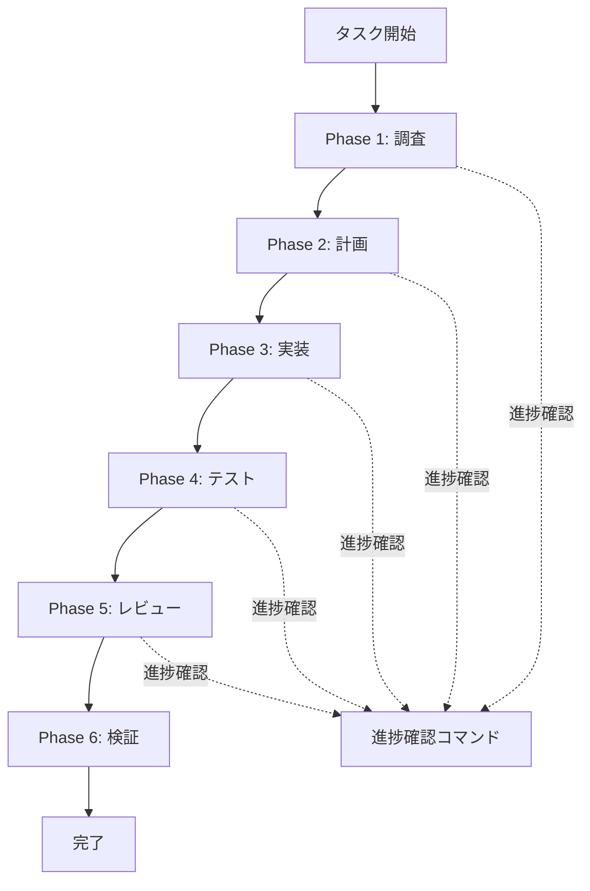

# 開発ワークフロー実践ガイド

Claude Codeを使用した日常的な開発フローの実践ガイド

---

## 📋 目次

1. [開発フローの全体像](#開発フローの全体像)
2. [フェーズ別詳細ガイド](#フェーズ別詳細ガイド)
3. [シナリオ別ワークフロー](#シナリオ別ワークフロー)
4. [ベストプラクティス](#ベストプラクティス)
5. [トラブルシューティング](#トラブルシューティング)

---

## 開発フローの全体像

### 標準開発サイクル



### 各フェーズの目的

| フェーズ | コマンド | 目的 | 成果物 |
|---------|----------|------|--------|
| 調査 | `/research` | 既存コードの理解 | 調査結果 |
| 計画 | `/think` | SOW作成 | SOW文書 |
| 実装 | `/code` | TDD実装 | コード + テスト |
| テスト | `/test` | 動作検証 | テスト結果 |
| レビュー | `/review` | 品質確認 | レビュー結果 |
| 検証 | `/validate` | 適合性確認 | 検証レポート |

---

## フェーズ別詳細ガイド

### Phase 1: 調査（/research）

#### 目的

- 既存コードベースの理解
- 関連するコンポーネント/機能の把握
- 技術的な制約や依存関係の確認

#### 実行手順

**1. コマンド実行**

```bash
/research "調査したい内容や問題の説明"
```

**2. 調査範囲の明確化**

AIが以下を確認：

- 調査対象のファイル/ディレクトリ
- 探索する観点
- 調査の深さ

**3. 並列調査実行**

Taskエージェントが自動的に：

- ファイルパターンの検索
- コード構造の分析
- 依存関係の追跡

**4. 結果の確認**

- 発見した情報の整理
- 次のステップへの影響評価

#### 出力例

```text
調査結果:

【対象コンポーネント】
- components/UserProfile/index.tsx
- hooks/useUserData.ts
- api/users.ts

【依存関係】
- React Query (データフェッチ)
- Zod (バリデーション)
- TailwindCSS (スタイリング)

【技術的制約】
- TypeScript strict mode有効
- 既存のUserデータ型との互換性必須
```

#### ベストプラクティス

✅ **推奨**:

- 具体的な調査範囲を指定
- 問題の症状を詳しく記述
- 関連するエラーメッセージを含める

❌ **非推奨**:

- 曖昧すぎる指示
- 過度に広範囲の調査依頼

---

### Phase 2: 計画（/think）

#### 目的

- 検証可能なStatement of Work（SOW）の作成
- 受け入れ基準の明確化
- 実装アプローチの決定

#### 実行手順

**1. コマンド実行**

```bash
/think "実装する機能の説明"
```

**2. SOW生成**

AIが以下を生成：

- 機能概要
- 受け入れ基準（検証可能な形式）
- 技術的アプローチ
- 成功メトリクス

**3. TodoWrite統合**

自動的にタスクリストを作成：

- 実装ステップ
- テスト項目
- 検証ポイント

**4. SOW文書の保存**

`.claude/workspace/sow/[timestamp]-[task].md` に保存

#### SOW文書の構造

```markdown
# [機能名] Statement of Work

## 概要
[機能の簡潔な説明]

## 受け入れ基準
- [ ] 基準1: [検証可能な条件]
- [ ] 基準2: [検証可能な条件]
- [ ] 基準3: [検証可能な条件]

## 技術的アプローチ
- 使用技術: [ライブラリ/フレームワーク]
- 設計パターン: [採用するパターン]
- テスト戦略: [テストの種類と範囲]

## 成功メトリクス
- パフォーマンス: [基準値]
- テストカバレッジ: [目標値]
- コード品質: [品質指標]

## 実装計画
1. [ステップ1]
2. [ステップ2]
3. [ステップ3]
```

#### ベストプラクティス

✅ **推奨**:

- 受け入れ基準は測定可能に
- 技術的制約を明記
- テスト計画を含める

❌ **非推奨**:

- 曖昧な基準（「良い感じに」など）
- 検証方法のない要件

---

### Phase 3: 実装（/code）

#### 目的

- TDD/RGRCサイクルによる実装
- SOLID原則の適用
- 高品質なコードの作成

#### TDD/RGRCサイクル

```text
🔴 Red    - 失敗するテストを書く
  ↓
🟢 Green  - テストをパスする最小限の実装
  ↓
🔵 Refactor - コードを改善
  ↓
💾 Commit - 変更をコミット
  ↓
（繰り返し）
```

#### 実行手順

**1. コマンド実行**

```bash
/code
```

**2. テストファースト**

まずテストを作成：

```typescript
// UserProfile.test.tsx
describe('UserProfile', () => {
  it('ユーザー名を表示する', () => {
    // 🔴 Red: まだ実装がないので失敗
    render(<UserProfile userId="123" />);
    expect(screen.getByText('John Doe')).toBeInTheDocument();
  });
});
```

**3. 最小実装**

テストをパスする最小限のコード：

```typescript
// UserProfile.tsx
export const UserProfile = ({ userId }: Props) => {
  // 🟢 Green: テストをパスする最小限
  return <div>John Doe</div>;
};
```

**4. リファクタリング**

コードを改善：

```typescript
// UserProfile.tsx
export const UserProfile = ({ userId }: Props) => {
  // 🔵 Refactor: 実際のデータフェッチに改善
  const { data } = useUserData(userId);
  return <div>{data.name}</div>;
};
```

**5. コミット**

```bash
git add .
git commit -m "feat: ユーザープロフィール表示機能を追加"
```

#### 適用される開発原則

**オッカムの剃刀**

- 最もシンプルな解決策から開始
- 必要になるまで複雑さを追加しない

**プログレッシブエンハンスメント**

- 基本機能を最初に実装
- 段階的に機能を追加

**Container/Presentational パターン**

```typescript
// Container (ロジック)
export const UserProfileContainer = ({ userId }: Props) => {
  const { data, isLoading } = useUserData(userId);

  if (isLoading) return <Spinner />;
  return <UserProfileView user={data} />;
};

// Presentational (UI)
export const UserProfileView = ({ user }: Props) => {
  return (
    <div className="profile">
      <h2>{user.name}</h2>
      <p>{user.email}</p>
    </div>
  );
};
```

#### ベストプラクティス

✅ **推奨**:

- 小さなステップで進める（1機能ずつ）
- 各ステップでテストをパス
- こまめにコミット（1機能1コミット）
- 可読性を最優先

❌ **非推奨**:

- 複数機能の同時実装
- テストなしの実装
- 巨大なコミット

---

### Phase 4: テスト（/test）

#### 目的

- 実装した機能の動作検証
- 回帰テストの実行
- テストカバレッジの確認

#### 実行手順

**1. コマンド実行**

```bash
/test
```

**2. テストコマンドの自動検出**

AIが以下から自動検出：

- `package.json` の scripts
- プロジェクトの設定ファイル

**3. テスト実行**

実行されるテストタイプ：

- ユニットテスト
- 統合テスト
- E2Eテスト（必要に応じて）

**4. UI変更時のブラウザテスト**

UI変更がある場合：

- ブラウザでの視覚確認
- インタラクション確認
- レスポンシブデザイン確認

#### テストタイプ別ガイド

**ユニットテスト**

```typescript
// 単一関数/コンポーネントのテスト
describe('calculateTotal', () => {
  it('商品の合計金額を計算する', () => {
    const items = [
      { price: 100, quantity: 2 },
      { price: 200, quantity: 1 }
    ];
    expect(calculateTotal(items)).toBe(400);
  });
});
```

**統合テスト**

```typescript
// 複数コンポーネントの連携テスト
describe('UserProfileFlow', () => {
  it('ユーザー情報を取得して表示する', async () => {
    render(<UserProfileContainer userId="123" />);

    // API呼び出しを待つ
    await waitFor(() => {
      expect(screen.getByText('John Doe')).toBeInTheDocument();
    });
  });
});
```

**E2Eテスト**

```typescript
// ユーザーシナリオ全体のテスト
describe('Profile Edit Flow', () => {
  it('プロフィール編集から保存まで', async () => {
    // 1. プロフィールページを開く
    await page.goto('/profile');

    // 2. 編集ボタンをクリック
    await page.click('[data-testid="edit-button"]');

    // 3. 名前を変更
    await page.fill('[name="name"]', 'Jane Doe');

    // 4. 保存
    await page.click('[data-testid="save-button"]');

    // 5. 変更が反映されたことを確認
    expect(await page.textContent('.profile-name')).toBe('Jane Doe');
  });
});
```

#### ベストプラクティス

✅ **推奨**:

- テストは独立して実行可能に
- テストデータはモックを使用
- エラーケースもテスト
- テストカバレッジ80%以上を目指す

❌ **非推奨**:

- テスト間の依存関係
- 本番データへのアクセス
- 遅いテスト（ユニットは<100ms目標）

---

### Phase 5: レビュー（/review）

#### 目的

- コード品質の多次元チェック
- 潜在的な問題の早期発見
- ベストプラクティスの適用確認

#### 実行手順

**1. コマンド実行**

```bash
/review
```

**2. 自動エージェント選択**

14のエージェントが3フェーズで実行：

**Phase 1: 基礎レビュー**

- structure-reviewer: コード構造
- readability-reviewer: 可読性
- root-cause-reviewer: 根本的問題
- progressive-enhancer: CSS-first確認

**Phase 2: 品質レビュー**

- type-safety-reviewer: 型安全性
- design-pattern-reviewer: パターン
- testability-reviewer: テスト容易性
- document-reviewer: ドキュメント（.md検出時）

**Phase 3: 本番対応レビュー**

- performance-reviewer: パフォーマンス
- security-review (skill): セキュリティ
- accessibility-reviewer: アクセシビリティ

**3. 結果統合**

review-orchestratorが：

- 全エージェントの結果を統合
- 優先度付け（Critical/High/Medium/Low）
- 実行可能な改善提案を生成

#### レビュー結果の読み方

```text
━━━━━━━━━━━━━━━━━━━━━━━━━━━━━━━━━━━━━━━━━━━━
📊 コードレビュー結果
━━━━━━━━━━━━━━━━━━━━━━━━━━━━━━━━━━━━━━━━━━━━

🔴 Critical Issues (0)
なし

🟠 High Priority (2)
1. [type-safety] any型の使用を避ける
   📍 src/components/UserProfile/index.tsx:42
   💡 提案: User型を明示的に定義

2. [security] XSS脆弱性の可能性
   📍 src/components/Comment/index.tsx:18
   💡 提案: dangerouslySetInnerHTMLの代わりにテキストノードを使用

🟡 Medium Priority (5)
...

🟢 Low Priority (3)
...

━━━━━━━━━━━━━━━━━━━━━━━━━━━━━━━━━━━━━━━━━━━━
✅ 総合評価: B (改善推奨)
━━━━━━━━━━━━━━━━━━━━━━━━━━━━━━━━━━━━━━━━━━━━
```

#### 優先度別対応方針

| 優先度 | 対応タイミング | 対応方針 |
|--------|--------------|----------|
| Critical | 即座 | マージ前に必ず修正 |
| High | 24時間以内 | 次のコミットで修正 |
| Medium | 1週間以内 | バックログに追加 |
| Low | 任意 | リファクタリング時に検討 |

#### ベストプラクティス

✅ **推奨**:

- コミット前に必ずレビュー実行
- Criticalは必ず修正
- Highも可能な限り修正
- レビュー結果をチームで共有

❌ **非推奨**:

- レビューのスキップ
- 警告の無視
- 「後で直す」の繰り返し

---

### Phase 6: 検証（/validate）

#### 目的

- SOWで定義した受け入れ基準の達成確認
- 最終品質チェック
- リリース準備の完了確認

#### 実行手順

**1. コマンド実行**

```bash
/validate
```

**2. 検証項目**

**受け入れ基準**

- SOWで定義した全基準の達成確認
- 各基準の検証方法の実行

**テストカバレッジ**

- ユニットテスト: 80%以上
- 統合テスト: 主要フローをカバー
- E2Eテスト: クリティカルパスをカバー

**パフォーマンス基準**

- ページロード時間
- レンダリング性能
- バンドルサイズ

**セキュリティチェック**

- 既知の脆弱性なし
- セキュリティベストプラクティス適用

**3. 検証レポート生成**

```text
━━━━━━━━━━━━━━━━━━━━━━━━━━━━━━━━━━━━━━━━━━━━
📋 SOW検証レポート
━━━━━━━━━━━━━━━━━━━━━━━━━━━━━━━━━━━━━━━━━━━━

✅ 受け入れ基準: 5/5 達成
  ✅ ユーザープロフィール表示
  ✅ プロフィール編集機能
  ✅ アバター画像アップロード
  ✅ レスポンシブデザイン
  ✅ アクセシビリティ対応

✅ テストカバレッジ: 85% (目標: 80%)
  ✅ ユニットテスト: 42/45 passed
  ✅ 統合テスト: 8/8 passed
  ✅ E2Eテスト: 3/3 passed

✅ パフォーマンス: 基準内
  ✅ ページロード: 1.2s (基準: <2s)
  ✅ FCP: 0.8s (基準: <1s)
  ✅ バンドル: 245KB (基準: <300KB)

✅ セキュリティ: 問題なし
  ✅ XSS対策実装済み
  ✅ CSRF対策実装済み
  ✅ 依存関係に脆弱性なし

━━━━━━━━━━━━━━━━━━━━━━━━━━━━━━━━━━━━━━━━━━━━
🎉 検証結果: 合格 - リリース可能
━━━━━━━━━━━━━━━━━━━━━━━━━━━━━━━━━━━━━━━━━━━━
```

#### ベストプラクティス

✅ **推奨**:

- すべての基準が達成されるまで反復
- 検証失敗時は原因を特定して修正
- チームで検証結果をレビュー

❌ **非推奨**:

- 基準未達成でのリリース
- 検証のスキップ
- 「たぶん大丈夫」の判断

---

### 進捗確認（/sow）

#### いつでも使用可能

開発中いつでも実行して進捗を確認。

```bash
/sow
```

#### 出力例

```text
━━━━━━━━━━━━━━━━━━━━━━━━━━━━━━━━━━━━━━━━━━━━
📊 SOW進捗状況
━━━━━━━━━━━━━━━━━━━━━━━━━━━━━━━━━━━━━━━━━━━━

タスク: ユーザープロフィール機能
作成日時: 2025-09-30 10:00

受け入れ基準: 3/5 完了 (60%)
  ✅ ユーザープロフィール表示
  ✅ プロフィール編集機能
  ✅ アバター画像アップロード
  ⏳ レスポンシブデザイン (進行中)
  ⬜ アクセシビリティ対応

実装進捗:
  ✅ Phase 1: 調査完了
  ✅ Phase 2: 計画完了
  ✅ Phase 3: 実装完了
  ⏳ Phase 4: テスト中
  ⬜ Phase 5: レビュー待ち
  ⬜ Phase 6: 検証待ち

現在のフォーカス:
  📍 レスポンシブデザインのテスト作成

━━━━━━━━━━━━━━━━━━━━━━━━━━━━━━━━━━━━━━━━━━━━
```

---

## シナリオ別ワークフロー

### シナリオ1: 新規機能開発

#### 状況

新しい機能をゼロから開発する

#### 推奨フロー

```text
1. /research
   目的: 関連する既存コードを理解

2. /think
   目的: 検証可能なSOWを作成

3. /code
   目的: TDD/RGRCで実装

   ↓ 各実装ステップで

4. /test
   目的: テストを実行・確認

   ↓ 実装完了後

5. /review
   目的: コード品質を確認

6. /validate
   目的: SOW基準の達成を確認
```

#### 所要時間目安

- 小規模機能: 2-4時間
- 中規模機能: 1-2日
- 大規模機能: 3-5日

---

### シナリオ2: バグ修正

#### 状況

既存コードのバグを修正する

#### 推奨フロー

```text
1. /research
   目的: バグの原因を特定

2. /fix
   目的: 素早く修正
   （内部で think → code → test を実行）
```

#### 所要時間目安

- 単純なバグ: 15-30分
- 複雑なバグ: 1-3時間

#### ベストプラクティス

- 再現手順を明確にする
- テストケースを追加する
- 根本原因を記録する

---

### シナリオ3: 緊急対応（本番障害）

#### 状況

本番環境で問題が発生、即座の対応が必要

#### 推奨フロー

```text
/hotfix
（最小プロセスで修正）

タイムボックス:
- 5分: トリアージ
- 15分: 修正
- 10分: テスト
```

#### 所要時間目安

- 最大30分

#### 注意事項

⚠️ **必須**:

- ロールバック計画を用意
- 修正後に詳細な調査
- 再発防止策の検討

---

### シナリオ4: リファクタリング

#### 状況

既存コードの品質改善

#### 推奨フロー

```text
1. /review
   目的: 現状の問題点を特定

2. /think
   目的: リファクタリング計画を立てる

3. /code
   目的: 段階的にリファクタリング
   （各ステップでテストがパスすることを確認）

4. /test
   目的: 既存機能が壊れていないことを確認

5. /review
   目的: 改善を確認
```

#### 所要時間目安

- 単一ファイル: 30分-1時間
- 複数ファイル: 2-4時間
- モジュール全体: 1-2日

---

### シナリオ5: コードレビュー（レビュアー視点）

#### 状況

他の開発者のコードをレビューする

#### 推奨フロー

```text
1. /review
   目的: 自動レビューを実行

2. レビュー結果を確認
   - Critical/High issuesを重点的に
   - コード全体の一貫性をチェック

3. 手動レビュー
   - ビジネスロジックの妥当性
   - テストの網羅性
   - ドキュメントの適切性

4. フィードバック
   - 具体的な改善提案
   - 優先度の明示
```

---

## ベストプラクティス

### コミット戦略

#### コミットメッセージ

**Conventional Commits形式を推奨**

```text
<type>: <subject>

<body>

<footer>
```

**Type一覧**:

- `feat`: 新機能
- `fix`: バグ修正
- `refactor`: リファクタリング
- `test`: テスト追加/修正
- `docs`: ドキュメント
- `style`: コードフォーマット
- `perf`: パフォーマンス改善
- `chore`: ビルド/ツール変更

**例**:

```text
feat: ユーザープロフィール表示機能を追加

- プロフィールコンポーネントを実装
- ユーザーデータフェッチ用カスタムフックを追加
- レスポンシブデザイン対応

Closes #123
```

#### コミット粒度

✅ **推奨**:

- 1機能 = 1コミット
- テストとコードを同時にコミット
- 動作する状態でコミット

❌ **非推奨**:

- 複数機能の混在
- 動作しない状態でのコミット
- 「WIP」の乱用

---

### テスト戦略

#### テストピラミッド

```text
       /\
      /E2E\      少ない（クリティカルパスのみ）
     /------\
    / 統合  \    中程度（主要なフロー）
   /----------\
  / ユニット  \  多い（すべての関数/コンポーネント）
 /--------------\
```

#### カバレッジ目標

- **ユニットテスト**: 80%以上
- **統合テスト**: 主要フローをカバー
- **E2Eテスト**: クリティカルパスをカバー

#### テスト作成のタイミング

**TDDアプローチ（推奨）**:

```text
1. テストを先に書く（Red）
2. 実装する（Green）
3. リファクタリング（Refactor）
```

**後からテスト（非推奨だが現実的な場合）**:

```text
1. 実装
2. すぐにテストを書く（同じコミットで）
```

---

### レビュー戦略

#### セルフレビュー

コミット前に必ず実行：

```bash
/review
```

#### チームレビュー

PR作成前に確認：

- `/review` の結果を共有
- Critical/Highは必ず修正
- Mediumも可能な限り対応

#### レビューのタイミング

- **コミット前**: セルフレビュー
- **PR作成前**: 最終レビュー
- **定期的**: 週次でコードベース全体

---

### 進捗管理

#### SOWの活用

**作成時**:

```bash
/think "機能の説明"
```

**進捗確認時**:

```bash
/sow
```

**完了検証時**:

```bash
/validate
```

#### タスク分割

大きなタスクは小さく分割：

❌ **悪い例**:

```text
- ユーザー管理機能を実装
```

✅ **良い例**:

```text
- ユーザー一覧表示機能
- ユーザー詳細表示機能
- ユーザー登録機能
- ユーザー編集機能
- ユーザー削除機能
```

---

## トラブルシューティング

### よくある問題と解決策

#### 問題1: テストが失敗する

**症状**: `/test` 実行時にテストが失敗

**原因**:

- 実装の不具合
- テストの不備
- 環境の問題

**解決策**:

1. エラーメッセージを確認
2. 失敗しているテストを特定
3. テストをデバッグモードで実行
4. 必要に応じて `/fix` で修正

---

#### 問題2: レビューで多数の警告

**症状**: `/review` で大量のissueが報告される

**原因**:

- コード品質の低下
- ベストプラクティス未適用
- 複雑度の増加

**解決策**:

1. Criticalから順に対応
2. 似た問題はまとめて修正
3. リファクタリングを検討
4. チームで品質基準を再確認

---

#### 問題3: SOW検証が失敗

**症状**: `/validate` で基準未達成

**原因**:

- 受け入れ基準の誤解
- 実装の不完全
- テスト不足

**解決策**:

1. 未達成の基準を確認
2. SOWを再確認
3. 不足している実装を追加
4. テストを追加
5. 再度 `/validate` 実行

---

#### 問題4: パフォーマンスの低下

**症状**: レスポンスが遅い、レンダリングが重い

**原因**:

- 不要な再レンダリング
- 重い計算処理
- バンドルサイズの増加

**解決策**:

1. `/review` でパフォーマンス問題を確認
2. React DevToolsでプロファイリング
3. メモ化（useMemo/useCallback）の適用
4. コード分割の検討
5. 再度 `/test` でパフォーマンス確認

---

### エラーメッセージ別対処法

#### "Understanding Level < 95%"

**意味**: AIがタスクを十分に理解できていない

**対処**:

- より詳細な説明を提供
- 関連ファイルのパスを指定
- 具体的な例を示す

---

#### "Test Coverage Below Target"

**意味**: テストカバレッジが目標未達

**対処**:

1. カバレッジレポートを確認
2. 未カバーの箇所を特定
3. テストを追加
4. 再度 `/test` 実行

---

#### "Critical Security Issue Found"

**意味**: 重大なセキュリティ問題を検出

**対処**:

1. すぐに作業を停止
2. 問題の詳細を確認
3. `/fix` で修正
4. セキュリティレビューを実施
5. チームに報告

---

## まとめ

### 開発フローのチェックリスト

毎回の開発で確認：

```markdown
Phase 1: 調査
□ `/research` で既存コードを理解
□ 依存関係を把握
□ 技術的制約を確認

Phase 2: 計画
□ `/think` でSOWを作成
□ 受け入れ基準を明確化
□ 実装計画を立案

Phase 3: 実装
□ `/code` でTDD実装
□ 小さなステップで進める
□ こまめにコミット

Phase 4: テスト
□ `/test` でテスト実行
□ カバレッジを確認
□ 全テストがパス

Phase 5: レビュー
□ `/review` で品質確認
□ Critical/High issueを修正
□ コード規約に準拠

Phase 6: 検証
□ `/validate` でSOW確認
□ 全基準を達成
□ リリース準備完了

進捗確認
□ `/sow` で定期的に確認
□ チームと進捗共有
```

### 推奨される開発リズム

**毎日**:

- `/sow` で進捗確認
- `/review` でコード品質確認

**機能完了時**:

- `/validate` で基準達成確認

**週次**:

- コードベース全体のレビュー
- テクニカルデットの確認

### 次のステップ

1. **チームでの導入**
   - このガイドをチームで共有
   - ワークフローを統一
   - 定期的な振り返り

2. **カスタマイズ**
   - プロジェクト固有の要件を追加
   - チーム独自のベストプラクティスを統合

3. **継続的改善**
   - ワークフローの効果を測定
   - 問題点を特定して改善
   - 新しい知見を共有

---

*最終更新: 2025-09-30*
*作成者: Claude Code System*
*バージョン: 1.0*
