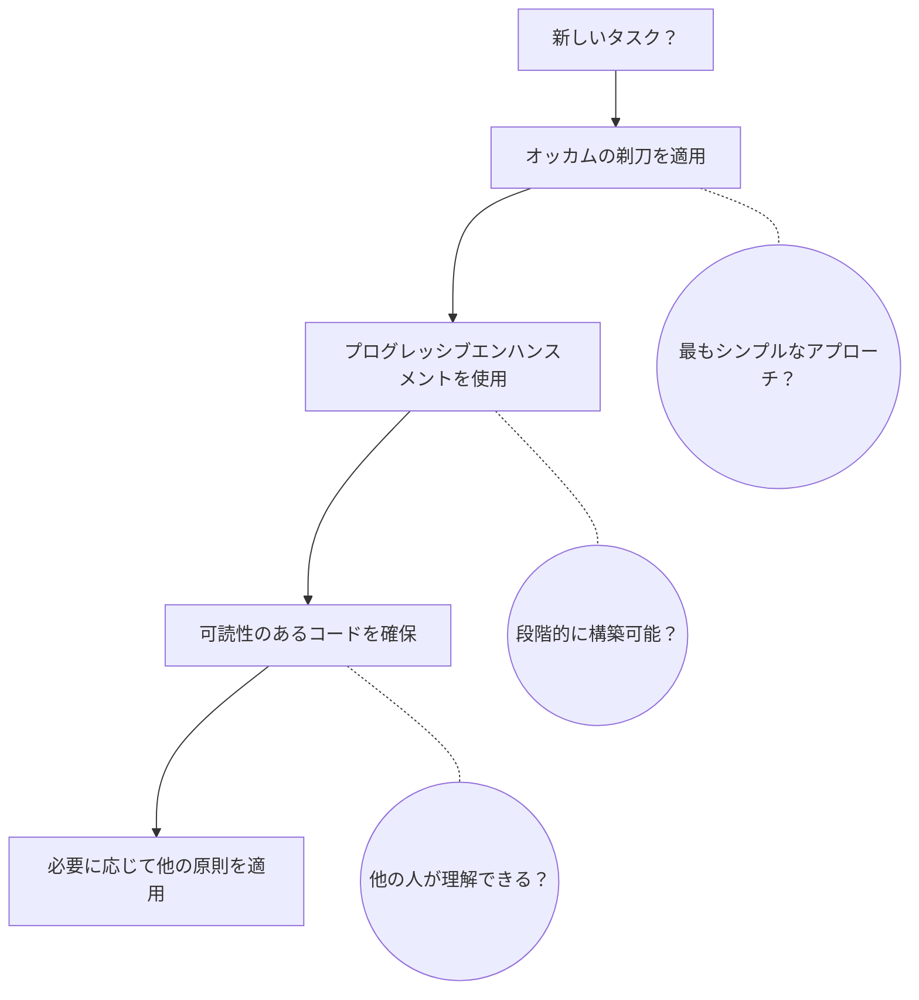

# 原則適用ガイド

> 即座のニーズにはクイックリファレンスを。深い理解には詳細ガイドを読んでください。

---

## クイックリファレンス

### 優先度マトリックス

| 優先度 | 原則 | 一言で | いつ適用するか |
| --- | --- | --- | --- |
| [Critical] **必須** | | | |
| | オッカムの剃刀 | 動作する最もシンプルな解決策を選ぶ | 常に - すべての決定で |
| | プログレッシブエンハンスメント | シンプルに構築、段階的に強化 | 実装開始時 |
| [Default] **デフォルト** | | | |
| | 可読性のあるコード | コンピュータではなく人間のために書く | コードを書く時 |
| | TDD/Baby Steps | テストと共に小さな増分変更 | 開発プロセス |
| | DRY | 繰り返すな | 3回以上の重複発見時 |
| [Contextual] **状況依存** | | | |
| | SOLID | 変更に強い設計 | 大規模アーキテクチャ |
| | Container/Presentational | ロジックとUIを分離 | React/UIコンポーネント |
| | デメテルの法則 | 直接の友達とだけ話す | 複雑な依存関係 |
| | 漏れのある抽象化 | 不完全な抽象化を受け入れる | 抽象化の評価時 |
| | AI支援開発 | AIが生成、人間が検証 | AIツール使用時 |
| | TIDYINGS | 開発しながら整理 | 開発中 |

### 判断フロー



### 競合の解決

| 競合 | 解決 | 例 |
| --- | --- | --- |
| **DRY vs 可読性** | 可読性が優先 | 抽象化が明確さを損なうなら重複を受け入れる |
| **SOLID vs シンプル** | シンプルが優先 | 想像上の未来のために過度な設計をしない |
| **完璧 vs 動作** | 動作が優先 | 実際の問題を解決する漏れのある抽象化を出荷 |
| **抽象 vs 具体** | 具体から開始 | パターンが現れた時（3回以上）のみ抽象化 |

### 危険信号

- メソッドチェーン > 3レベル → デメテルの法則を適用
- 1分で理解できない → 可読性のあるコードを適用
- 「念のため」実装 → YAGNIを思い出す
- 完璧な抽象化の試み → 漏れのある抽象化を受け入れる
- 複雑な解決策が最初 → オッカムの剃刀を適用
- レビューなしでAI出力を受け入れる → AI支援開発を適用

### クイックコマンド

| 状況 | コマンド | 適用される原則 |
| --- | --- | --- |
| バグ修正 | `/fix` | オッカムの剃刀、プログレッシブエンハンスメント |
| 新機能 | `/research → /think → /code` | TDD、Baby Steps、SOLID |
| リファクタリング | `/research → /code` | TIDYINGS、DRY、可読性のあるコード |

---

## 詳細ガイド

### 原則階層の理解

原則は適用頻度と影響に基づいて階層を形成します：

#### レベル1：普遍的原則（常にアクティブ）

**オッカムの剃刀**はメタ原則として機能します。アーキテクチャから変数名まで、すべての決定はこのフィルターを通すべきです：「これは問題を解決する最もシンプルな解決策か？」

**プログレッシブエンハンスメント**は私たちのアプローチを定義します。完全な解決策を前もって構築しない。推測ではなく実際のニーズに基づいて、最小限の実装から始めて強化します。

#### レベル2：プロセス原則（デフォルトワークフロー）

**可読性のあるコード**はチーム協働において譲れません。新しいチームメンバーが1分以内にコードを理解できなければ、簡素化が必要です。

**TDD/Baby Steps**は開発リズムを構造化します。Red → Green → Refactor → Commit。各サイクルは時間ではなく分で完了すべきです。

**DRY**はメンテナンスの悪夢を防ぎますが、パターンが現れた後にのみ適用されます。3の法則：1回目は書く；2回目は重複を記録；3回目に抽象化。

#### レベル3：文脈的原則（特定の状況）

これらの原則はコンテキストに基づいて有効化されます：

- **SOLID** - 進化するシステムを設計する時
- **Container/Presentational** - UIコンポーネントを構築する時
- **デメテルの法則** - 結合が問題になった時
- **漏れのある抽象化** - フレームワークの選択を評価する時
- **TIDYINGS** - コード品質が低下した時

### 原則依存グラフ

原則がどのように関連し、互いに構築されているかを理解することで、一貫して適用できます：

```mermaid
graph TD
    %% メタ原則をトップに
    OR[オッカムの剃刀<br/>メタ原則<br/>'最もシンプルな解決策が勝つ']

    %% レベル1: 普遍的原則
    OR -->|影響を与える| PE[プログレッシブ<br/>エンハンスメント<br/>'シンプルに構築<br/>→ 強化']
    OR -->|影響を与える| RC[可読性のあるコード<br/>'人間のための<br/>コード']
    OR -->|影響を与える| DRY[DRY<br/>"繰り返すな"]

    %% 可読性のあるコードをサポートする原則
    RC -->|サポートされる| ML[ミラーの法則<br/>'7±2の認知<br/>限界']

    %% レベル2: 適用された実践（プログレッシブエンハンスメントから）
    PE -->|通知する| TDD[TDD/Baby Steps<br/>'Red-Green-<br/>Refactor']

    %% レベル2: 適用された実践（可読性のあるコード & DRYから）
    RC -->|通知する| CP[Container/<br/>Presentational<br/>'ロジックとUIを<br/>分離']
    DRY -->|通知する| TIDY[TIDYINGS<br/>'開発しながら<br/>整理']

    %% 別の階層としてのSOLID
    SOLID[SOLID<br/>原則<br/>'変更のための<br/>設計']
    OR -->|バランス| SOLID
    SOLID -->|通知する| CP
    SOLID -->|通知する| LOD[デメテルの法則<br/>'直接の友達<br/>とだけ話す']

    %% 漏れのある抽象化
    OR -->|受け入れる| LA[漏れのある<br/>抽象化<br/>'実用的 over<br/>完璧']

    %% 異なる原則タイプのスタイリング
    classDef metaPrinciple fill:#ff6b6b,stroke:#c92a2a,stroke-width:3px,color:#fff
    classDef universalPrinciple fill:#4dabf7,stroke:#1971c2,stroke-width:2px,color:#fff
    classDef appliedPractice fill:#51cf66,stroke:#2f9e44,stroke-width:2px,color:#fff
    classDef contextual fill:#ffd43b,stroke:#fab005,stroke-width:2px,color:#000
    classDef scientific fill:#e599f7,stroke:#ae3ec9,stroke-width:2px,color:#fff

    class OR metaPrinciple
    class PE,RC,DRY universalPrinciple
    class TDD,CP,TIDY,LOD,LA appliedPractice
    class SOLID contextual
    class ML scientific
```

**グラフの凡例:**

- **赤（メタ原則）**: オッカムの剃刀 - すべての複雑さに疑問を投げかける
- **青（普遍的）**: デフォルトですべての決定に適用
- **緑（適用された実践）**: 具体的な実装パターン
- **黄（文脈的）**: 状況が要求する時に適用
- **紫（科学的）**: 認知科学的裏付け

**主要な関係:**

1. **オッカムの剃刀 → すべて**: すべての複雑さに疑問を投げかけるメタ原則
2. **オッカムの剃刀 → プログレッシブエンハンスメント**: シンプルに始め、必要な時のみ複雑さを追加
3. **オッカムの剃刀 → DRY**: 抽象化（DRY）とシンプルさ（オッカムの剃刀）のバランス
4. **オッカムの剃刀 ⟷ SOLID**: バランス関係 - 構造のためのSOLID、過度な設計を防ぐオッカムの剃刀
5. **プログレッシブエンハンスメント → TDD/Baby Steps**: 両方とも段階的開発を強調
6. **可読性のあるコード → ミラーの法則**: 可読性限界（7±2項目）の認知科学的裏付け
7. **SOLID → Container/Presentational**: SRP（単一責任原則）がUI/ロジック分離を駆動
8. **SOLID → デメテルの法則**: 両方とも依存関係と結合を管理
9. **可読性のあるコード + DRY → TIDYINGS**: コードをクリーンに保つ実践的適用
10. **オッカムの剃刀 → 漏れのある抽象化**: シンプルさのために不完全な抽象化を受け入れる

**このグラフの使い方:**

- **開始点**: すべての決定でオッカムの剃刀（赤）から始める
- **構築**: 普遍的原則（青）を適用 - プログレッシブエンハンスメント、可読性のあるコード、DRY
- **実装**: 適用された実践（緑）を使用 - TDD、Container/Presentational、TIDYINGS
- **特定の文脈**: 文脈的原則（黄）を適用 - 必要な時のみSOLID、デメテルの法則
- **競合解決**: 原則が競合する時は、トップのオッカムの剃刀まで遡る

### 実践的な適用シナリオ

#### シナリオ1：新機能の開始

```markdown
1. プログレッシブエンハンスメントの考え方から始める
   - 価値を提供する最もシンプルなバージョンは何か？
   - これを段階的に出荷できるか？

2. TDD/Baby Stepsを適用
   - 最もシンプルな失敗するテストを書く
   - パスする最小限のコードを実装
   - 明確さが向上する場合のみリファクタリング

3. 可読性のあるコードをチェック
   - 新しい開発者はこれを理解できるか？
   - 名前は自己文書化されているか？

4. 以下の場合のみSOLIDを検討：
   - 複数のチームがこれを拡張する
   - 要件が明示的に将来の変更に言及している
   - パブリックAPIを構築している
```

#### シナリオ2：レガシーコードの修正

```markdown
1. まずオッカムの剃刀
   - 問題を修正する最小限の変更は何か？
   - 再構築を避けられるか？

2. TIDYINGSを適用
   - 触れたものだけをきれいにする
   - コードベースを完璧ではなく、より良くする

3. DRYを慎重に検討
   - 重複は実際に有害か？
   - 抽象化はデバッグを困難にするか？

4. 漏れのある抽象化を受け入れる
   - フレームワークの制限を修正しない
   - それらと協力し、文書化する
```

#### シナリオ3：コードレビューチェックリスト

```typescript
// 各原則について尋ねる：

// ✓ オッカムの剃刀
これを達成するもっとシンプルな方法はあるか？

// ✓ プログレッシブエンハンスメント
これをより小さな部分で出荷できるか？

// ✓ 可読性のあるコード
コンテキストなしでこれを理解できるか？

// ✓ DRY
この重複は実際に問題か？

// ✓ デメテルの法則
obj.method()           // ✓ 良い
obj.prop.method()      // ⚠️ 疑問
obj.prop.prop.method() // ✗ リファクタリング

// ✓ 漏れのある抽象化
フレームワークと戦っているか、協力しているか？
```

### 原則の深掘り

#### 原則が競合する時

**DRY vs 可読性のあるコード**

```typescript
// Bad: DRYを取りすぎた
const processData = (data, mode) => {
  return mode === 'user'
    ? data.filter(x => x.active).map(x => ({...x, type: 'user'}))
    : data.filter(x => x.enabled).map(x => ({...x, type: 'admin'}))
}

// Good: 可読な重複
const processUsers = (users) => {
  return users
    .filter(user => user.active)
    .map(user => ({...user, type: 'user'}))
}

const processAdmins = (admins) => {
  return admins
    .filter(admin => admin.enabled)
    .map(admin => ({...admin, type: 'admin'}))
}
```

**SOLID vs オッカムの剃刀**

```typescript
// Bad: シンプルなニーズに対するSOLIDの過度な設計
interface DataProcessor { process(data: Data): Result }
class UserProcessor implements DataProcessor { }
class ProcessorFactory { }
class ProcessorRegistry { }

// Good: 現在のニーズに対するシンプルな解決策
function processUser(user) {
  return { ...user, processed: true }
}
// 2番目のプロセッサが現れた時のみ抽象化を追加
```

#### 実践でのプログレッシブエンハンスメント

```typescript
// フェーズ1：動作させる（オッカムの剃刀）
function calculateTotal(items) {
  return items.reduce((sum, item) => sum + item.price, 0)
}

// フェーズ2：実際のエラーに遭遇（想像ではない）
function calculateTotal(items) {
  if (!items) return 0
  return items.reduce((sum, item) => sum + item.price, 0)
}

// フェーズ3：実際のパフォーマンス問題を測定
const calculateTotal = memo((items) => {
  if (!items) return 0
  return items.reduce((sum, item) => sum + item.price, 0)
})

// 注：各フェーズは実際のニーズが証明された後のみ
```

### コマンドとの統合

| コマンド | 主要原則 | 副次原則 |
| --- | --- | --- |
| `/think` | SOLID、オッカムの剃刀 | プログレッシブエンハンスメント |
| `/research` | - | コンテキストのためのすべての原則 |
| `/code` | TDD、Baby Steps | 可読性のあるコード、DRY、AI支援開発 |
| `/test` | TDD | デメテルの法則、AI支援開発 |
| `/fix` | オッカムの剃刀 | TIDYINGS |
| `/audit` | すべての原則 | 優先順位順 |

### 避けるべきアンチパターン

#### 完璧な抽象化の罠

```typescript
// Bad: 完璧な抽象化を作ろうとする
class AbstractDataProcessorFactoryBuilder<T> { }

// Good: 漏れを受け入れ、脱出口を提供
class DataProcessor {
  process(data) { }

  // 抽象化が漏れた時の脱出口
  processRaw(sql) { }
}
```

#### DRY狂信者

```typescript
// Bad: すべてを抽出
const TRUE = true
const FALSE = false
const ZERO = 0

// Good: 実用的なアプローチ
// 一部の重複は問題ない
// プログラミングリテラルではなくドメイン概念の定数
```

#### SOLID伝道者

```typescript
// Bad: すべてにインターフェース
interface IUserService { }
interface IUserRepository { }
interface IUserValidator { }
// それぞれ実装は1つだけ

// Good: 具体的に始め、必要時に抽象化
class UserService {
  // 2番目の実装が現れたらインターフェースを追加
}
```

### 成功の測定

原則を正しく適用している時：

- **コードレビューが速い** - レビュアーがすぐに理解
- **変更が局所的** - 修正が連鎖しない
- **デバッグが単純** - 問題が予想される場所にある
- **新機能が簡単** - コードベースが抵抗しない
- **テストがシンプル** - 複雑なモッキング不要

原則を過度に適用している時：

- **シンプルなタスクが複雑** - 過度な抽象化
- **すべてにインターフェース** - SOLID過剰摂取
- **どこにも重複がない** - DRY過激主義
- **完璧な抽象化の試み** - 漏れを無視
- **リファクタリングが終わらない** - TIDYINGS強迫観念

### 成長の道

成長するにつれて：

1. **初心者**：オッカムの剃刀と可読性のあるコードに集中
2. **中級者**：プログレッシブエンハンスメントとTDDを追加
3. **上級者**：SOLIDとデメテルの法則を文脈的に適用
4. **エキスパート**：いつ原則を破るかを知る

覚えておくこと：**原則はツールであり、ルールではない**。目標は原則への完璧な遵守ではなく、実際の問題を解決する動作し保守可能なソフトウェアです。

## 最後の知恵

> 「最良の原則は、いつ原則を適用しないかを知ることである」

迷った時：

1. 賢いより簡単を選ぶ
2. 抽象より具体を選ぶ
3. 完璧より動作を選ぶ
4. DRYより明確を選ぶ
5. 純粋より実用的を選ぶ

## 参照

### 中心文書

- [@~/.claude/skills/applying-code-principles/SKILL.md](~/.claude/skills/applying-code-principles/SKILL.md) - コア原則（オッカムの剃刀、SOLID、DRY、Miller's Law、YAGNI）
- [@./development/PROGRESSIVE_ENHANCEMENT.md](./development/PROGRESSIVE_ENHANCEMENT.md) - アプローチ
- [@./development/READABLE_CODE.md](./development/READABLE_CODE.md) - ベースライン

### すべての原則

- Skills: [@~/.claude/skills/applying-code-principles/SKILL.md](~/.claude/skills/applying-code-principles/SKILL.md) - SOLID、DRY、オッカムの剃刀
- Development: [@./development/](./development/) - すべての実践的原則
- Commands: [@../docs/COMMANDS.md](../docs/COMMANDS.md) - 統合されたワークフロー
