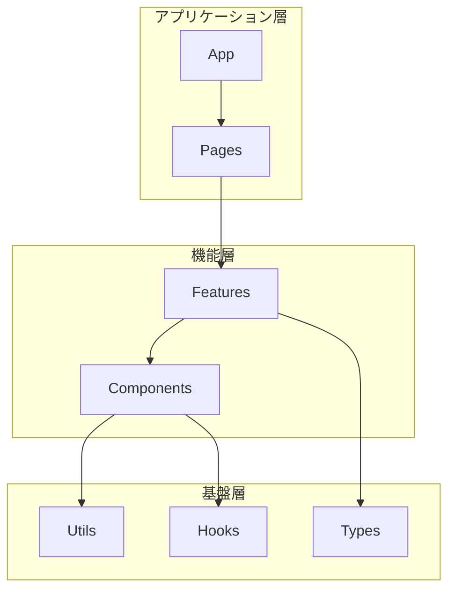
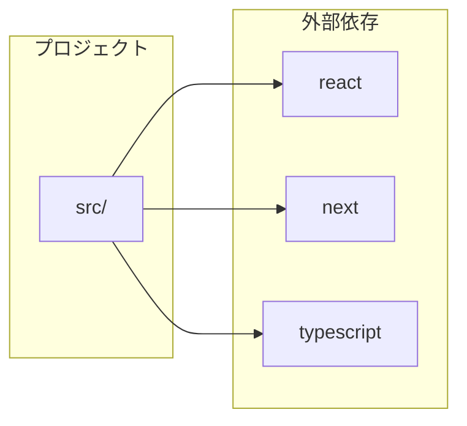

# docs:architecture - アーキテクチャ概要生成

## 概要

コードベースを解析し、アーキテクチャ概要ドキュメントを自動生成するスキル。

## 生成内容

1. **プロジェクト概要** - 技術スタック、フレームワーク検出
2. **ディレクトリ構造** - treeコマンドによる構造表示
3. **モジュール構成** - Mermaid図によるモジュール関係
4. **主要コンポーネント** - クラス・関数の一覧と統計
5. **依存関係** - 外部/内部依存の可視化
6. **統計情報** - ファイル数、行数、クラス数等

## 処理フロー

```text
Phase 1: 初期化
├── プロジェクトルート特定
├── 言語・フレームワーク検出
└── 解析対象ファイル収集

Phase 2: ディレクトリ構造解析
├── tree コマンドで構造取得
├── 主要ディレクトリ分類
└── ファイル種別判定

Phase 3: コード構造解析
├── tree-sitter-analyzer による解析
│   ├── クラス抽出
│   ├── 関数抽出
│   └── インポート抽出
└── 統計情報集計

Phase 4: 依存関係解析
├── import/export 文の解析
├── モジュール間関係マッピング
└── 外部依存関係特定

Phase 5: ドキュメント生成
├── Mermaid図生成
├── テンプレート埋め込み
└── Markdown出力
```

## 使用方法

```bash
# 基本使用
/docs architecture

# 特定ディレクトリを解析
/docs architecture src/

# 出力先を指定
/docs architecture --output docs/ARCHITECTURE.md
```

## 解析コマンド

### ディレクトリ構造取得

```bash
tree -L 3 -I 'node_modules|.git|dist|build|__pycache__|.venv|coverage|.next' --dirsfirst
```

### コード構造解析

```bash
# 各ファイルの構造解析
tree-sitter-analyzer {file} --structure --output-format json

# 統計情報取得
tree-sitter-analyzer {file} --statistics
```

### 依存関係抽出

```bash
# TypeScript/JavaScript
grep -r "^import\|^export" --include="*.ts" --include="*.tsx" --include="*.js"

# Python
grep -r "^import\|^from.*import" --include="*.py"
```

## 出力テンプレート

[テンプレートファイル](./assets/architecture-template.md)を参照。

## Mermaid図生成

### モジュール関係図



### 依存関係図



## スクリプト

| スクリプト | 用途 |
| --- | --- |
| `scripts/analyze-structure.sh` | ディレクトリ構造解析 |
| `scripts/extract-modules.sh` | モジュール情報抽出 |
| `scripts/generate-mermaid.sh` | Mermaid図生成 |

## エラーハンドリング

| エラー | 対処 |
| --- | --- |
| プロジェクトルート特定失敗 | カレントディレクトリを使用 |
| tree-sitter-analyzer未対応 | Grep/Readでフォールバック |
| 大規模プロジェクト | サンプリング解析（上位100ファイル） |

## Markdown検証

```bash
~/.claude/skills/scripts/validate-markdown.sh {output-file}
```

生成されたMarkdownのフォーマット問題を検証。非ブロッキング（警告のみ）。

## 出力例

生成されるドキュメントの例:

```markdown
# my-project - アーキテクチャ概要

**生成日時**: 2025-12-19 12:00
**解析対象**: /path/to/my-project

## 技術スタック

| カテゴリ | 技術 |
|---------|------|
| 言語 | TypeScript |
| フレームワーク | Next.js |
| テスト | Vitest |

## ディレクトリ構造

src/
├── app/
│   ├── layout.tsx
│   └── page.tsx
├── components/
│   ├── Button.tsx
│   └── Header.tsx
└── lib/
    └── utils.ts

## 統計情報

| 指標 | 値 |
|------|-----|
| 総ファイル数 | 45 |
| 総行数 | 3,200 |
| クラス数 | 12 |
| 関数数 | 85 |
```

## 関連ドキュメント

- エージェント: [@architecture-analyzer](../../agents/analyzers/architecture-analyzer.md)
- コマンド: [@/docs](../../commands/docs.md)
