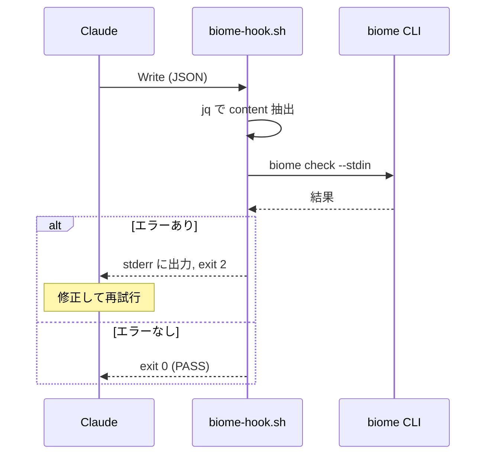

# SOW: biome-hook

Created: 2026-01-24
Status: draft

## Executive Summary

Claude Code の PreToolCall フックとして動作する、biome CLI ラッパー。Write/Edit 操作時にコードを検証し、問題があれば Claude に修正を促す。

Scope: シェルスクリプト実装, biome CLI 連携

## Problem Analysis

| ID    | Issue                              | Evidence                       | Confidence |
| ----- | ---------------------------------- | ------------------------------ | ---------- |
| I-001 | 現行 guardrails が動作していない   | バイナリ未ビルド, hooks 未設定 | [✓]        |
| I-002 | 正規表現ベースでは精度に限界がある | コメント内の誤検出等           | [✓]        |

## Solution Design

**シェルスクリプト + biome CLI** で実装。

| 当初案 | 採用案 | 理由 |
|--------|--------|------|
| Rust + biome crate | シェル + biome CLI | 50ms 差は体感なし、実装10行 |
| 別リポジトリ | claude-config 内 | シェルスクリプト1つで完結 |
| 独自設定ファイル | biome.json 流用 | biome CLI が自動で読み込む |

## Architecture

```
claude-config/
└── hooks/
    └── biome-hook.sh    ← これだけ
```

### 実装

```bash
#!/bin/bash
INPUT=$(cat)
CODE=$(echo "$INPUT" | jq -r '.tool_input.content')
FILE=$(echo "$INPUT" | jq -r '.tool_input.file_path')

RESULT=$(echo "$CODE" | biome check --stdin-file-path="$FILE" 2>&1)
EXIT_CODE=$?

if [ $EXIT_CODE -ne 0 ]; then
    echo "$RESULT" >&2
fi

exit $EXIT_CODE
```

### 動作フロー



### 設定

プロジェクトの `biome.json` を自動で読み込む（追加実装不要）。

```json
{
  "linter": {
    "rules": {
      "suspicious": { "noExplicitAny": "error" },
      "security": { "noGlobalEval": "error" }
    }
  }
}
```

## Acceptance Criteria

| ID     | Description                                              | Confidence |
| ------ | -------------------------------------------------------- | ---------- |
| AC-001 | WHEN Write ツール実行 THEN biome がコードをチェック      | [✓]        |
| AC-002 | IF エラー検出 THEN stderr に出力して exit 2              | [✓]        |
| AC-003 | IF biome.json 存在 THEN その設定を反映                   | [✓]        |
| AC-004 | IF Claude がエラー受信 THEN 修正版で再試行可能           | [✓]        |

## Implementation Plan

| Phase | Description          | Status |
| ----- | -------------------- | ------ |
| 1     | biome-hook.sh 作成   | Done   |
| 2     | settings.json に登録 | TODO   |
| 3     | 旧 guardrails/ 削除  | TODO   |
| 4     | ドキュメント更新     | TODO   |

## Dependencies

- `biome` CLI (`npm install -g @biomejs/biome`)
- `jq` (JSON パーサー)

## Success Metrics

| Metric   | Target  |
| -------- | ------- |
| 実行時間 | < 300ms |
| 実装行数 | < 20行  |

## References

| Type       | Path                |
| ---------- | ------------------- |
| 実装       | hooks/biome-hook.sh |
| hooks 設計 | docs/HOOKS.md       |
