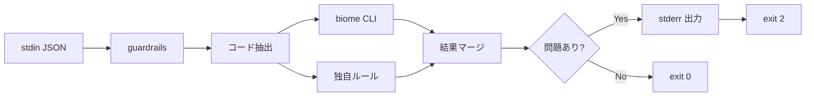
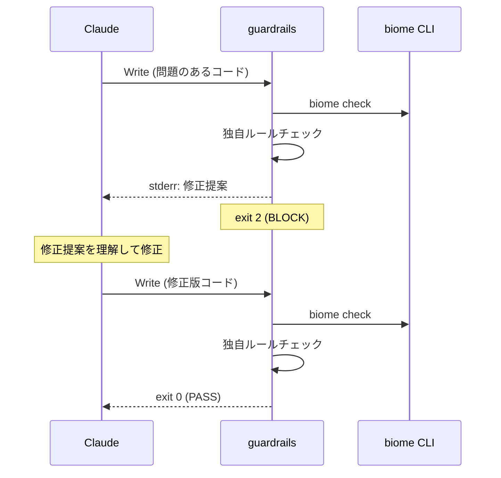

# SOW: claude-guardrails

Created: 2026-01-24
Status: draft

## Executive Summary

Claude Code の PreToolCall フックとして動作するコード品質チェックツール。biome CLI + 独自ルールでコードを検証し、問題があれば Claude に修正を促す。

Scope: 別リポジトリ, Rust 実装, biome CLI 連携, 独自ルール補完

## Problem Analysis

| ID    | Issue                              | Evidence                       | Confidence |
| ----- | ---------------------------------- | ------------------------------ | ---------- |
| I-001 | 現行 guardrails が動作していない   | バイナリ未ビルド, hooks 未設定 | [✓]        |
| I-002 | 正規表現ベースでは精度に限界がある | コメント内の誤検出等           | [✓]        |
| I-003 | biome だけではカバーできないルールがある | innerHTML, postMessage 等   | [✓]        |

## Solution Design

**Rust 実装 (biome CLI + 独自ルール)** で実装。

| 観点 | 内容 |
|------|------|
| メインチェック | biome CLI (300+ ルール) |
| 補完ルール | 独自実装 (biome にないもの) |
| 出力 | Claude が理解できる修正提案 |
| 配布 | 別リポジトリ, GitHub Releases |

### biome でカバーできるルール

| ルール | biome |
|--------|-------|
| `eval()` | noGlobalEval |
| `new Function()` | noGlobalEval |
| `dangerouslySetInnerHTML` | noDangerouslySetInnerHtml |
| `: any` | noExplicitAny |
| `console.log` | noConsole |
| 未使用変数 | noUnusedVariables |

### 独自ルール（biome でカバーできない）

| ルール | 理由 |
|--------|------|
| `document.write()` | biome に該当なし |
| `innerHTML =` | biome に該当なし |
| `outerHTML =` | biome に該当なし |
| `setTimeout(文字列)` | biome に該当なし |
| `setInterval(文字列)` | biome に該当なし |
| `postMessage('*')` | biome に該当なし |
| `localStorage(機密)` | 独自ロジック |
| レイヤー違反 | プロジェクト固有 |

## Architecture

### リポジトリ構成

```
claude-guardrails/ (別リポジトリ)
├── src/
│   ├── main.rs           # エントリポイント
│   ├── biome.rs          # biome CLI 呼び出し
│   ├── reporter.rs       # stderr 出力フォーマット
│   └── rules/            # 独自ルール
│       ├── mod.rs
│       ├── security.rs   # innerHTML, postMessage 等
│       └── architecture.rs
├── Cargo.toml
├── README.md
└── .github/
    └── workflows/
        └── release.yml   # バイナリ自動ビルド
```

### 動作フロー



### Claude 自動修正フロー



### stderr 出力フォーマット（Claude 向け）

```
🛡️ GUARDRAILS: 2 issues found

[1] security/noGlobalEval (biome)
    File: src/utils.ts:42
    Code: eval(userInput)
    Fix: Use JSON.parse() or a safe alternative instead of eval()

[2] security/innerHTML (guardrails)
    File: src/components/Card.tsx:15
    Code: element.innerHTML = content
    Fix: Use textContent or DOMPurify.sanitize()

Please fix these issues and try again.
```

### 設定

プロジェクトの `biome.json` を biome CLI が自動で読み込む。

```json
{
  "linter": {
    "rules": {
      "recommended": true,
      "suspicious": { "noExplicitAny": "error" },
      "security": { "noGlobalEval": "error" }
    }
  }
}
```

## Acceptance Criteria

| ID     | Description                                              | Confidence |
| ------ | -------------------------------------------------------- | ---------- |
| AC-001 | WHEN Write ツール実行 THEN guardrails がコードをチェック | [✓]        |
| AC-002 | IF biome エラー THEN stderr に修正提案を出力             | [✓]        |
| AC-003 | IF 独自ルール違反 THEN stderr に修正提案を出力           | [✓]        |
| AC-004 | IF biome.json 存在 THEN その設定を反映                   | [✓]        |
| AC-005 | IF Claude がエラー受信 THEN 修正版で再試行               | [✓]        |
| AC-006 | WHEN 問題なし THEN exit 0 で通過                         | [✓]        |

## Implementation Plan

| Phase | Description              | Status |
| ----- | ------------------------ | ------ |
| 1     | 別リポジトリ作成         | TODO   |
| 2     | biome CLI 連携実装       | TODO   |
| 3     | 独自ルール移植           | TODO   |
| 4     | stderr 出力フォーマット  | TODO   |
| 5     | GitHub Actions 設定      | TODO   |
| 6     | claude-config 連携       | TODO   |

## Dependencies

- `biome` CLI (システムにインストール済み想定)
- Rust 標準ライブラリのみ（外部 crate 最小限）

## Success Metrics

| Metric       | Target  |
| ------------ | ------- |
| 実行時間     | < 300ms |
| biome ルール | 300+    |
| 独自ルール   | 8       |
| Claude 修正率 | > 90%   |

## References

| Type         | Path                           |
| ------------ | ------------------------------ |
| 現行実装     | hooks/guardrails/              |
| hooks 設計   | docs/HOOKS.md                  |
| biome        | https://biomejs.dev/           |
