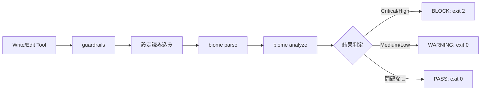
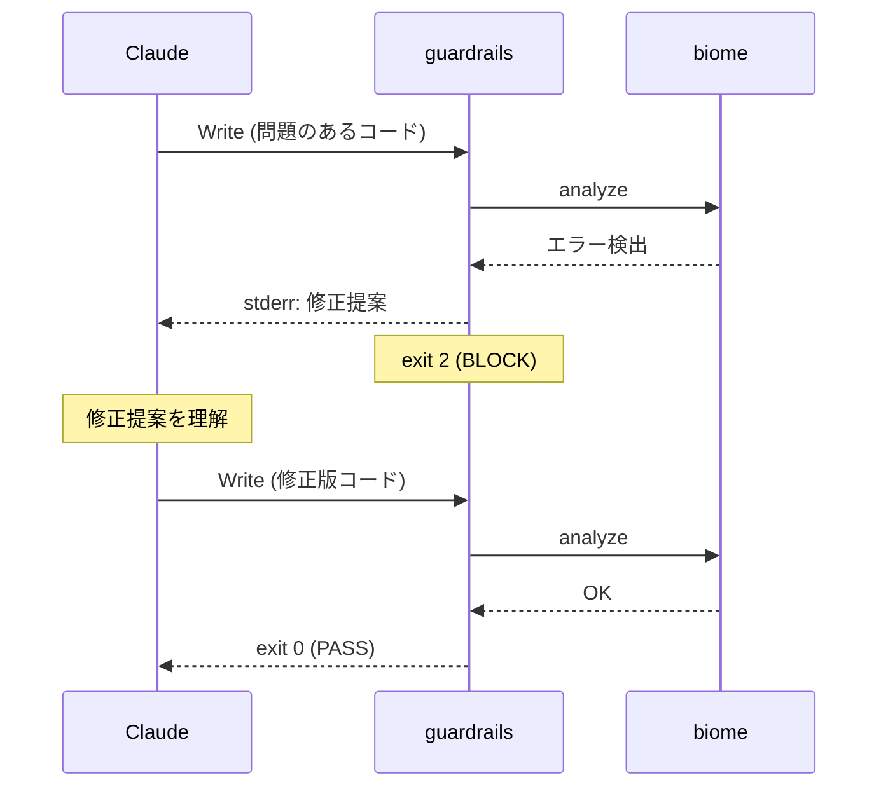
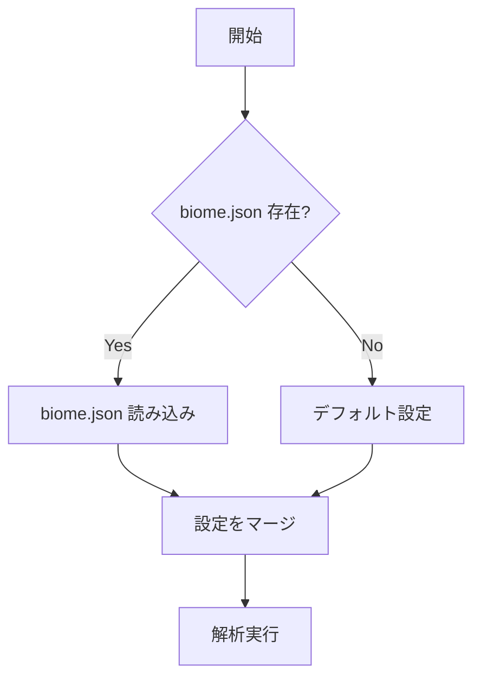

# SOW: claude-guardrails

Created: 2026-01-24
Status: draft

## Executive Summary

Claude Code の PreToolCall フックとして動作する、biome ベースのコード品質チェックツール。Write/Edit 操作時にコードを検証し、問題があればブロックまたは警告する。

Scope: 別リポジトリ化, biome 統合, PreToolCall フック

## Problem Analysis

| ID    | Issue                                | Evidence                           | Confidence |
| ----- | ------------------------------------ | ---------------------------------- | ---------- |
| I-001 | 現行 guardrails が動作していない     | バイナリ未ビルド, hooks 未設定     | [✓]        |
| I-002 | 正規表現ベースでは精度に限界がある   | コメント内の誤検出等               | [✓]        |
| I-003 | hooks/ 配下にソースがあり構成が不明瞭 | hooks/guardrails/src/ の存在       | [✓]        |
| I-004 | 機能分離すると複雑になる             | Pre/Post で別ツールは意図が伝わりにくい | [✓]        |
| I-005 | 設定の重複管理                       | guardrails と biome.json で二重管理     | [✓]        |

## Assumptions

| ID    | Type       | Description                              | Confidence |
| ----- | ---------- | ---------------------------------------- | ---------- |
| A-001 | fact       | biome は ~130ms で実行可能               | [✓]        |
| A-002 | fact       | biome クレートは crates.io で公開済み    | [✓]        |
| A-003 | assumption | 130ms は体感できないレベル               | [→]        |
| A-004 | assumption | biome 一本化でシンプルに保てる           | [→]        |
| A-005 | unknown    | biome クレートの API 安定性              | [?]        |

## Solution Design

| Phase | Description                          | Confidence |
| ----- | ------------------------------------ | ---------- |
| 1     | 別リポジトリ作成 (claude-guardrails) | [✓]        |
| 2     | biome クレートで再実装               | [→]        |
| 3     | このリポジトリから旧実装を削除       | [✓]        |
| 4     | install スクリプト追加               | [✓]        |

Alternatives considered:
- Option A: biome 一本化 (ADOPT) - シンプル、130ms は許容範囲
- Option B: 正規表現 + biome 併用 (REJECT) - 複雑、メリット薄い
- Option C: Pre/Post 分離 (REJECT) - 同一目的なのに分散して複雑

## Architecture

### リポジトリ構成

```
claude-config/
├── src/
│   └── guardrails/           ← git submodule (別リポジトリ)
│       ├── src/
│       │   ├── main.rs
│       │   ├── config.rs
│       │   ├── analyzer.rs
│       │   └── reporter.rs
│       ├── Cargo.toml
│       ├── config.example.json
│       ├── README.md
│       └── .github/
│           └── workflows/
│               └── release.yml
├── hooks/
│   └── guardrails            ← ビルド済みバイナリ (.gitignore)
└── .gitmodules
```

### 別リポジトリ (claude-guardrails)

```
claude-guardrails/
├── src/
│   ├── main.rs           # エントリポイント
│   ├── config.rs         # 設定読み込み
│   ├── analyzer.rs       # biome 連携
│   └── reporter.rs       # 出力フォーマット
├── Cargo.toml
├── config.example.json
├── README.md
└── .github/
    └── workflows/
        └── release.yml   # バイナリ自動ビルド
```

### 依存クレート

```toml
[dependencies]
biome_js_parser = "0.5"
biome_js_analyze = "0.5"
biome_js_syntax = "0.5"
biome_diagnostics = "0.5"
biome_configuration = "0.5"    # biome.json 読み込み
biome_deserialize = "0.5"
serde = { version = "1.0", features = ["derive"] }
serde_json = "1.0"
```

### 動作フロー



### Claude 自動修正フロー

ブロック時に修正提案を stderr に出力することで、Claude が自動的に修正して再試行する。



### stderr 出力フォーマット

```
🛡️ BLOCKED: {rule_name}

File: {file_path}:{line}
Problem: {code_snippet}
Why: {explanation}
Fix: {suggestion}

Please fix and retry.
```

**重要**: Claude Code は exit 2 時に **stderr のみ** を Claude に渡す。stdout は無視される。

### 設定読み込みフロー



### 設定の優先順位

| 優先度 | 設定ソース | 説明 |
|--------|-----------|------|
| 1 | プロジェクトの `biome.json` | プロジェクト固有のルール |
| 2 | `~/.config/guardrails/config.json` | ユーザーグローバル設定 |
| 3 | デフォルト | recommended ルール |

### biome.json 例

```json
{
  "$schema": "https://biomejs.dev/schemas/2.0.0/schema.json",
  "linter": {
    "enabled": true,
    "rules": {
      "recommended": true,
      "suspicious": {
        "noExplicitAny": "error",
        "noDebugger": "error"
      },
      "correctness": {
        "noUnusedVariables": "warn"
      },
      "security": {
        "noGlobalEval": "error"
      }
    }
  }
}
```

### guardrails 固有設定例

```json
{
  "enabled": true,
  "rules": {
    "security": true,
    "correctness": true,
    "suspicious": true,
    "style": false
  },
  "severity": {
    "blockOn": ["error"],
    "warnOn": ["warning", "info"]
  }
}
```

## Acceptance Criteria

| ID     | Description                                                    | Validates | Confidence |
| ------ | -------------------------------------------------------------- | --------- | ---------- |
| AC-001 | WHEN Write ツール実行 THEN guardrails がコードをチェックする   | I-001     | [✓]        |
| AC-002 | IF eval() 検出 THEN ブロックして理由を表示                     | I-002     | [✓]        |
| AC-003 | IF 未使用変数検出 THEN 警告を表示して続行                      | I-002     | [✓]        |
| AC-004 | WHEN 設定ファイルなし THEN デフォルト設定で動作                | -         | [✓]        |
| AC-005 | IF TS/JS 以外のファイル THEN スキップして通過                  | -         | [✓]        |
| AC-006 | WHEN biome.json 存在 THEN そのルール設定を反映                 | I-005     | [✓]        |
| AC-007 | IF biome.json でルール無効化 THEN guardrails もそのルールをスキップ | I-005     | [✓]        |
| AC-008 | WHEN ブロック時 THEN stderr に修正提案を出力                       | -         | [✓]        |
| AC-009 | IF Claude が修正提案を受信 THEN 修正版で再試行可能                 | -         | [✓]        |

## Test Plan

| Priority | Type        | Description                        | Validates |
| -------- | ----------- | ---------------------------------- | --------- |
| HIGH     | unit        | biome パース成功                   | AC-001    |
| HIGH     | unit        | eval() 検出でブロック              | AC-002    |
| HIGH     | unit        | 未使用変数で警告                   | AC-003    |
| MEDIUM   | integration | stdin からの JSON 入力処理         | AC-001    |
| MEDIUM   | unit        | 設定ファイル読み込み               | AC-004    |
| MEDIUM   | unit        | biome.json 読み込み・反映          | AC-006    |
| MEDIUM   | unit        | biome.json でルール無効時スキップ  | AC-007    |
| LOW      | unit        | 非対応ファイルのスキップ           | AC-005    |
| HIGH     | unit        | stderr 出力フォーマット            | AC-008    |
| HIGH     | integration | Claude 修正フロー (e2e)            | AC-009    |

## Implementation Plan

| Phase | Description              | Steps                                           | Validates      |
| ----- | ------------------------ | ----------------------------------------------- | -------------- |
| 1     | リポジトリ作成           | GitHub リポジトリ作成, 基本構成                 | -              |
| 2     | biome 統合               | パース, 解析, 結果変換の実装                    | AC-001, AC-002 |
| 3     | 設定機能                 | biome.json 読み込み, フォールバック設定         | AC-004, AC-006, AC-007 |
| 4     | 出力フォーマット         | stderr 出力, Claude 向け修正提案生成            | AC-002, AC-003, AC-008, AC-009 |
| 5     | CI/CD                    | GitHub Actions でバイナリ自動ビルド             | -              |
| 6     | claude-config 連携       | install スクリプト, settings.json 設定例        | -              |
| 7     | 旧実装削除               | hooks/guardrails/ を削除                        | I-003          |

## Success Metrics

| Metric           | Target        | Validates |
| ---------------- | ------------- | --------- |
| 実行時間         | < 200ms       | A-003     |
| バイナリサイズ   | < 15MB        | -         |
| biome ルール数   | 50+ 利用可能  | I-002     |
| 誤検出率         | < 5%          | I-002     |
| biome.json 互換  | 100%          | I-005     |

## Risks

| ID    | Risk                           | Impact | Mitigation                               |
| ----- | ------------------------------ | ------ | ---------------------------------------- |
| R-001 | biome クレート API の破壊的変更 | MED    | バージョン固定, 定期的な更新確認         |
| R-002 | バイナリサイズが大きすぎる     | LOW    | 必要なルールのみ有効化, strip            |
| R-003 | パフォーマンス劣化             | LOW    | ベンチマーク監視, 閾値超えたらアラート   |

## Verification Checklist

- [x] Research/investigation completed (biome クレート調査, ベンチマーク)
- [x] Impact on existing structure confirmed (hooks/guardrails/ 削除)
- [ ] Backup of related files obtained (if needed)

## References

| Type     | Path                                          |
| -------- | --------------------------------------------- |
| 現行実装 | hooks/guardrails/                             |
| hooks 設計 | docs/HOOKS.md                                |
| biome    | https://github.com/biomejs/biome              |
| crates   | https://crates.io/crates/biome_js_parser      |
