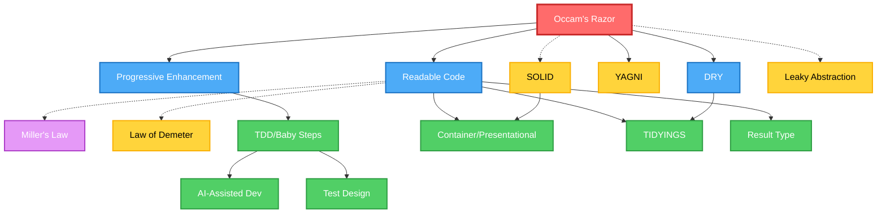

# Principles

## Priority Matrix

| Priority   | Principle                | One-liner                               | When to Apply               |
| ---------- | ------------------------ | --------------------------------------- | --------------------------- |
| Critical   | Occam's Razor            | Choose the simplest solution that works | Always - every decision     |
| Critical   | Progressive Enhancement  | Build simple, enhance gradually         | Starting any implementation |
| Default    | Readable Code            | Code for humans, not computers          | Writing any code            |
| Default    | Miller's Law             | Respect 7±2 cognitive limit             | Designing interfaces        |
| Default    | TDD/Baby Steps           | Small incremental changes with tests    | Development process         |
| Default    | DRY                      | Don't Repeat Yourself                   | 3+ duplications found       |
| Default    | YAGNI                    | You Aren't Gonna Need It                | Adding "just in case" code  |
| Contextual | SOLID                    | Design for change                       | Large-scale architecture    |
| Contextual | Container/Presentational | Separate logic from UI                  | React/UI components         |
| Contextual | Law of Demeter           | Only talk to immediate friends          | Complex dependencies        |
| Contextual | Leaky Abstraction        | Accept imperfect abstractions           | Evaluating abstractions     |
| Contextual | AI-Assisted Development  | AI generates, humans validate           | When using AI tools         |
| Contextual | TIDYINGS                 | Clean as you go                         | During development          |

## Dependency Graph

| Color  | Type             | Description                              |
| ------ | ---------------- | ---------------------------------------- |
| Red    | Meta Principle   | Occam's Razor - questions all complexity |
| Blue   | Universal        | Applied by default to all decisions      |
| Green  | Applied Practice | Concrete implementation patterns         |
| Yellow | Contextual       | Applied when situation demands           |
| Purple | Scientific       | Backed by cognitive science              |

## Key Relationships

| Relationship                          | Why it matters                          |
| ------------------------------------- | --------------------------------------- |
| **Occam's Razor ⟷ SOLID**             | Balance: structure vs over-engineering  |
| **Occam's Razor ⟷ Leaky Abstraction** | Accept imperfection over complexity     |
| **Readable Code → Miller's Law**      | Cognitive science backing (7±2 limit)   |
| **Readable Code + DRY → TIDYINGS**    | Practical combination of two principles |
| **TDD → AI-Assisted Development**     | AI accelerates cycles, humans validate  |

## Conflict Resolution

| Conflict                    | Resolution     | Example                                          |
| --------------------------- | -------------- | ------------------------------------------------ |
| **DRY vs Readable**         | Readable wins  | Accept duplication if abstraction hurts clarity  |
| **SOLID vs Simple**         | Simple wins    | Don't over-engineer for imagined futures         |
| **Perfect vs Working**      | Working wins   | Ship leaky abstractions that solve real problems |
| **Abstraction vs Concrete** | Start concrete | Abstract only when pattern emerges (3+ times)    |

## Red Flags

- Method chains > 2 levels → Apply Law of Demeter
- Can't understand in 1 minute → Apply Readable Code
- Implementing "just in case" → Remember YAGNI
- Perfect abstraction attempt → Accept Leaky Abstraction
- Complex solution first → Apply Occam's Razor
- Accepting AI output without review → Apply AI-Assisted Development

## Commands

| Command     | Primary Principles   | Secondary Principles                        |
| ----------- | -------------------- | ------------------------------------------- |
| `/think`    | SOLID, Occam's Razor | Progressive Enhancement                     |
| `/research` | -                    | All principles for context                  |
| `/code`     | TDD, Baby Steps      | Readable Code, DRY, AI-Assisted Development |
| `/test`     | TDD                  | Law of Demeter, AI-Assisted Development     |
| `/fix`      | Occam's Razor        | TIDYINGS                                    |
| `/audit`    | All principles       | Priority order                              |

## Final Wisdom

The best principle is knowing when not to apply a principle.

When in doubt:

1. Choose simple over clever
2. Choose concrete over abstract
3. Choose working over perfect
4. Choose clear over DRY
5. Choose pragmatic over pure

Remember: **Principles are tools, not rules**. The goal is working, maintainable software.
