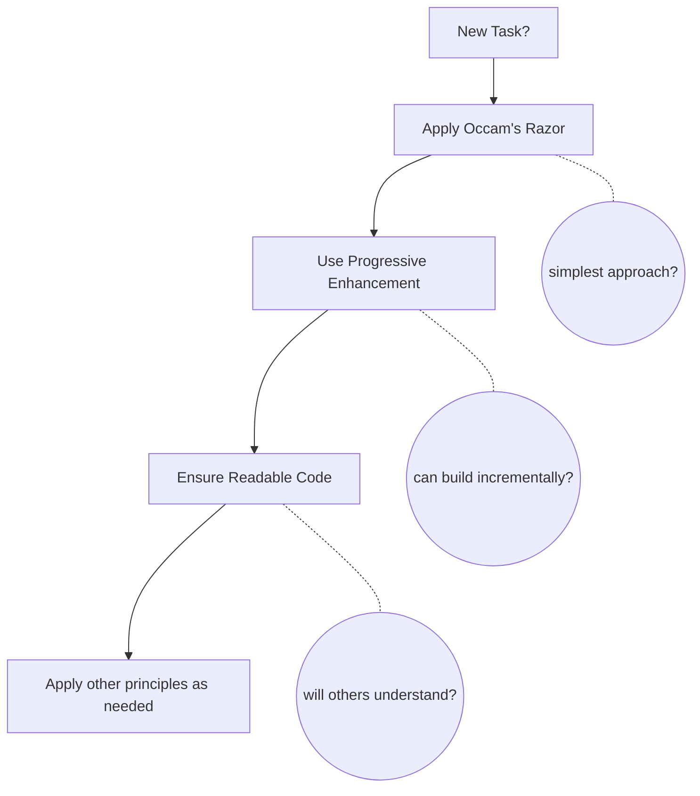

# Principles Application Guide

> Start with Quick Reference for immediate needs. Read Detailed Guide for deeper understanding.

---

## Quick Reference

### Priority Matrix

| Priority | Principle | One-liner | When to Apply |
| --- | --- | --- | --- |
| **[Critical]** | | | |
| | Occam's Razor | Choose the simplest solution that works | Always - every decision |
| | Progressive Enhancement | Build simple, enhance gradually | Starting any implementation |
| **[Default]** | | | |
| | Readable Code | Code for humans, not computers | Writing any code |
| | TDD/Baby Steps | Small incremental changes with tests | Development process |
| | DRY | Don't Repeat Yourself | 3+ duplications found |
| **[Contextual - Architecture]** | | | |
| | SOLID | Design for change | Large-scale architecture |
| | Container/Presentational | Separate logic from UI | React/UI components |
| | Law of Demeter | Only talk to immediate friends | Complex dependencies |
| **[Contextual - Practice]** | | | |
| | Leaky Abstraction | Accept imperfect abstractions | Evaluating abstractions |
| | AI-Assisted Development | AI generates, humans validate | When using AI tools |
| | TIDYINGS | Clean as you go | During development |

### Decision Flow

### Conflict Resolution

| Conflict | Resolution | Example |
| --- | --- | --- |
| **DRY vs Readable** | Readable wins | Accept duplication if abstraction hurts clarity |
| **SOLID vs Simple** | Simple wins | Don't over-engineer for imagined futures |
| **Perfect vs Working** | Working wins | Ship leaky abstractions that solve real problems |
| **Abstraction vs Concrete** | Start concrete | Abstract only when pattern emerges (3+ times) |

### Red Flags

- Method chains > 3 levels → Apply Law of Demeter
- Can't understand in 1 minute → Apply Readable Code
- Implementing "just in case" → Remember YAGNI
- Perfect abstraction attempt → Accept Leaky Abstraction
- Complex solution first → Apply Occam's Razor
- Accepting AI output without review → Apply AI-Assisted Development

### Quick Commands

| Situation | Command | Principles Applied |
| --- | --- | --- |
| Bug fix | `/fix` | Occam's Razor, Progressive Enhancement |
| New feature | `/research → /think → /code` | TDD, Baby Steps, SOLID |
| Refactoring | `/research → /code` | TIDYINGS, DRY, Readable Code |

---

## Detailed Guide

### Principle Hierarchy

| Level | Principles | Key Question |
| --- | --- | --- |
| **L1: Universal** | Occam's Razor, Progressive Enhancement | "Simplest solution? Start minimal?" |
| **L2: Default** | Readable Code, TDD/Baby Steps, DRY | "Clear? Tested? Rule of 3?" |
| **L3: Contextual** | SOLID, Container/Presentational, Law of Demeter, Leaky Abstraction, TIDYINGS | "When needed only" |

### Principle Relationships

For detailed principle relationships and dependency graph, see:
[@./PRINCIPLE_RELATIONSHIPS.md](./PRINCIPLE_RELATIONSHIPS.md)

### Practical Application Scenarios

| Scenario | Key Principles | Approach |
| --- | --- | --- |
| **New Feature** | Progressive Enhancement TDD/Baby Steps Readable Code | 1. Start with simplest version 2. Write failing test → minimal code 3. Ensure clarity for new developers 4. Consider SOLID only if: multi-team, public API, or explicit future requirements |
| **Legacy Fix** | Occam's Razor TIDYINGS Leaky Abstraction | 1. Minimal change to fix issue 2. Clean only touched code 3. Question DRY: is duplication harmful? 4. Accept framework limitations, don't fight them |
| **Code Review** | All principles | Check each: Simpler way? (Occam) Ship incrementally? (Progressive) Understandable? (Readable) Duplication problematic? (DRY) Method chains >2? (Demeter) Fighting framework? (Leaky) |

### Integration with Commands

| Command | Primary Principles | Secondary Principles |
| --- | --- | --- |
| `/think` | SOLID, Occam's Razor | Progressive Enhancement |
| `/research` | - | All principles for context |
| `/code` | TDD, Baby Steps | Readable Code, DRY, AI-Assisted Development |
| `/test` | TDD | Law of Demeter, AI-Assisted Development |
| `/fix` | Occam's Razor | TIDYINGS |
| `/audit` | All principles | Priority order |

### Anti-Patterns

**Key examples**: Single-implementation interfaces, classes wrapping one function, "future-proof" abstractions

Details: [@../skills/reviewing-readability/references/ai-antipatterns.md](../skills/reviewing-readability/references/ai-antipatterns.md)

## Final Wisdom

> "The best principle is knowing when not to apply a principle."

When in doubt:

1. Choose simple over clever
2. Choose concrete over abstract
3. Choose working over perfect
4. Choose clear over DRY
5. Choose pragmatic over pure

Remember: **Principles are tools, not rules**. The goal is working, maintainable software.

## Related Principles

### Core Documents

- [@../skills/applying-code-principles/SKILL.md](../skills/applying-code-principles/SKILL.md) - Principles with thresholds
- [@./development/PROGRESSIVE_ENHANCEMENT.md](./development/PROGRESSIVE_ENHANCEMENT.md) - The approach
- [@./development/READABLE_CODE.md](./development/READABLE_CODE.md) - The baseline

### All Principles

- Skill: [@../skills/applying-code-principles/SKILL.md](../skills/applying-code-principles/SKILL.md) - SOLID, DRY, Occam's Razor, Miller's Law, YAGNI
- Development: [@./development/](./development/) - Practical principles
- Commands: [@../docs/COMMANDS.md](../docs/COMMANDS.md) - Integrated workflows
