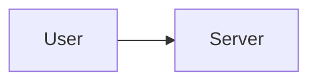

# Documentation Rules and Guidelines

Guidelines for maintaining consistent, well-organized documentation in the Claude Code ecosystem.

## Core Principles

1. **Clarity Over Completeness** - Apply Occam's Razor to documentation
2. **Consistency Across Languages** - Maintain EN/JP synchronization
3. **Logical Hierarchy** - Clear separation between principles and practices
4. **No Circular References** - Maintain clean dependency graphs
5. **Emoji Usage Policy** - Distinguish between human output and AI documentation:
   - **Human-facing output templates**: Emojis allowed (✅/❌/⚠️ for visual effect)
   - **AI-consumed documentation**: Use text labels instead of emojis
6. **Diagram Format Policy** - Prefer Mermaid and tables over ASCII art:
   - **New documentation**: Use Mermaid diagrams or Markdown tables (required)
   - **Existing documentation**: Migrate ASCII diagrams to Mermaid/tables when editing

## Directory Structure

### Placement Criteria

```markdown
/rules/
├── core/ # AI Operation Rules (hook-injected)
│ ├── AI_OPERATION_PRINCIPLES.md # Safety, authority, workflow
│ ├── PRE_TASK_CHECK_RULES.md # Task verification (rules)
│ └── PRE_TASK_CHECK_TEMPLATES.md # Task verification (templates)
│
├── guidelines/ # Documentation Guidelines
│ └── DOCUMENTATION_RULES.md # This file
│
├── development/ # Practical Application
│ ├── TDD_RGRC.md # TDD cycle
│ ├── PROGRESSIVE_ENHANCEMENT.md # CSS-first approach
│ ├── READABLE_CODE.md # Code clarity
│ └── TIDYINGS.md # Micro-improvements
│
├── commands/ # Command-specific rules
│ └── COMMAND_WORKFLOWS.md # Workflow selection
│
├── PRINCIPLES_GUIDE.md # Quick reference
└── PRINCIPLE_RELATIONSHIPS.md # Principle dependencies

Note: Core principles (SOLID, DRY, Occam's Razor) are in:
→ /skills/applying-code-principles/SKILL.md
```

### Decision Framework

When adding new documentation:

```markdown
Is it a fundamental principle or theory?
YES → /rules/guidelines/
NO → Continue

Is it a practical method or technique?
YES → /rules/development/
NO → Continue

Is it a command or tool?
YES → /commands/
NO → /docs/
```

## Reference Management

### Reference Hierarchy

```markdown
Level 1: CLAUDE.md (Top-level configuration)
├─→ Level 2: Core Principles (/rules/guidelines/)
├─→ Level 2: Development Practices (/rules/development/)
└─→ Level 2: Commands (/commands/)
└─→ Level 3: Cross-references between docs
```

### Reference Rules

1. **Maximum Depth**: 3 levels of references
2. **Avoid Circular**: A → B → A is forbidden
3. **Direct Important**: Core principles should be directly referenced from CLAUDE.md
4. **Group Related**: Use section headers to group references

### Reference Format

```markdown
## Related Principles

### Core Principles (From skills/)

- [@../../skills/applying-code-principles/SKILL.md](../../skills/applying-code-principles/SKILL.md) - SOLID, DRY, YAGNI principles

### Applied in Practice

- [@../development/TDD_RGRC.md](../development/TDD_RGRC.md) - TDD methodology
```

### Standard Section Names

| Purpose           | Standard Name           | Deprecated                     |
| ----------------- | ----------------------- | ------------------------------ |
| Related documents | `## Related Principles` | `## References`, `## See Also` |
| Code examples     | `## Examples`           | -                              |
| API documentation | `## API Reference`      | -                              |

**Note**: Use `## Related Principles` consistently at the end of all documentation files.

## Language Synchronization

### Dual-Language Requirements

**Every documentation file MUST have:**

- English version: `/path/to/FILE.md`
- Japanese version: `/.ja/path/to/FILE.md`

### Synchronization Checklist

When updating documentation:

```markdown
☐ Update English version
☐ Update Japanese version
☐ Verify structure matches
☐ Check reference paths (relative paths differ!)
☐ Confirm section headers align
☐ Test cross-references work
```

### Path References

Both EN and JP use identical relative path patterns within their respective directories:

```markdown
[@./DOCUMENTATION_RULES.md](./DOCUMENTATION_RULES.md) # Same directory
[@../development/TDD_RGRC.md](../development/TDD_RGRC.md) # Up one level
```

### Language Exceptions

**ADR (Architecture Decision Records)**:

- `docs/adr/*.md` files are written in Japanese by default (per CLAUDE.md P1 rule)
- No `.ja/` translation needed as the source is already in Japanese
- ADR output language follows the project's language settings

## Update Procedures

| Operation     | Steps                                                                       |
| ------------- | --------------------------------------------------------------------------- |
| **Add New**   | 1. Create EN/JP both 2. Add ref to CLAUDE.md 3. Update related docs         |
| **Modify**    | 1. `grep -r "FILENAME"` check refs 2. Update EN/JP together 3. Verify links |
| **Move File** | 1. Search refs 2. Move EN/JP 3. Update all refs                             |

## Documentation Standards

### File Structure

```markdown
# Title - Clear and Descriptive

## Core Philosophy

Brief explanation of why this exists

## Key Concepts

Main ideas, clearly explained

## Practical Application

Examples and use cases

## Related Principles

Links to related documentation
```

### Writing Style

1. **Headers**: Use sentence case, not CAPS
2. **Examples**: Include practical code examples
3. **Comparisons**: Show Bad vs Good
4. **Summaries**: Key points in bullet lists
5. **Emoji Policy**: Apply Core Principle #5 (see above)
   - Output templates for humans: Keep emojis for visual effect
   - AI documentation sections: Use text labels instead

### Diagram Format

Apply Core Principle #6 when creating visual representations:

**Use Mermaid for flowcharts and relationships:**

````markdown
<!-- Bad: ASCII art -->

+--------+ +--------+
| User | --> | Server |
+--------+ +--------+

<!-- Good: Mermaid diagram -->


````

**Use tables for structured data:**

```markdown
<!-- Bad: ASCII table -->

+----------+--------+---------+
| Name | Type | Default |
+----------+--------+---------+
| timeout | number | 30000 |
+----------+--------+---------+

<!-- Good: Markdown table -->

| Name    | Type   | Default |
| ------- | ------ | ------- |
| timeout | number | 30000   |
```

**Migration priority:**

| Priority | Pattern                    | Action                          |
| -------- | -------------------------- | ------------------------------- |
| High     | Flowcharts, decision trees | Convert to Mermaid              |
| High     | Data tables                | Convert to Markdown tables      |
| Medium   | Directory structures       | Keep as code blocks (exception) |
| Low      | Simple inline diagrams     | Evaluate case by case           |

### Code Examples

```typescript
// Bad: Avoid: Complex example first
complexImplementation();

// Good: Prefer: Simple example first
simpleImplementation();

// Then show progression to complex
advancedImplementation();
```

## Quality Checklist

- [ ] EN/JP synchronized
- [ ] All links tested
- [ ] No circular references
- [ ] Correct placement (guidelines/ vs development/)
- [ ] Diagrams use Mermaid or tables (no ASCII art)

## Common Patterns

| Pattern       | Steps                                                    |
| ------------- | -------------------------------------------------------- |
| New Principle | Create EN/JP in guidelines/ → Add to CLAUDE.md           |
| New Practice  | Create EN/JP in development/ → Reference from principles |
| New Command   | Create EN/JP in commands/ → Add to COMMANDS.md           |

## Anti-Patterns

| Avoid                    | Instead                               |
| ------------------------ | ------------------------------------- |
| Single language updates  | Synchronized updates (EN/JP together) |
| Deep nesting (>3 levels) | Flat hierarchy                        |
| Orphan documents         | Connected graph                       |
| Circular references      | Tree structure                        |
| Misplaced files          | Follow decision framework             |
| ASCII art diagrams       | Mermaid diagrams or Markdown tables   |

## Maintenance Tasks

### Regular Reviews

Weekly:

- Check for broken references
- Verify EN/JP synchronization
- Review recent changes for consistency

Monthly:

- Evaluate directory structure
- Check for orphaned documents
- Review reference depth

### Refactoring Signals

Consider refactoring when:

- Reference depth exceeds 3 levels
- Circular dependencies detected
- Placement confusion (principle vs practice)
- EN/JP drift in structure
- Too many cross-references (>5 per doc)

## Tools

```bash
grep -r "FILENAME" ~/.claude/           # Find references
diff <(ls /rules/) <(ls /.ja/rules/)    # Check EN/JP match
```

## Evolution Guidelines

### When to Create New Categories

Create new directories when:

- 5+ related documents in same category
- Clear conceptual boundary emerges
- Confusion about placement recurring

### When to Merge Categories

Consider merging when:

- Categories have <3 documents each
- Conceptual boundaries unclear
- Frequent placement confusion

### Version Control

Always commit with clear messages:

```bash
# Good commit messages
docs: add Occam's Razor principle to reference
docs: synchronize EN/JP for TDD_RGRC
docs: move TIDYINGS from reference to development
refactor: reorganize principle documentation structure

# Include what changed and why
```

## Remember

> "The best documentation is not the most comprehensive, but the most comprehensible" - Occam's Razor applied to docs

Keep it:

- **Simple** - Easy to understand
- **Organized** - Easy to find
- **Synchronized** - Consistent across languages
- **Connected** - Well-referenced
- **Maintained** - Regularly updated

---

_Last updated: 2026-01-01_
