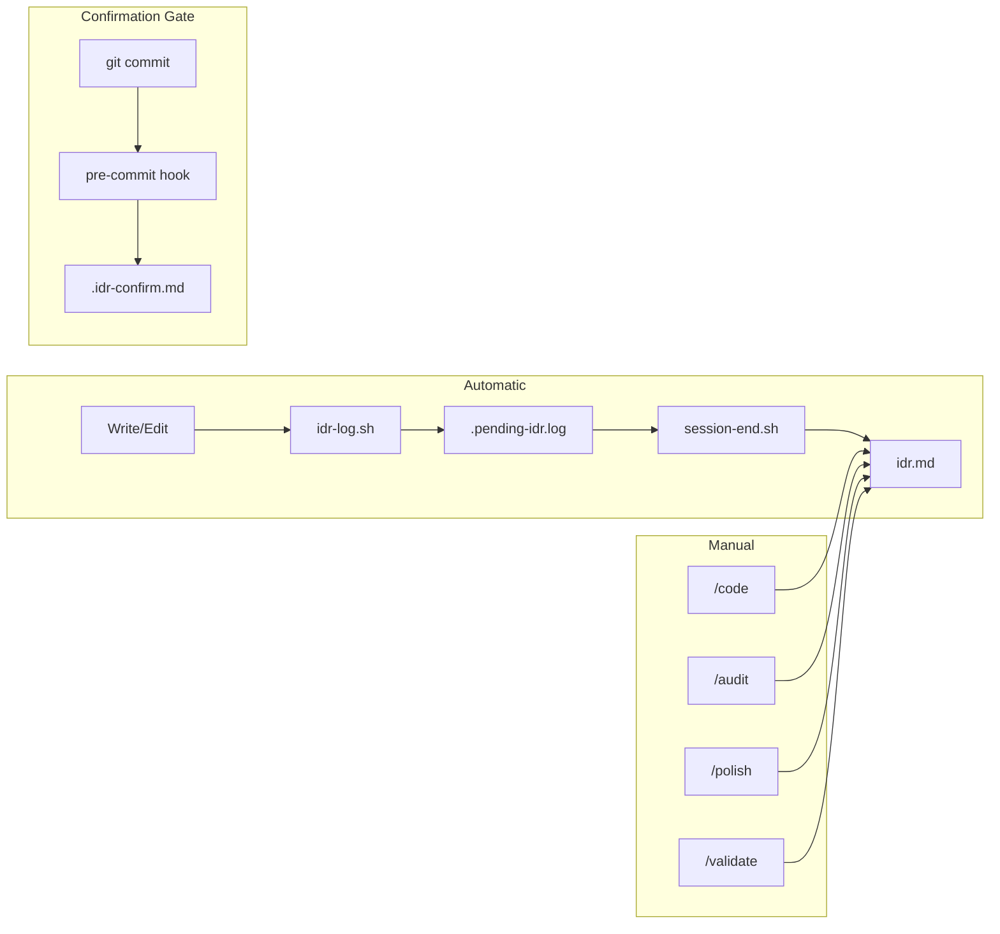

# IDR (Implementation Decision Record) Generation

Tracks implementation decisions throughout development lifecycle.

## Recording Layers

| Layer       | Trigger            | Records                          | Automatic |
| ----------- | ------------------ | -------------------------------- | --------- |
| session-end | Session end        | Implementation, design decisions | Yes       |
| /code       | Implementation end | Design decisions, trade-offs     | Optional  |
| /audit      | Review time        | Issues, improvements             | Optional  |
| /polish     | Cleanup time       | Deletions, simplifications       | Optional  |
| /validate   | Validation time    | SOW conformance, gaps            | Optional  |

## Automatic Recording (session-end hook)

Records automatically at session end:

| Section          | Content                              |
| ---------------- | ------------------------------------ |
| Implementation   | Claude summarizes changes            |
| Design Decisions | Key decisions and rationale (if any) |

## Confirmation Gate (pre-commit hook)

Pre-commit confirmation gate (no IDR recording):

| File              | Purpose                       |
| ----------------- | ----------------------------- |
| `.idr-confirm.md` | Confirmation questions (temp) |

## Manual Recording (Slash Commands)

Use slash commands for detailed recording:

| Command   | When to Use             | Records                     |
| --------- | ----------------------- | --------------------------- |
| /code     | Significant decisions   | Decision rationale, options |
| /audit    | After code review       | Issues, fix suggestions     |
| /polish   | After refactoring       | Deletions, simplifications  |
| /validate | Implementation complete | SOW conformance, remaining  |

## IDR File Location

| Scenario   | Detection                                       | Path                         |
| ---------- | ----------------------------------------------- | ---------------------------- |
| SOW exists | Search `~/.claude/workspace/planning/**/sow.md` | `[SOW directory]/idr.md`     |
| No SOW     | Date-based directory                            | `planning/YYYY-MM-DD/idr.md` |

## Integration

## Related

- Hook: `~/.claude/hooks/lifecycle/idr-log.sh`
- Hook: `~/.claude/hooks/lifecycle/idr-pre-commit.sh`
- Hook: `~/.claude/hooks/lifecycle/session-end.sh`
- SOW Template: `~/.claude/templates/sow/template.md`
