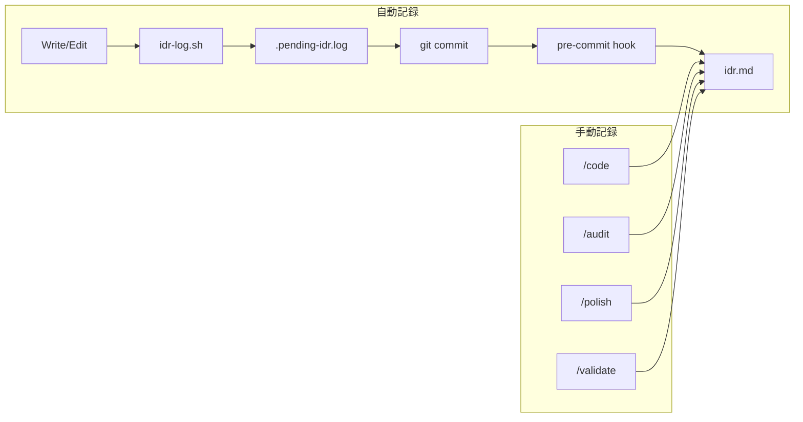

# IDR (Implementation Decision Record) Generation

Tracks implementation decisions throughout development lifecycle.

## Recording Layers

| Layer      | Trigger    | Records                    | Automatic |
| ---------- | ---------- | -------------------------- | --------- |
| pre-commit | git commit | 変更ファイル、確認チェック | Yes       |
| /code      | 実装完了時 | 設計決定、トレードオフ     | Optional  |
| /audit     | レビュー時 | 問題点、改善提案           | Optional  |
| /polish    | 整理時     | 削除・簡略化内容           | Optional  |
| /validate  | 検証時     | SOW適合性、ギャップ        | Optional  |

## Automatic Recording (pre-commit hook)

コミット時に自動的に以下を記録：

| Section      | Content                        |
| ------------ | ------------------------------ |
| 変更ファイル | ステージされたファイル一覧     |
| 確認内容     | Claudeが生成した確認質問の回答 |
| メモ         | 開発者が記入したメモ           |

Location: `[IDRと同じディレクトリ]/.idr-confirm.md` (作業用)

## Manual Recording (Slash Commands)

より詳細な記録が必要な場合にスラッシュコマンドを使用：

| Command   | When to Use            | Records              |
| --------- | ---------------------- | -------------------- |
| /code     | 重要な設計決定をした時 | 決定理由、代替案     |
| /audit    | コードレビュー後       | 問題点、修正提案     |
| /polish   | リファクタリング後     | 削除内容、簡略化理由 |
| /validate | 実装完了時             | SOW適合性、残タスク  |

## IDR File Location

| Scenario   | Detection                                       | Path                      |
| ---------- | ----------------------------------------------- | ------------------------- |
| SOW exists | Search `~/.claude/workspace/planning/**/sow.md` | `[SOW directory]/idr.md`  |
| No SOW     | Default location                                | `planning/default/idr.md` |

## Integration

## Related

- Hook: `~/.claude/hooks/lifecycle/idr-log.sh`
- Hook: `~/.claude/hooks/lifecycle/idr-pre-commit.sh`
- SOW Template: `~/.claude/templates/sow/template.md`
