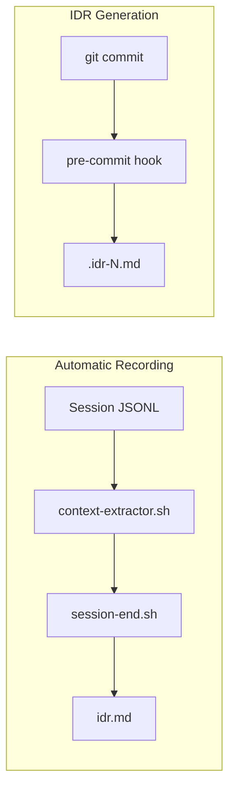

# IDR (Implementation Decision Record) Generation

Tracks implementation decisions throughout development lifecycle.

## Recording Layers

| Layer       | Trigger     | Records                          | Automatic |
| ----------- | ----------- | -------------------------------- | --------- |
| session-end | Session end | Implementation, design decisions | Yes       |
| pre-commit  | git commit  | IDR with code examples           | Yes       |

## Automatic Recording (session-end hook)

Records automatically at session end:

| Section          | Content                              |
| ---------------- | ------------------------------------ |
| Implementation   | Claude summarizes changes            |
| Design Decisions | Key decisions and rationale (if any) |

## IDR Generation (pre-commit hook)

Generates IDR with code examples at commit time (non-blocking):

| File        | Purpose                                |
| ----------- | -------------------------------------- |
| `.idr-N.md` | Implementation record with code blocks |

### IDR Format

```markdown
# IDR: [purpose summary]

## 変更概要

[One paragraph summary]

## 主要な変更

### [path/to/file.md](path/to/file.md)

[Description]
\`\`\`yaml
[Key code snippet]
\`\`\`

## 設計判断

[Design decisions and rationale]
```

> File paths are markdown links for IDE/GitHub navigation.

## IDR File Location

| Scenario           | Detection                                   | Path                         |
| ------------------ | ------------------------------------------- | ---------------------------- |
| Tracked SOW exists | Read `$HOME/.claude/workspace/.current-sow` | `[SOW directory]/idr.md`     |
| No tracked SOW     | Date-based directory                        | `planning/YYYY-MM-DD/idr.md` |

### SOW Tracking

The `.current-sow` file tracks the active SOW for the current work:

```bash
# Set current SOW (done by /think, /code commands)
echo "/path/to/sow.md" > "$HOME/.claude/workspace/.current-sow"

# Clear when work is complete
mv "$HOME/.claude/workspace/.current-sow" ~/.Trash/
```

## Integration



## Related

- Utility: `$HOME/.claude/hooks/lifecycle/_utils.sh`
- Utility: `$HOME/.claude/hooks/lifecycle/_context-extractor.sh`
- Hook: `$HOME/.claude/hooks/lifecycle/idr-pre-commit.sh`
- Hook: `$HOME/.claude/hooks/lifecycle/session-end.sh`
- SOW Template: `$HOME/.claude/templates/sow/template.md`
