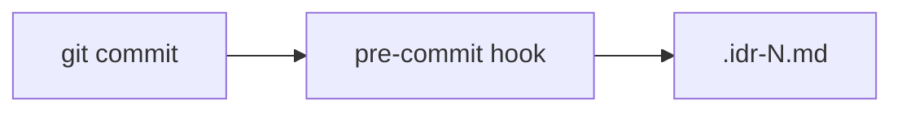

# IDR (Implementation Decision Record) Generation

Tracks implementation decisions at commit time via git pre-commit hook.

## Output

| File        | Purpose                                |
| ----------- | -------------------------------------- |
| `.idr-N.md` | Implementation record with code blocks |

## IDR Format

```markdown
# IDR: [purpose summary]

## 変更概要

[One paragraph summary]

## 主要な変更

### [path/to/file.md](path/to/file.md)

[Description]
\`\`\`yaml
[Key code snippet]
\`\`\`

## 設計判断

[Design decisions and rationale]
```

> File paths are markdown links for IDE/GitHub navigation.

## File Location

| Scenario           | Detection                                   | Path                            |
| ------------------ | ------------------------------------------- | ------------------------------- |
| Tracked SOW exists | Read `$HOME/.claude/workspace/.current-sow` | `[SOW directory]/.idr-N.md`     |
| No tracked SOW     | Date-based directory                        | `planning/YYYY-MM-DD/.idr-N.md` |

## Integration



## Related

- Hook: `$HOME/.claude/hooks/lifecycle/idr-pre-commit.sh`
- Utility: `$HOME/.claude/hooks/lifecycle/_utils.sh`
- SOW Template: `$HOME/.claude/templates/sow/template.md`
