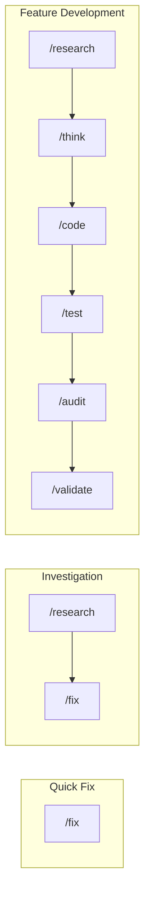

# Workflow Guide

Guide for **using** commands. User reference for command selection and workflow patterns.

## Available Commands

### Core Development

| Command     | Purpose                                  |
| ----------- | ---------------------------------------- |
| `/think`    | SOW creation with validation             |
| `/research` | Investigation without implementation     |
| `/code`     | TDD/RGRC implementation + IDR generation |
| `/test`     | Comprehensive testing                    |
| `/audit`    | Code review via agents + IDR update      |
| `/polish`   | Remove AI-generated slop + IDR update    |
| `/validate` | Validate SOW conformance + IDR reconcile |
| `/plans`    | List planning documents (SOW/Spec)       |
| `/spec`     | Generate Spec (implementation details)   |
| `/sow`      | Display SOW progress                     |

### Quick Actions

| Command | Purpose                           |
| ------- | --------------------------------- |
| `/fix`  | Quick bug fixes (think→code→test) |

### Browser & Documentation

| Command   | Purpose                          |
| --------- | -------------------------------- |
| `/e2e`    | E2E test from browser operations |
| `/adr`    | Architecture Decision Record     |
| `/rulify` | Generate project rule from ADR   |
| `/docs`   | Generate documentation from code |

### Git Operations

| Command   | Purpose                       |
| --------- | ----------------------------- |
| `/branch` | Suggest branch names          |
| `/commit` | Conventional Commits messages |
| `/pr`     | PR descriptions               |
| `/issue`  | GitHub Issues                 |

## Standard Workflows

| Pattern       | Workflow                                                            | When                                    |
| ------------- | ------------------------------------------------------------------- | --------------------------------------- |
| Quick Fix     | `/fix`                                                              | Small bug, stable codebase              |
| Investigation | `/research` → `/fix`                                                | Unknown cause                           |
| Feature       | `/research` → `/think` → `/code` → `/test` → `/audit` → `/validate` | New capability, requirements unstable   |
| Simple        | `/code` → `/test`                                                   | Clear implementation, tech stack stable |

## Command Selection

| Criteria          | [✓] High Priority     | [→] Medium Priority  | [?] Low Priority    |
| ----------------- | --------------------- | -------------------- | ------------------- |
| **Understanding** | ≥95% → direct         | 70-94% → `/think`    | <70% → `/research`  |
| **Complexity**    | Multi-step → workflow | Single file → `/fix` | Unclear → `/think`  |
| **Urgency**       | Critical → `/fix`     | Normal → standard    | Planning → `/think` |

### Task Analysis

| User Intent        | Analysis            | Result                             |
| ------------------ | ------------------- | ---------------------------------- |
| "X is broken"      | Need investigation? | Yes → `/research` → `/fix`         |
| "Add Y feature"    | Multi-step?         | Yes → `/think` → `/code` → `/test` |
| "Site is down"     | Critical?           | Yes → `/fix` (urgent)              |
| "Fix typo"         | Simple & clear?     | Yes → `/fix`                       |
| "How does Z work?" | Investigation only  | `/research` (no implementation)    |

**Key Factors**:

- **Scope**: Single file vs multiple components
- **Context**: Known vs needs exploration
- **Risk**: Dev environment vs production

## IDR (Implementation Decision Record)

Auto-generated document tracking implementation through the lifecycle.
SOW/IDR serve as structured memory: AI reads entirely, humans reference selectively.

See [@./IDR_GENERATION.md](./IDR_GENERATION.md)

| Command     | IDR Action              |
| ----------- | ----------------------- |
| `/code`     | Creates with decisions  |
| `/audit`    | Appends review findings |
| `/polish`   | Appends simplifications |
| `/validate` | Reconciles with SOW AC  |

**Location**: `~/.claude/workspace/planning/[feature]/idr.md`

## Architecture

| Layer       | Location            | Role                  |
| ----------- | ------------------- | --------------------- |
| **Command** | `commands/*.md`     | User-facing workflows |
| **Skill**   | `skills/*/SKILL.md` | Knowledge base        |
| **Agent**   | `agents/*.md`       | Specialized analysis  |

## Edge Cases

| Situation                 | Action                                                 |
| ------------------------- | ------------------------------------------------------ |
| Ambiguous intent          | Ask clarification in understanding check               |
| No command match          | Use `Command: N/A`, proceed with direct implementation |
| Multiple valid approaches | Present options for user choice                        |
| Unclear requirements      | Start with `/research`                                 |
| Complex multi-part        | Break into sub-workflows                               |
