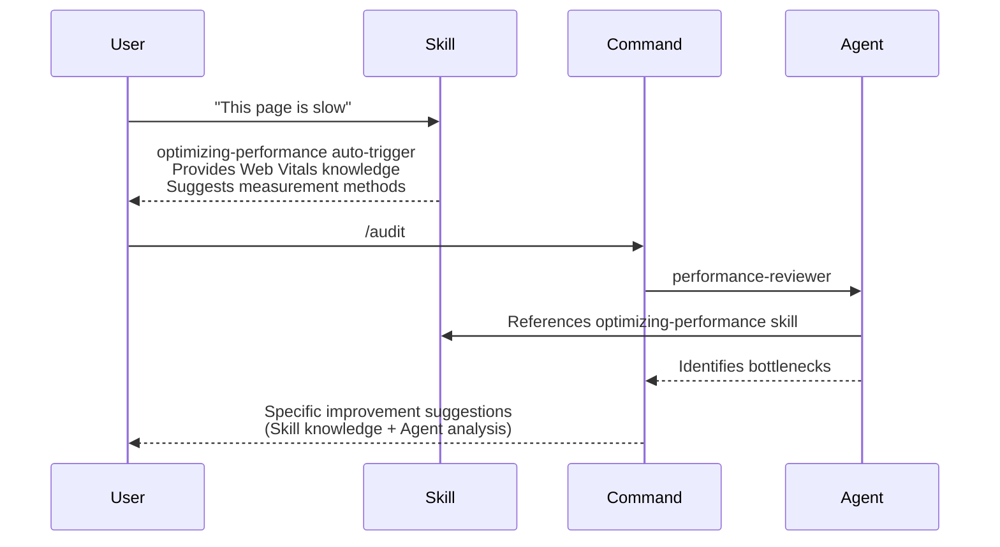
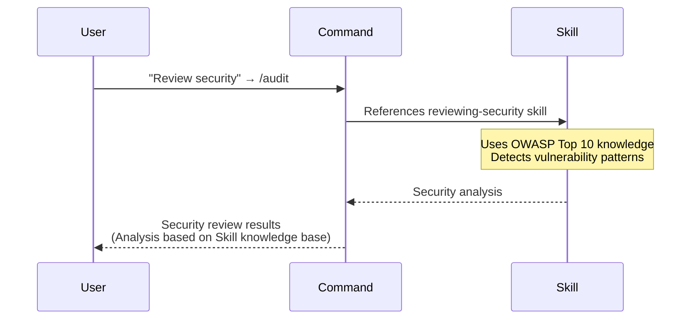

# Claude Agent Skills - Usage Guide

## Overview

This directory contains Skills for Claude Code. Skills provide **knowledge bases, guides, and automation workflows**.

## What are Skills?

Skills are used for:

- **Educational content**: Systematic guides for best practices, design principles, and implementation patterns
- **Knowledge base**: Technical knowledge reusable across projects
- **Project-specific automation**: Automation specialized for specific environments or workflows

## Commands, Agents, and Skills

### Commands

**Role**: User-invoked workflows

- `/audit` → Code review orchestration
- `/adr` → ADR creation flow
- `/code` → TDD/RGRC implementation

**Features**: Thin wrapper, coordinates Skills and Agents

### Agents

**Role**: Specialized analysis/review (called from Commands)

- `performance-reviewer` → Performance analysis
- `accessibility-reviewer` → Accessibility verification
- `type-safety-reviewer` → Type safety checking

**Features**: Specific task execution, short-term, can reference Skills

### Skills

**Role**: Knowledge base, guides, automation

- `optimizing-performance` → Optimization knowledge
- `enhancing-progressively` → Design principles
- `creating-adrs` → ADR creation guide
- `esa-daily-report` → Project-specific automation

**Features**: Persistent knowledge, educational, reusable

## When to Use Skills

### Create Skills for

1. **Educational content**
   - Systematic best practices explanations
   - Detailed design principle guides
   - Implementation pattern collections

2. **Knowledge base**
   - Cross-project technical knowledge
   - Team member learning resources
   - Content explaining "why"

3. **Project-specific automation**
   - Environment-dependent workflows
   - External API integration
   - Specific tool integration

4. **Automatic context expansion**
   - Automatically provide knowledge via keyword triggers
   - Implicitly activate in conversation flow

### Not for Skills

- **Workflow execution** → Use Commands
- **Specialized reviews** → Use Agents
- **Temporary tasks** → Execute directly

## Complete Skill Inventory (21 Skills)

| Category | Skill Name | Description | Used by |
| --- | --- | --- | --- |
| **TDD/Testing** | `generating-tdd-tests` | TDD/RGRCサイクル、テスト設計、基礎原則 | /code, /fix |
| **Code Quality** | `applying-code-principles` | SOLID, DRY, YAGNI principles | /code |
| | `applying-frontend-patterns` | React/UI patterns (structure) | /code --frontend |
| | `integrating-storybook` | Storybook component development | /code --storybook |
| | `enhancing-progressively` | CSS-first, progressive enhancement | /code |
| | ↳ `frontend-design` (official) | Visual design quality (aesthetics) | plugin |
| **Review** | `reviewing-security` | セキュリティレビュー（OWASP） | /audit |
| | `reviewing-readability` | 可読性レビュー | /audit |
| | `reviewing-type-safety` | 型安全性レビュー（TypeScript） | /audit |
| | `reviewing-silent-failures` | サイレント障害検出 | /audit |
| | `reviewing-testability` | テスタビリティレビュー | /audit |
| | `analyzing-root-causes` | 根本原因分析（5 Whys） | /audit |
| | `optimizing-performance` | パフォーマンス最適化 | /audit |
| **Documentation** | `creating-adrs` | ADR作成ガイド | /adr, /rulify |
| | `formatting-audits` | ドキュメントフォーマット | /sow, /spec |
| | `documenting-architecture` | アーキテクチャドキュメント | /docs:architecture |
| | `documenting-apis` | API仕様ドキュメント | /docs:api |
| | `documenting-domains` | ドメイン理解ドキュメント | /docs:domain |
| | `setting-up-docs` | 環境セットアップガイド | /docs:setup |
| **Automation** | `automating-browser` | Interactive browser control (demos, GIFs) | /workflow:create |
| | ↳ `webapp-testing` (official) | Playwright E2E testing (CI/CD) | plugin |
| | `utilizing-cli-tools` | CLI tools (gh, git, etc.) | /commit, /pr, /branch, /issue, /rabbit |
| | `creating-hooks` | Custom hooks creation | /hookify |

### Naming Convention

- **Format**: gerund form (動名詞形式) - e.g., `generating-*`, `applying-*`, `creating-*`
- **Reason**: スキル（能力）を表現する〜ing形式が適切
- **Consistency**: ディレクトリ名とdependencies配列で同一名を使用

---

## Current Skills List

### Knowledge Base Skills

#### optimizing-performance

**Purpose**: Systematic guide for performance optimization

- Detailed Web Vitals (LCP, FID, CLS) explanations
- React optimization patterns
- Bundle size optimization
- Measurement tool usage

**Usage**: Auto-triggers on keywords like "performance", "slow", "optimize"

**Agent integration**: `performance-reviewer` agent references this Skill

#### enhancing-progressively

**Purpose**: Design principle guide for CSS-first approach

- HTML → CSS → JavaScript priority
- CSS-only solution collection
- Progressive enhancement patterns

**Usage**: Auto-triggers on keywords like "layout", "style", "animation"

#### reviewing-type-safety

**Purpose**: TypeScript type safety patterns and best practices

- Type coverage metrics (strict null checks, any usage)
- Type guard patterns and discriminated unions
- Strict mode configuration checklist
- Common type safety anti-patterns

**Usage**: Auto-triggers on keywords like "型安全", "type safety", "any", "unknown", "type guard"

**Agent integration**: `type-safety-reviewer` agent references this Skill

#### reviewing-silent-failures

**Purpose**: Detection patterns for silent failures in frontend code

- Empty catch blocks and unhandled Promise rejections
- Missing error boundaries and fire-and-forget async
- Risk level assessment (Critical/High/Medium/Low)
- Error handling best practices

**Usage**: Auto-triggers on keywords like "silent failure", "empty catch", "unhandled promise"

**Agent integration**: `silent-failure-reviewer` agent references this Skill

#### reviewing-testability

**Purpose**: Testable code design patterns for TypeScript/React

- Dependency injection patterns
- Pure functions and side effect isolation
- Mock-friendly architecture (interfaces, factories)
- Component testability guidelines

**Usage**: Auto-triggers on keywords like "testability", "テスト容易性", "dependency injection"

**Agent integration**: `testability-reviewer` agent references this Skill

#### analyzing-root-causes

**Purpose**: Root cause analysis methodology for frontend issues

- 5 Whys technique and templates
- Common symptom→root cause mappings
- Decision framework for identifying symptom-based solutions
- Progressive enhancement opportunities

**Usage**: Auto-triggers on keywords like "root cause", "5 Whys", "根本原因", "対処療法"

**Agent integration**: `root-cause-reviewer` agent references this Skill

#### creating-adrs

**Purpose**: Detailed process guide for Architecture Decision Record creation

- 6-phase ADR creation process in MADR format
- Pre-check, template selection, reference collection
- Validation checklist, index updates

**Usage**: `/adr` command references this Skill

### Project-Specific Skills

#### esa-daily-report

**Purpose**: Automation for esa.io daily reports

- Google Calendar integration
- Template-based report generation
- Automatic WIP post creation

**Usage**: Auto-triggers on keywords like "daily report"

**Note**: Project-specific, included in `.gitignore`

## Skill Creation Guidelines

### Structure Levels

Three structure levels based on Skill complexity:

#### Minimal (Knowledge-only Skill)

```text
skills/
└── your-skill-name/
    └── SKILL.md          # Main definition file only
```

**Use case**: Simple best practice guides, glossaries, etc.

#### Standard (Most Skills)

```text
skills/
└── your-skill-name/
    ├── SKILL.md          # Main definition file
    └── references/       # External document references
```

**Use case**: Guides with external documents or references

#### Comprehensive (Complex Skills)

```text
skills/
└── your-skill-name/
    ├── SKILL.md          # Main definition file
    ├── references/       # External document references
    ├── scripts/          # Automation scripts
    └── assets/           # Templates, config files
```

**Use case**: High-function Skills with automation, template generation
**Examples**: creating-adrs, generating-tdd-tests

### Frontmatter Specification

#### Required Fields

```yaml
---
name: your-skill-name          # Must match directory name
description: >
  Concise description of Skill purpose and functionality.
  Include trigger keywords (e.g., "ADR", "decision record", "technology selection")
allowed-tools: Read, Write, Edit, Grep, Glob, Bash, Task
---
```

**Field requirements**:

| Field | Required | Description |
| --- | --- | --- |
| `name` | Required | Must exactly match directory name |
| `description` | Required | Description including trigger keywords |
| `allowed-tools` | Required | Comma-separated list of available tools |

#### Optional Fields

```yaml
config:
  strict_mode: true        # Optional config items
  auto_collect: true       # Skill-specific settings
```

### Language Support (EN/JP Sync)

#### Basic Rules

| Item | Requirement |
| --- | --- |
| EN version | **Required** - Always create English version first |
| JP version | **Recommended** - Create for Japanese users |
| Structure sync | When both exist, match section structure |

#### Directory Structure

```text
~/.claude/skills/your-skill/SKILL.md        # EN version (required)
~/.claude/ja/skills/your-skill/SKILL.md     # JP version (recommended)
```

#### Sync Checklist

When both versions exist:

- [ ] Main sections match
- [ ] Frontmatter fields match (name, allowed-tools)
- [ ] Line count ratio is 80%+ (JP/EN)
- [ ] Reference paths are correct (note relative path differences)

### Quality Checklist

Check when creating/updating Skills:

#### Structure Check

- [ ] `name` field matches directory name
- [ ] `description` includes trigger keywords
- [ ] `allowed-tools` lists required tools

#### Content Check

- [ ] "Purpose" section is clear
- [ ] "Usage" section has concrete examples
- [ ] All reference links are valid

#### Integration Check

- [ ] References from related Commands work
- [ ] Integration with related Agents works
- [ ] EN/JP structure matches (if both exist)

### Required SKILL.md Elements

```yaml
---
name: your-skill-name
description: >
  Concise description of Skill purpose and functionality.
  Include trigger keywords.
allowed-tools: Read, Write, Grep, Glob
---

# Skill Name

## Purpose
The problem this Skill solves or value it provides

## When to Use
- Specific use cases

## Usage
- Basic invocation methods

## Content
- Detailed guides, implementation examples, best practices
```

### Golden Masters (Reference Examples)

High-quality Skill implementation examples:

| Skill | Structure Level | Features |
| --- | --- | --- |
| **creating-adrs** | Comprehensive | 6-phase process, scripts, assets, EN/JP both |
| **generating-tdd-tests** | Comprehensive | RGRC cycle, reference docs, scripts |
| **applying-code-principles** | Standard | Systematic 5-principle explanation, reference docs |

## Collaboration Examples

### Performance Optimization Collaboration



### Security-Related Collaboration



## FAQ

### Q: What's the difference between Skill and Agent?

**Skill**: Persistent knowledge, educational content, implicit trigger
**Agent**: Specific task execution, explicit invocation, short-term

### Q: When should I create a Skill?

When these conditions apply:

- Reusable across projects
- Has educational value explaining "why"
- Serves as team member learning resource
- Keyword-based auto-trigger is useful

### Q: What's the difference from Command?

**Command**: Workflow execution explicitly invoked by user
**Skill**: Knowledge provision, referenced from Commands, or auto-triggered

### Q: I want to customize an existing Skill

1. Edit files directly in Skill directory
2. Modify template files (e.g., `templates/default.md`)
3. Adjust settings in SKILL.md

### Q: I want to create a project-specific Skill

1. Create `skills/your-project-skill/`
2. Add to `.gitignore` (if not needed for other projects)
3. Specify environment-dependent settings in SKILL.md

## Related Documentation

- [COMMANDS.md](../docs/COMMANDS.md) - Commands details
- [CLAUDE.md](../CLAUDE.md) - Global settings and rules
- [Agent Skills Official Documentation](https://docs.claude.com/)

## Maintenance

### Regular Reviews

- **Monthly**: Check Skills usage frequency
- **Quarterly**: Check for content staleness
- **As needed**: Add new knowledge and best practices

### Update Notes

1. **SKILL.md changes**: Update description or trigger keywords
2. **Template changes**: Consider backward compatibility
3. **Dependencies**: Confirm impact on Commands and Agents

---

**Last updated**: 2025-12-26
