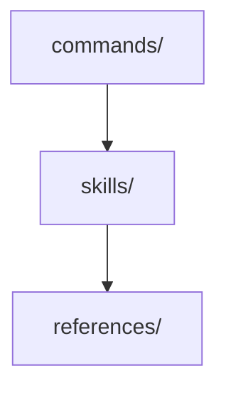

# Architecture Pattern Template

Document decisions that adopt an architecture pattern, component structure, or design policy affecting multiple files.

## When to Use

| Scenario                                                                |
| ----------------------------------------------------------------------- |
| Choosing between architectural patterns (MVC, Clean Architecture, etc.) |
| Defining component structure or module boundaries                       |
| Establishing design policies that affect multiple files                 |

## Required Sections (MADR Core)

| # | Section                       | Purpose                                               |
| - | ----------------------------- | ----------------------------------------------------- |
| 1 | Title                         | Action-oriented. Example: `Adopt X pattern for Y`     |
| 2 | Status                        | `proposed` / `accepted` / `deprecated` / `superseded` |
| 3 | Context and Problem Statement | Why this decision is needed now                       |
| 4 | Decision Drivers              | Factors influencing the choice                        |
| 5 | Considered Options            | Minimum 2 options, each with Good / Bad bullets       |
| 6 | Decision Outcome              | `Chosen option: X, because Y`                         |
| 7 | Consequences                  | Positive and Negative impacts                         |

Metadata line: `- Confidence: {level}. {rationale}`. Reassessment goes in an optional `## Reassessment Triggers` section after Consequences.

## Template-Specific Sections

| Section                   | Purpose                                             |
| ------------------------- | --------------------------------------------------- |
| Architecture Diagram      | Mermaid or text diagram showing the structure       |
| Quality Attributes        | Priority table (maintainability, performance, etc.) |
| Trade-offs                | What is sacrificed for what is gained               |
| Implementation Guidelines | Concrete rules for applying the pattern             |
| Monitoring                | How to verify the pattern is working                |

## Example

````markdown
# Adopt Skill-Centric Architecture

- Status: accepted
- Deciders: Project owner
- Date: 2026-01-08
- Confidence: high. 6 months of production use validated the pattern.

## Context and Problem Statement

Command files grew bloated, with some exceeding 900 lines. Knowledge (skills) and workflows (commands) were not separated, causing DRY violations and declining maintainability.

## Decision Drivers

- Command files violating Miller's Law (responsibilities > 9)
- Same knowledge duplicated across multiple commands
- Unclear impact scope when adding new features

## Considered Options

### Skill-Centric Architecture

Commands act as thin wrappers, delegating knowledge to skills.

- Good: Achieves DRY (knowledge in one place)
- Good: Commands stay under 100 lines
- Bad: Increased indirection via references

### Status Quo (Monolithic Commands)

Each command contains all required knowledge inline.

- Good: Self-contained in one file
- Bad: Duplication keeps growing
- Bad: Hard to predict change impact

## Decision Outcome

Adopted skill-centric architecture. Commands follow the Thin Wrapper pattern; implementation knowledge is consolidated in `skills/`.

### Positive Consequences

- Commands are lightweight (average 80 lines)
- Skills become reusable

### Negative Consequences

- More inter-file navigation required

## Architecture Diagram



## Quality Attributes

| Attribute         | Priority | Approach     |
| ----------------- | -------- | ------------ |
| Maintainability   | High     | Skill split  |
| Understandability | Medium   | Thin Wrapper |

## Trade-offs

More files in exchange for clear single-responsibility per file.

## Reassessment Triggers

- If command count exceeds 30 and skill dependency graph becomes tangled
````
