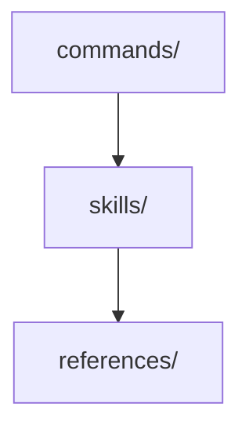

# Architecture Pattern Template

Document decisions that adopt an architecture pattern, component structure, or design policy affecting multiple files.

## When to Use

| Scenario                                                                |
| ----------------------------------------------------------------------- |
| Choosing between architectural patterns (MVC, Clean Architecture, etc.) |
| Defining component structure or module boundaries                       |
| Establishing design policies that affect multiple files                 |

## Template-Specific Topics

Place under `## More Information` as `### {topic}`.

| Topic                     | Purpose                                             |
| ------------------------- | --------------------------------------------------- |
| Architecture Diagram      | Mermaid or text diagram showing the structure       |
| Quality Attributes        | Priority table (maintainability, performance, etc.) |
| Trade-offs                | What is sacrificed for what is gained               |
| Implementation Guidelines | Concrete rules for applying the pattern             |
| Monitoring                | How to verify the pattern is working                |

## Example

`````markdown
---
status: "accepted"
date: 2026-01-08
decision-makers: Project owner
---

# Adopt Skill-Centric Architecture

## Context and Problem Statement

Command files grew bloated, with some exceeding 900 lines. Knowledge (skills) and workflows (commands) were not separated, causing DRY violations and declining maintainability. How should we restructure to keep commands lightweight and knowledge reusable?

## Decision Drivers

* Command files violating Miller's Law (responsibilities > 9)
* Same knowledge duplicated across multiple commands
* Unclear impact scope when adding new features

## Considered Options

* Skill-Centric Architecture
* Status Quo (Monolithic Commands)

## Decision Outcome

Chosen option: "Skill-Centric Architecture", because it achieves DRY by consolidating knowledge into `skills/` while keeping commands as thin wrappers.

### Consequences

* Good, because commands stay under 100 lines on average
* Good, because skills become reusable across commands
* Bad, because more inter-file navigation is required

### Confirmation

A line-count audit verifies commands stay under 100 lines. Skill reuse is tracked by counting cross-command references in skill files.

## Pros and Cons of the Options

### Skill-Centric Architecture

Commands act as thin wrappers, delegating knowledge to skills.

* Good, because achieves DRY (knowledge in one place)
* Good, because commands stay under 100 lines
* Bad, because increased indirection via references

### Status Quo (Monolithic Commands)

Each command contains all required knowledge inline.

* Good, because self-contained in one file
* Bad, because duplication keeps growing
* Bad, because hard to predict change impact

## More Information

### Architecture Diagram



### Quality Attributes

| Attribute         | Priority | Approach     |
| ----------------- | -------- | ------------ |
| Maintainability   | High     | Skill split  |
| Understandability | Medium   | Thin Wrapper |

### Trade-offs

More files in exchange for clear single-responsibility per file.

### Reassessment Triggers

* If command count exceeds 30 and skill dependency graph becomes tangled
`````
