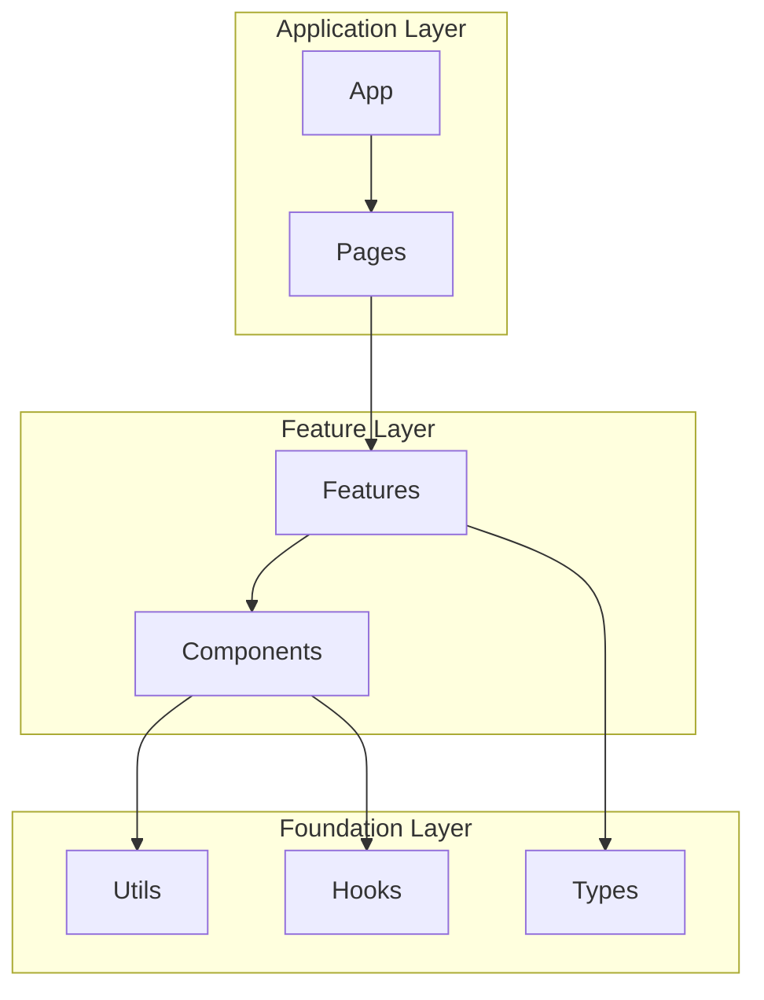
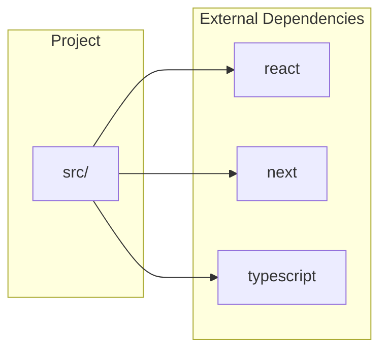

# docs:architecture - Architecture Overview Generation

## Overview

A skill that analyzes codebases and automatically generates architecture overview documentation.

## Generated Content

1. **Project Overview** - Tech stack, framework detection
2. **Directory Structure** - Structure display via tree command
3. **Module Composition** - Module relationships via Mermaid diagrams
4. **Key Components** - Class and function listing with statistics
5. **Dependencies** - External/internal dependency visualization
6. **Statistics** - File count, line count, class count, etc.

## Processing Flow

```text
Phase 1: Initialization
├── Identify project root
├── Detect language/framework
└── Collect files for analysis

Phase 2: Directory Structure Analysis
├── Get structure via tree command
├── Classify main directories
└── Determine file types

Phase 3: Code Structure Analysis
├── Analysis via tree-sitter-analyzer
│   ├── Class extraction
│   ├── Function extraction
│   └── Import extraction
└── Aggregate statistics

Phase 4: Dependency Analysis
├── Parse import/export statements
├── Map inter-module relationships
└── Identify external dependencies

Phase 5: Document Generation
├── Generate Mermaid diagrams
├── Populate templates
└── Output Markdown
```

## Usage

```bash
# Basic usage
/docs architecture

# Analyze specific directory
/docs architecture src/

# Specify output destination
/docs architecture --output docs/ARCHITECTURE.md
```

## Analysis Commands

### Get Directory Structure

```bash
tree -L 3 -I 'node_modules|.git|dist|build|__pycache__|.venv|coverage|.next' --dirsfirst
```

### Code Structure Analysis

```bash
# Analyze structure of each file
tree-sitter-analyzer {file} --structure --output-format json

# Get statistics
tree-sitter-analyzer {file} --statistics
```

### Extract Dependencies

```bash
# TypeScript/JavaScript
grep -r "^import\|^export" --include="*.ts" --include="*.tsx" --include="*.js"

# Python
grep -r "^import\|^from.*import" --include="*.py"
```

## Output Template

See [template file](./assets/architecture-template.md).

## Mermaid Diagram Generation

### Module Relationship Diagram



### Dependency Diagram



## Scripts

| Script | Purpose |
|--------|---------|
| `scripts/analyze-structure.sh` | Directory structure analysis |
| `scripts/extract-modules.sh` | Module information extraction |
| `scripts/generate-mermaid.sh` | Mermaid diagram generation |

## Error Handling

| Error | Resolution |
|-------|------------|
| Project root identification failed | Use current directory |
| tree-sitter-analyzer not supported | Fallback to Grep/Read |
| Large project | Sampling analysis (top 100 files) |

## Output Example

Example of generated documentation:

```markdown
# my-project - Architecture Overview

**Generated**: 2025-12-19 12:00
**Target**: /path/to/my-project

## Tech Stack

| Category | Technology |
|----------|------------|
| Language | TypeScript |
| Framework | Next.js |
| Testing | Vitest |

## Directory Structure

src/
├── app/
│   ├── layout.tsx
│   └── page.tsx
├── components/
│   ├── Button.tsx
│   └── Header.tsx
└── lib/
    └── utils.ts

## Statistics

| Metric | Value |
|--------|-------|
| Total Files | 45 |
| Total Lines | 3,200 |
| Class Count | 12 |
| Function Count | 85 |
```

## Related Documentation

- Agent: [@architecture-analyzer](../../agents/analyzers/architecture-analyzer.md)
- Command: [@/docs](../../commands/docs.md)
