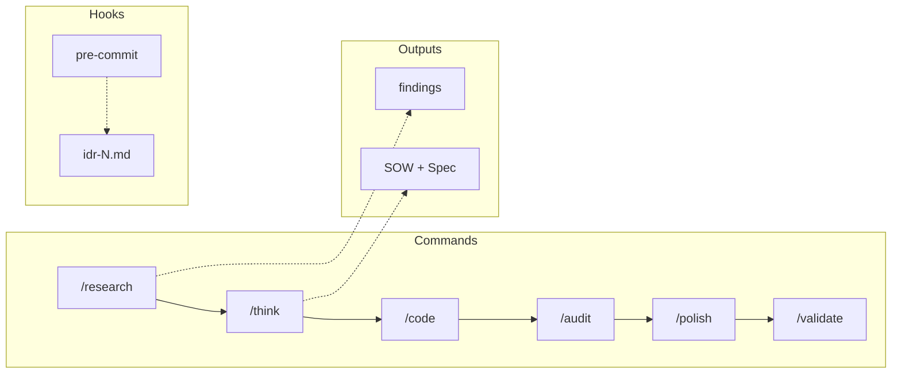

# Templates

Structural templates referenced by commands.

## Planning Workflow



| Phase          | Command   | Output          | Template             |
| -------------- | --------- | --------------- | -------------------- |
| Research       | /research | findings        | research/template.md |
| Planning       | /think    | sow.md, spec.md | sow/, spec/          |
| Implementation | /code     | -               | -                    |
| Review         | /audit    | -               | -                    |
| Polish         | /polish   | -               | -                    |
| Validation     | /validate | -               | -                    |
| Delta          | /delta    | delta.md        | (embedded in skill)  |
| Commit         | (hook)    | idr-N.md        | -                    |

## Directory Structure

```text
templates/
├── README.md
├── devcontainer/      # Dev Container templates
│   ├── .devcontainer/devcontainer.json
│   └── README.md
├── docs/              # Documentation templates
│   ├── api.md
│   ├── architecture.md
│   ├── domain.md
│   ├── purpose.md
│   └── setup.md
├── issue/             # GitHub Issue templates
│   ├── bug.md
│   ├── chore.md
│   ├── docs.md
│   └── feature.md
├── pr/                # Pull Request templates
│   └── default.md
├── research/
│   └── template.md    # Research findings
├── sow/
│   └── template.md    # Statement of Work
└── spec/
    └── template.md    # Specification
```

## Document Responsibilities

| Document | Role                          | Audience | Update Frequency      |
| -------- | ----------------------------- | -------- | --------------------- |
| **SOW**  | Planning, criteria, design    | AI       | Static after approval |
| **Spec** | Implementation details, tests | AI       | Static after approval |
| **IDR**  | Implementation records        | Human    | Dynamic (append-only) |

## Customization

1. Maintain required sections (## headers)
2. Use confidence markers: [✓] ≥95%, [→] 70-94%, [?] <70%
3. Use ID conventions: I-001, AC-001, FR-001, T-001, NFR-001
