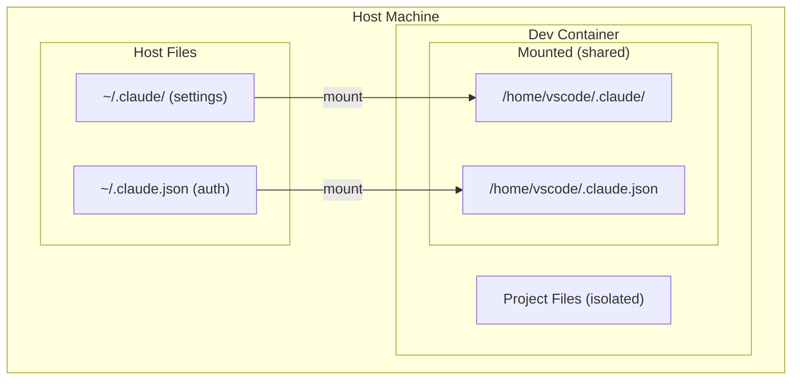

# Claude Code Dev Container Template

Template for running Claude Code in a secure containerized environment.

## Features

- **Physical sandbox**: Complete isolation from host filesystem
- **Shared authentication**: Mount `~/.claude/` to reuse settings
- **Ready-to-use environment**: Rust/Node/Ruby/Python integrated

## Usage

### 1. Copy template to your project

```bash
cp -r ~/.claude/templates/devcontainer/.devcontainer /path/to/your/project/
```

### 2. Open in VSCode

```bash
code /path/to/your/project
```

### 3. Open in Dev Container

In VSCode: `Cmd+Shift+P` → `Dev Containers: Reopen in Container`

## Customization

### Change base image

Modify `image` in `devcontainer.json`:

```jsonc
// Node.js only
"image": "mcr.microsoft.com/devcontainers/javascript-node:20"

// Python only
"image": "mcr.microsoft.com/devcontainers/python:3.12"
```

### Add ports

```jsonc
"forwardPorts": [3000, 5173, 8080, 4000]
```

### Install additional packages

```jsonc
"postCreateCommand": "npm install -g @anthropic-ai/claude-code && npm install -g pnpm"
```

## Architecture



## Notes

- **First launch**: Claude Code is installed via `postCreateCommand`
- **Authentication**: Host credentials are mounted, no re-login required
- **Git config**: May need separate configuration inside the container

## Troubleshooting

### Authentication errors

Check if the auth file exists on host:

```bash
ls -la ~/.claude.json
```

### Container won't start

Ensure Docker Desktop is running and pull the image:

```bash
docker pull ghcr.io/creanciel/deck:latest
```

## References

- [Original article: Claude Code Dev Container Setup](https://zenn.dev/creanciel/articles/my-claude-code-dev-container-deck)
- [Dev Containers Documentation](https://containers.dev/)
